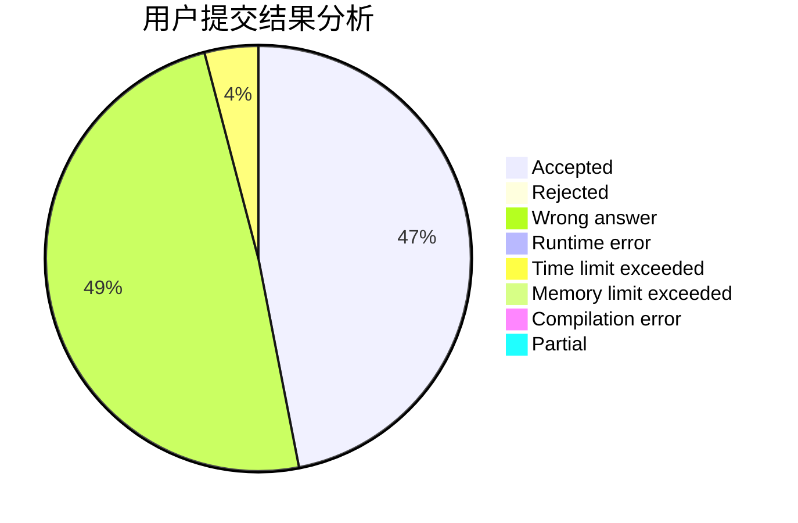
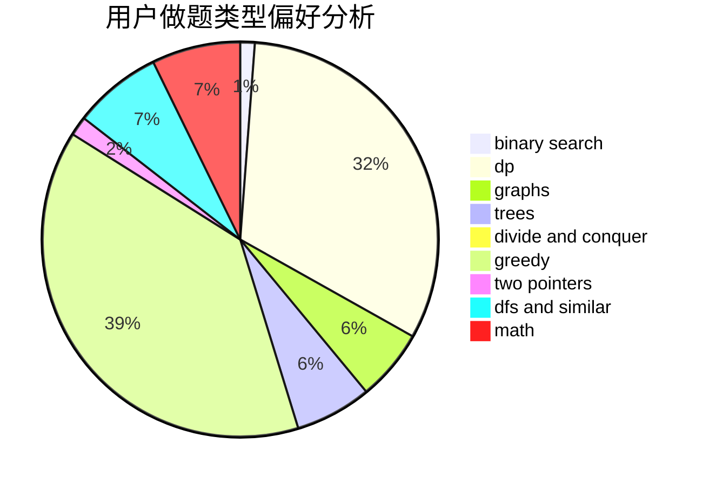

# diamond_dick

<!-- tabs:start -->

#### **用户提交结果分析**

#### **用户做题类型偏好分析**

<!-- tabs:end -->
# 推荐题目
[911A](https://codeforces.com/contest/911/problem/A)
[875F](https://codeforces.com/contest/875/problem/F)
[1358F](https://codeforces.com/contest/1358/problem/F)
[279A](https://codeforces.com/contest/279/problem/A)
[291A](https://codeforces.com/contest/291/problem/A)
[960C](https://codeforces.com/contest/960/problem/C)
[898C](https://codeforces.com/contest/898/problem/C)
[522D](https://codeforces.com/contest/522/problem/D)
[1210E](https://codeforces.com/contest/1210/problem/E)
[44C](https://codeforces.com/contest/44/problem/C)
