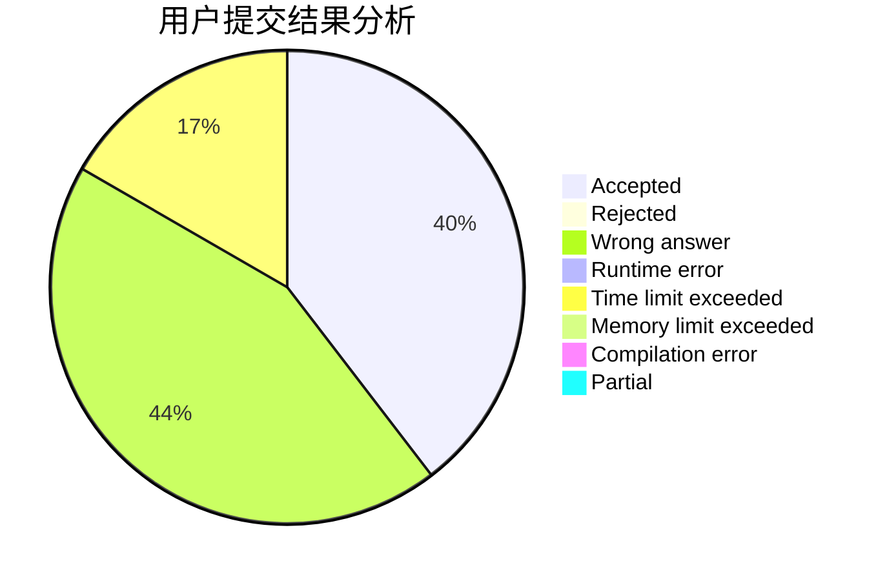
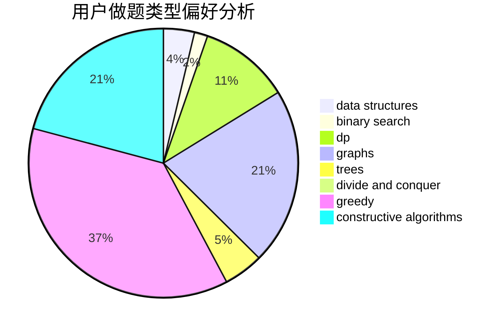
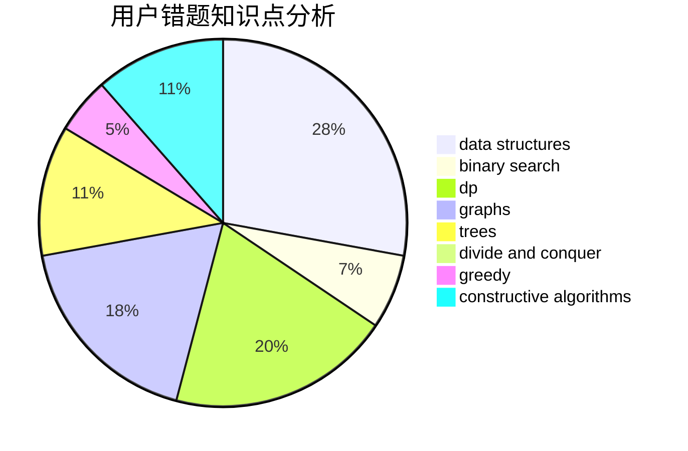

# dijkstra54321

<!-- tabs:start -->

#### **用户提交结果分析**

#### **用户做题类型偏好分析**

#### **用户错题知识点分析**

<!-- tabs:end -->
# 推荐题目
[1225A](https://codeforces.com/contest/1225/problem/A)		math		  
[898B](https://codeforces.com/contest/898/problem/B)		brute force,
                        implementation,
                        number theory		  
[1314F](https://codeforces.com/contest/1314/problem/F)		dsu,graphs,sortings,trees		  
[1229D](https://codeforces.com/contest/1229/problem/D)		dsu,graphs,sortings,trees		  
[703A](https://codeforces.com/contest/703/problem/A)		implementation		  
[11851](https://codeforces.com/contest/1185/problem/1)		dsu,graphs,sortings,trees		  
[1246D](https://codeforces.com/contest/1246/problem/D)		dsu,graphs,sortings,trees		  
[464C](https://codeforces.com/contest/464/problem/C)		dp		  
[645D](https://codeforces.com/contest/645/problem/D)		binary search,
                        dp,
                        graphs		  
[11651](https://codeforces.com/contest/1165/problem/1)		dsu,graphs,sortings,trees		  
