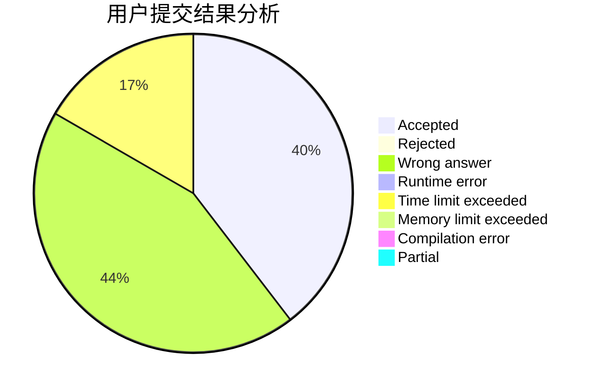
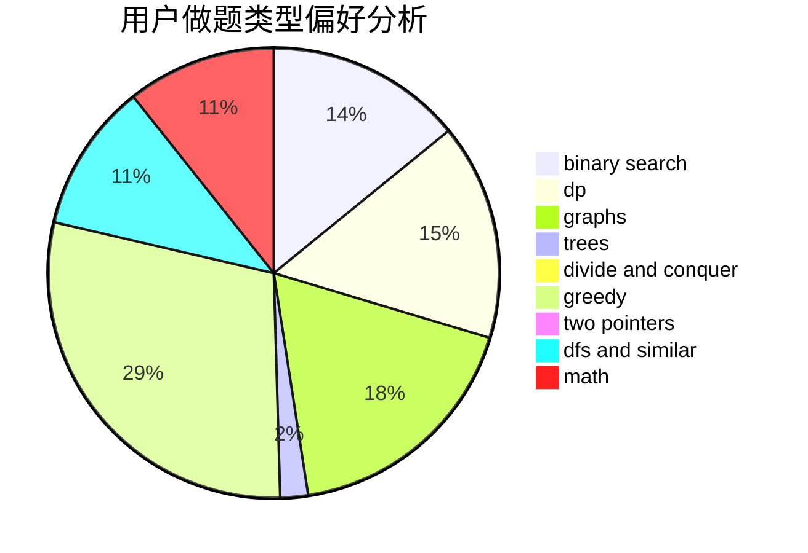

# dijkstra54321

<!-- tabs:start -->

#### **用户提交结果分析**

#### **用户做题类型偏好分析**

<!-- tabs:end -->
# 推荐题目
[1225A](https://codeforces.com/contest/1225/problem/A)
[898B](https://codeforces.com/contest/898/problem/B)
[1314F](https://codeforces.com/contest/1314/problem/F)
[1229D](https://codeforces.com/contest/1229/problem/D)
[703A](https://codeforces.com/contest/703/problem/A)
[11851](https://codeforces.com/contest/1185/problem/1)
[1246D](https://codeforces.com/contest/1246/problem/D)
[464C](https://codeforces.com/contest/464/problem/C)
[645D](https://codeforces.com/contest/645/problem/D)
[11651](https://codeforces.com/contest/1165/problem/1)
