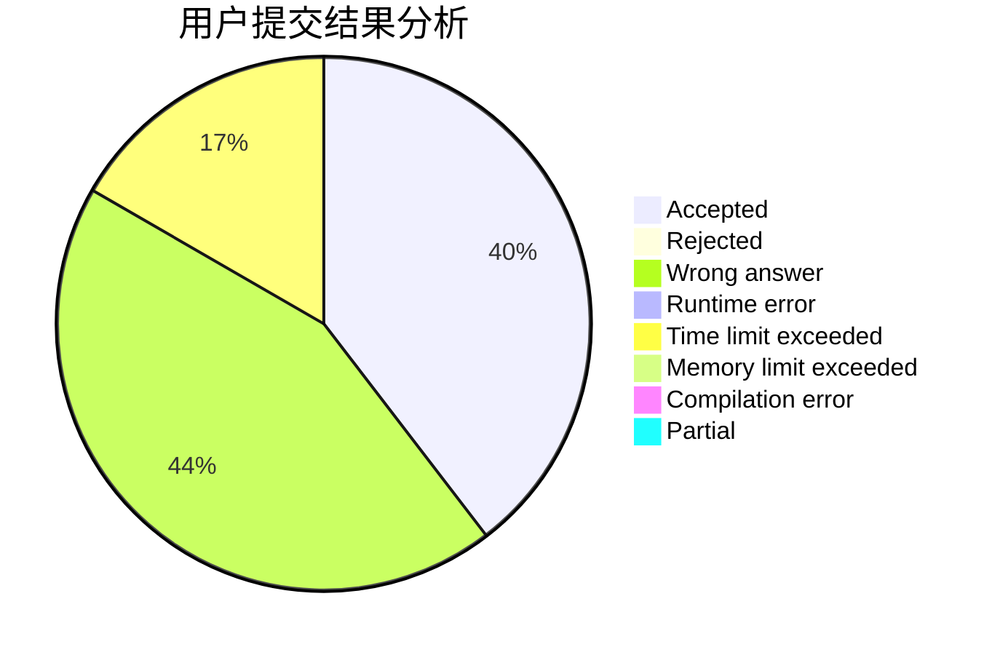
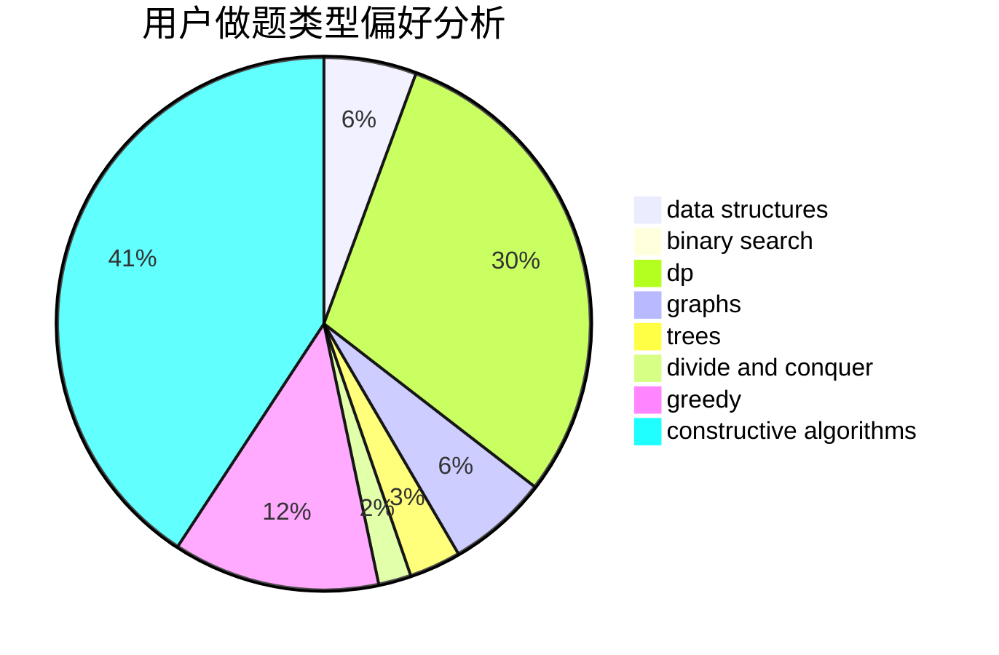
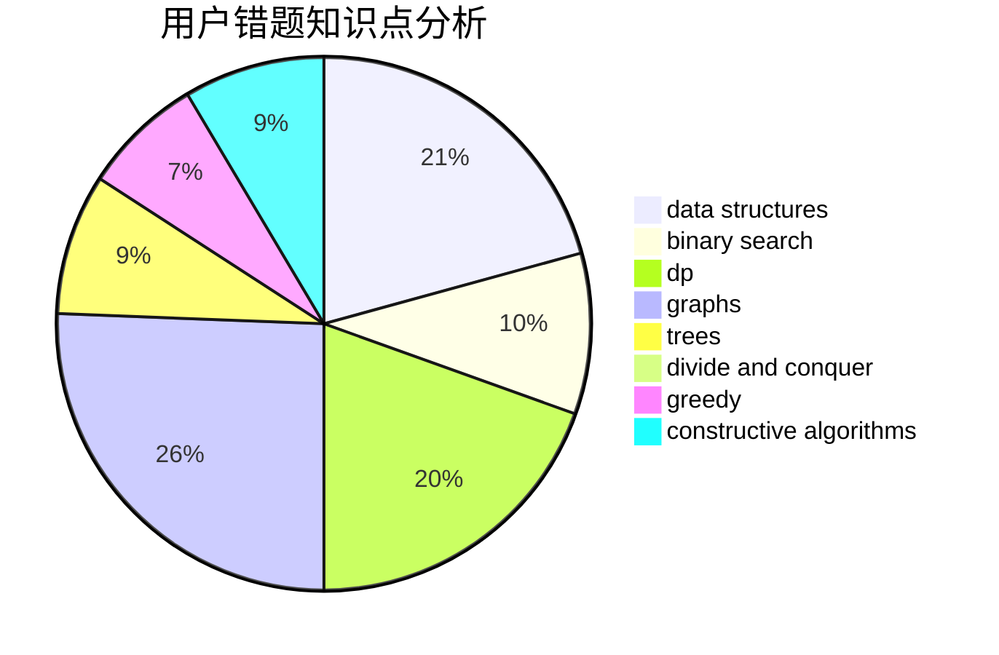

# dijkstra54321

<!-- tabs:start -->

#### **用户提交结果分析**

#### **用户做题类型偏好分析**

#### **用户错题知识点分析**

<!-- tabs:end -->
# 推荐题目
[1217D](https://codeforces.com/contest/1217/problem/D)		constructive algorithms,
                        dfs and similar,
                        graphs		  
[877C](https://codeforces.com/contest/877/problem/C)		constructive algorithms		  
[1305G](https://codeforces.com/contest/1305/problem/G)		bitmasks,
                        brute force,
                        dp,
                        dsu,
                        graphs		  
[1221C](https://codeforces.com/contest/1221/problem/C)		binary search,
                        math		  
[679B](https://codeforces.com/contest/679/problem/B)		binary search,
                        dp,
                        greedy		  
[1182C](https://codeforces.com/contest/1182/problem/C)		data structures,
                        greedy,
                        strings		  
[1241A](https://codeforces.com/contest/1241/problem/A)		dsu,graphs,sortings,trees		  
[444D](https://codeforces.com/contest/444/problem/D)		binary search,
                        hashing,
                        strings,
                        two pointers		  
[621B](https://codeforces.com/contest/621/problem/B)		combinatorics,
                        implementation		  
[1163C2](https://codeforces.com/contest/1163C/problem/2)		data structures,
                        geometry,
                        implementation,
                        math		  
