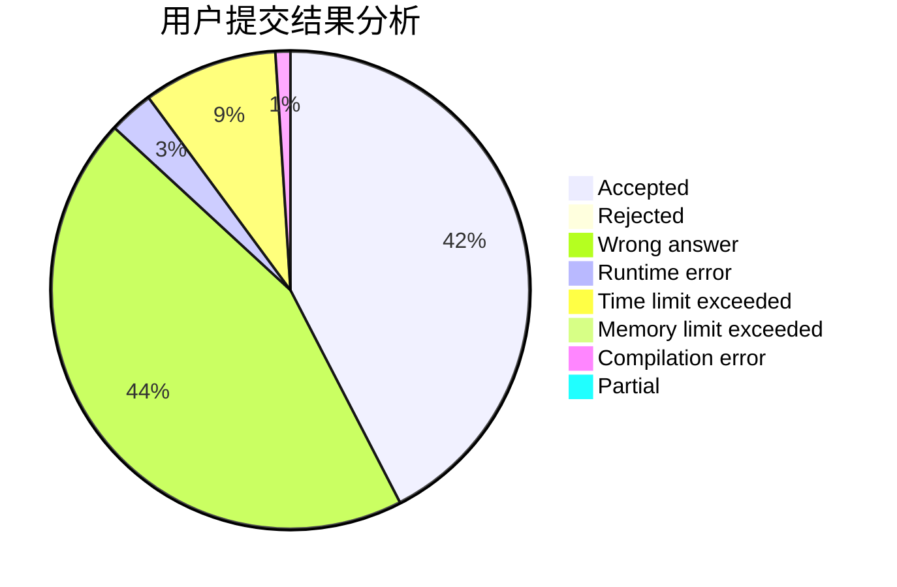
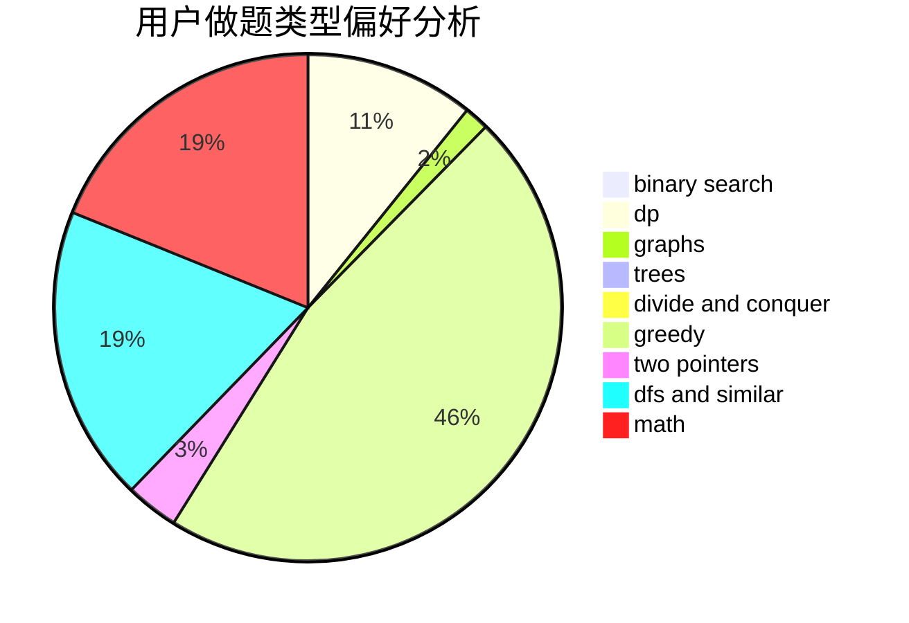

# Arrows

<!-- tabs:start -->

#### **用户提交结果分析**

#### **用户做题类型偏好分析**

<!-- tabs:end -->
# 推荐题目
[1168E](https://codeforces.com/contest/1168/problem/E)
[446A](https://codeforces.com/contest/446/problem/A)
[444D](https://codeforces.com/contest/444/problem/D)
[445B](https://codeforces.com/contest/445/problem/B)
[444E](https://codeforces.com/contest/444/problem/E)
[283B](https://codeforces.com/contest/283/problem/B)
[446B](https://codeforces.com/contest/446/problem/B)
[122C](https://codeforces.com/contest/122/problem/C)
[1081G](https://codeforces.com/contest/1081/problem/G)
[445A](https://codeforces.com/contest/445/problem/A)
