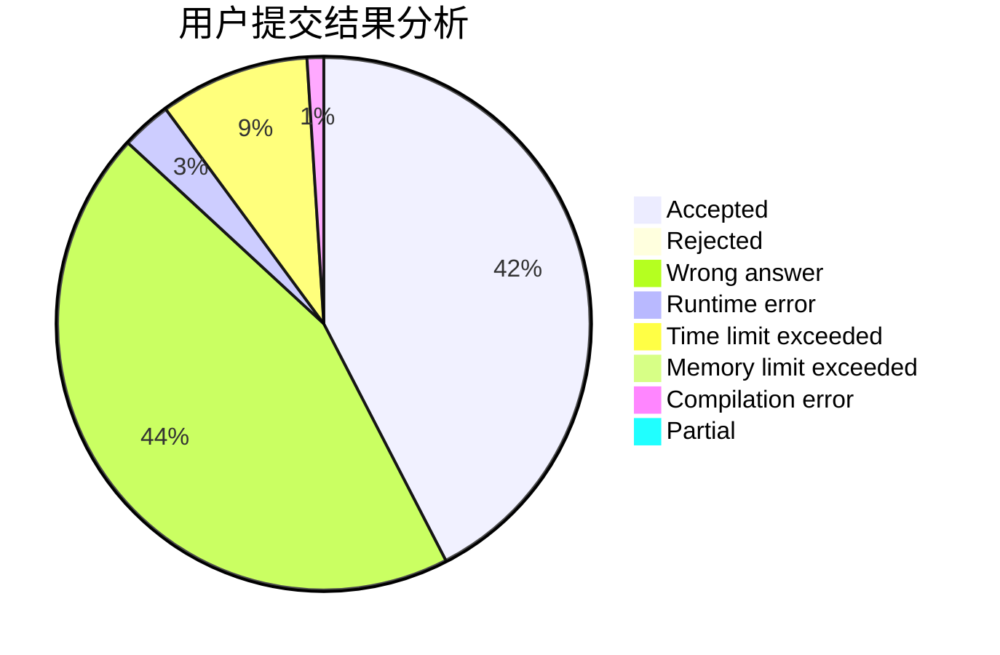
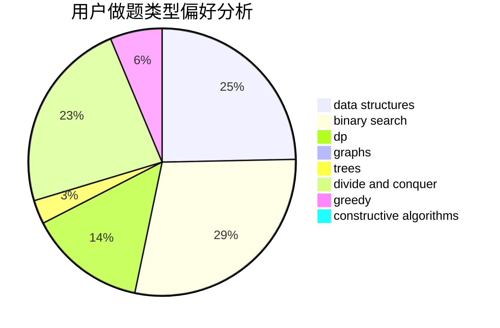

# Arrows

<!-- tabs:start -->

#### **用户提交结果分析**

#### **用户做题类型偏好分析**

#### **用户错题知识点分析**

<!-- tabs:end -->
# 推荐题目
[1166A](https://codeforces.com/contest/1166/problem/A)		combinatorics,
                        greedy		  
[420C](https://codeforces.com/contest/420/problem/C)		data structures,
                        graphs,
                        implementation,
                        two pointers		  
[418E](https://codeforces.com/contest/418/problem/E)		data structures		  
[41D](https://codeforces.com/contest/41/problem/D)		dp		  
[41A](https://codeforces.com/contest/41/problem/A)		implementation,
                        strings		  
[268A](https://codeforces.com/contest/268/problem/A)		brute force		  
[420D](https://codeforces.com/contest/420/problem/D)		data structures		  
[1221G](https://codeforces.com/contest/1221/problem/G)		bitmasks,
                        brute force,
                        combinatorics,
                        dp,
                        meet-in-the-middle		  
[1081D](https://codeforces.com/contest/1081/problem/D)		dsu,
                        graphs,
                        shortest paths,
                        sortings		  
[41B](https://codeforces.com/contest/41/problem/B)		brute force		  
