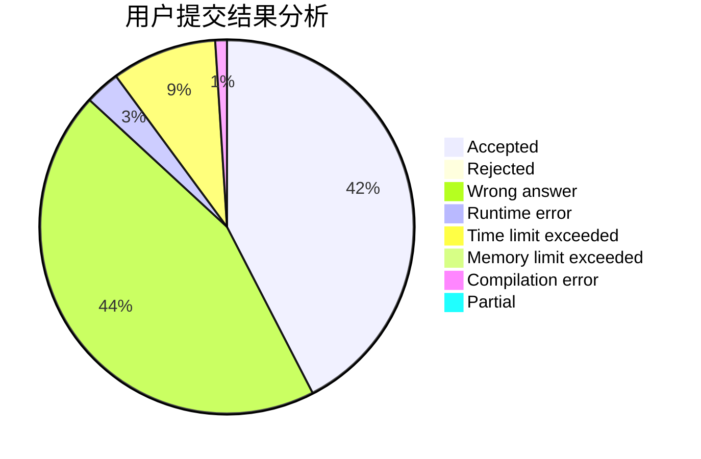
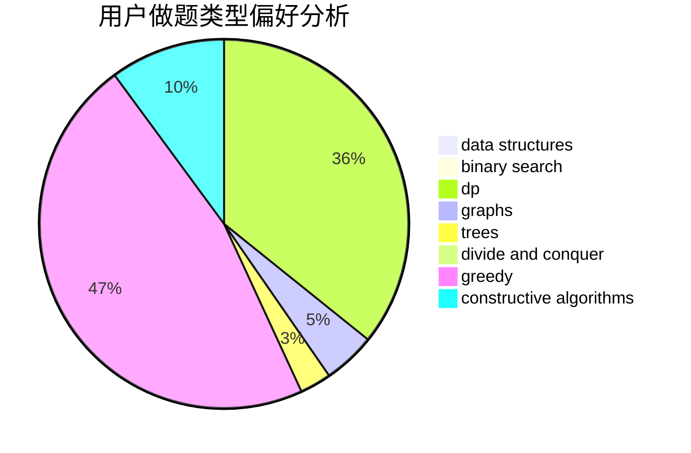
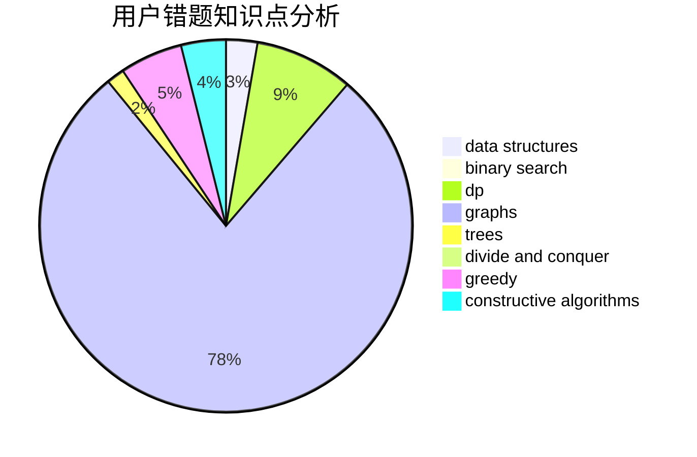

# Arrows

<!-- tabs:start -->

#### **用户提交结果分析**

#### **用户做题类型偏好分析**

#### **用户错题知识点分析**

<!-- tabs:end -->
# 推荐题目
[1168E](https://codeforces.com/contest/1168/problem/E)		constructive algorithms,
                        math		  
[446A](https://codeforces.com/contest/446/problem/A)		dp,
                        implementation,
                        two pointers		  
[444D](https://codeforces.com/contest/444/problem/D)		binary search,
                        hashing,
                        strings,
                        two pointers		  
[445B](https://codeforces.com/contest/445/problem/B)		dfs and similar,
                        dsu,
                        greedy		  
[444E](https://codeforces.com/contest/444/problem/E)		binary search,
                        dsu,
                        trees		  
[283B](https://codeforces.com/contest/283/problem/B)		dfs and similar,
                        dp,
                        graphs		  
[446B](https://codeforces.com/contest/446/problem/B)		brute force,
                        data structures,
                        greedy		  
[122C](https://codeforces.com/contest/122/problem/C)		dsu,graphs,sortings,trees		  
[1081G](https://codeforces.com/contest/1081/problem/G)		math,
                        probabilities		  
[445A](https://codeforces.com/contest/445/problem/A)		dfs and similar,
                        implementation		  
