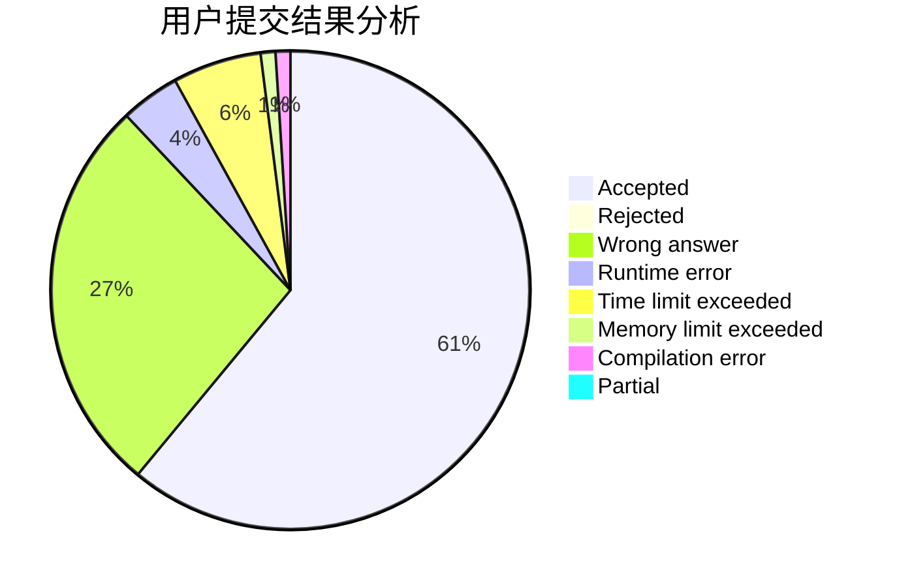
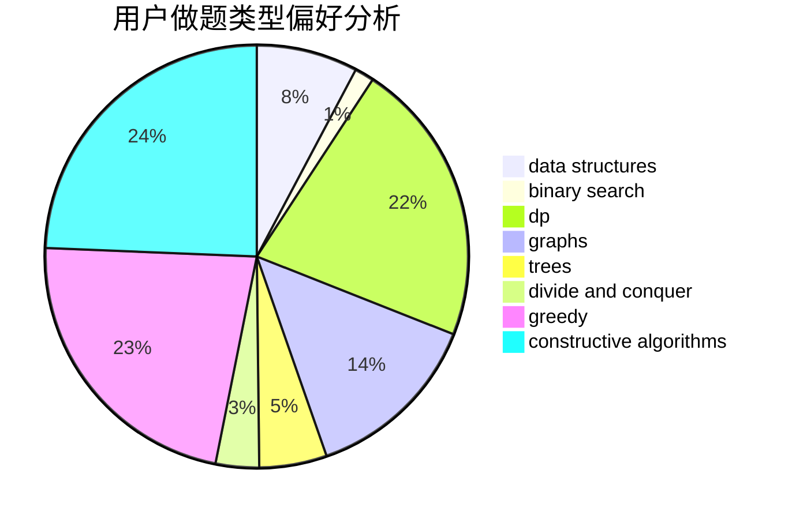
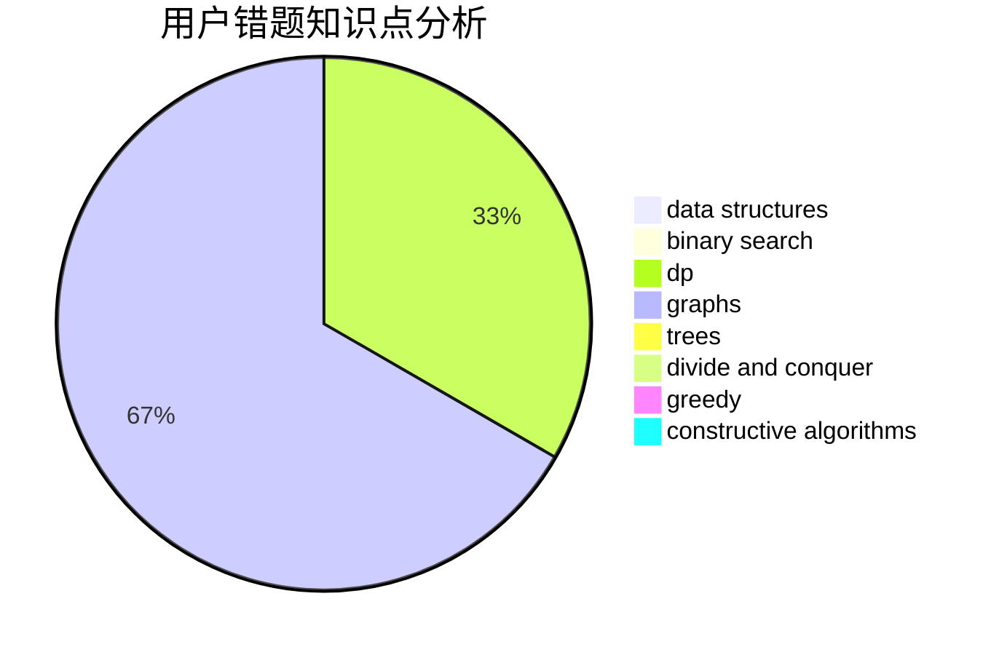

# dingdingsb

<!-- tabs:start -->

#### **用户提交结果分析**

#### **用户做题类型偏好分析**

#### **用户错题知识点分析**

<!-- tabs:end -->
# 推荐题目
[1265C](https://codeforces.com/contest/1265/problem/C)		dsu,graphs,sortings,trees		  
[1090D](https://codeforces.com/contest/1090/problem/D)		constructive algorithms		  
[795K](https://codeforces.com/contest/795/problem/K)		dsu,graphs,sortings,trees		  
[47E](https://codeforces.com/contest/47/problem/E)		data structures,
                        geometry,
                        sortings		  
[1174E](https://codeforces.com/contest/1174/problem/E)		combinatorics,
                        dp,
                        math,
                        number theory		  
[699D](https://codeforces.com/contest/699/problem/D)		dsu,graphs,sortings,trees		  
[367C](https://codeforces.com/contest/367/problem/C)		graphs,
                        greedy,
                        sortings		  
[960A](https://codeforces.com/contest/960/problem/A)		implementation		  
[714B](https://codeforces.com/contest/714/problem/B)		implementation,
                        sortings		  
[1336A](https://codeforces.com/contest/1336/problem/A)		dfs and similar,
                        dp,
                        greedy,
                        sortings,
                        trees		  
