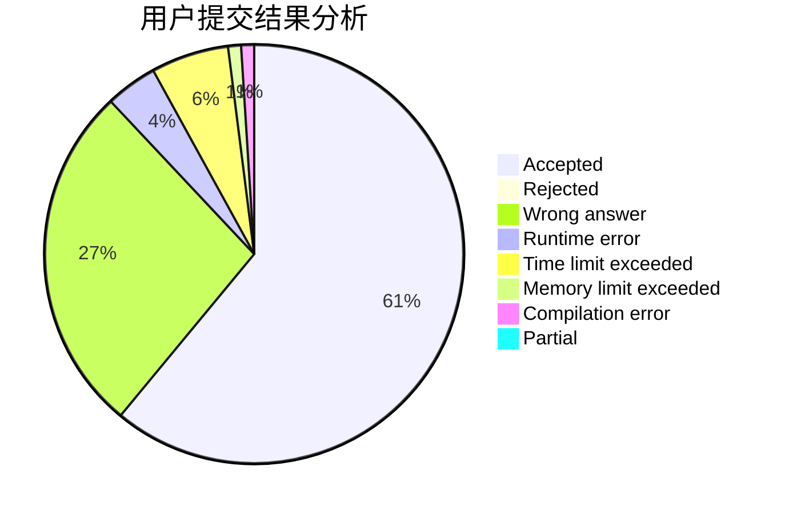
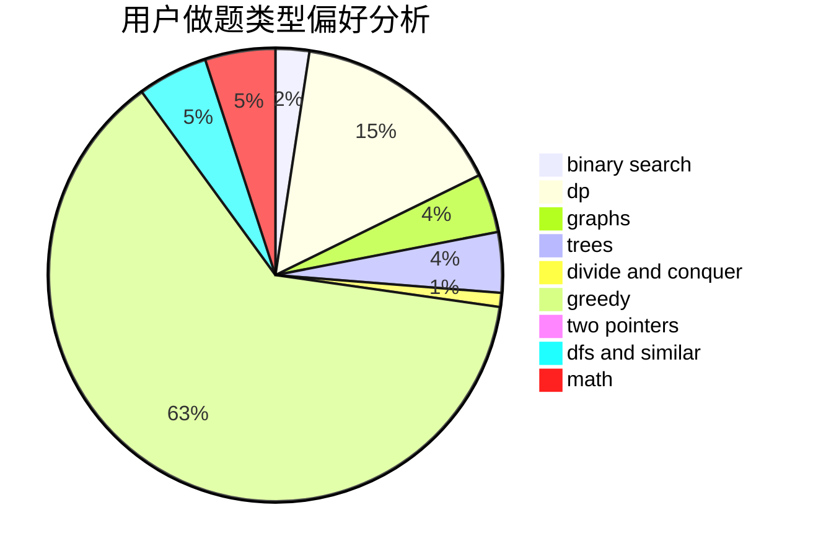

# dingdingsb

<!-- tabs:start -->

#### **用户提交结果分析**

#### **用户做题类型偏好分析**

<!-- tabs:end -->
# 推荐题目
[1265C](https://codeforces.com/contest/1265/problem/C)
[1090D](https://codeforces.com/contest/1090/problem/D)
[795K](https://codeforces.com/contest/795/problem/K)
[47E](https://codeforces.com/contest/47/problem/E)
[1174E](https://codeforces.com/contest/1174/problem/E)
[699D](https://codeforces.com/contest/699/problem/D)
[367C](https://codeforces.com/contest/367/problem/C)
[960A](https://codeforces.com/contest/960/problem/A)
[714B](https://codeforces.com/contest/714/problem/B)
[1336A](https://codeforces.com/contest/1336/problem/A)
