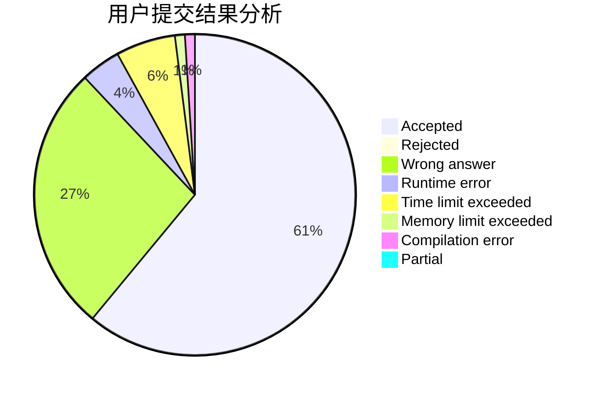
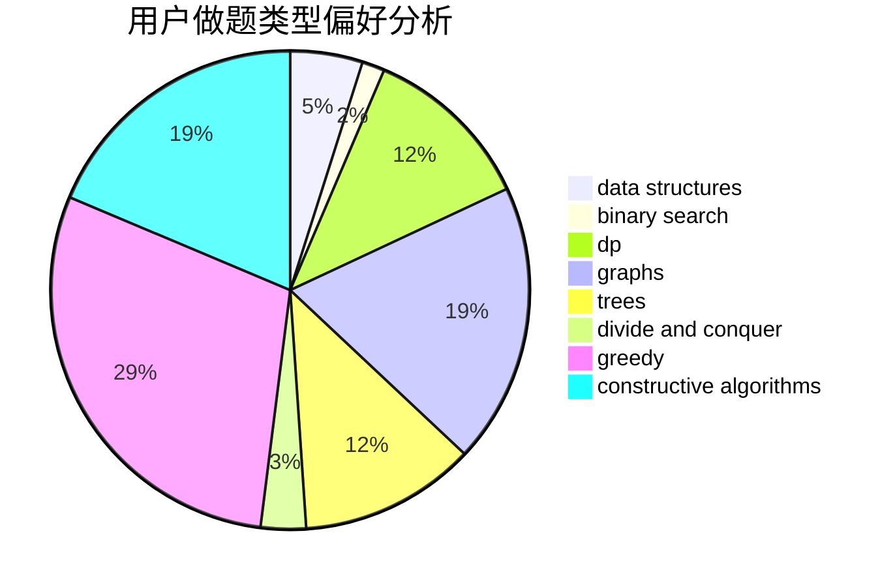
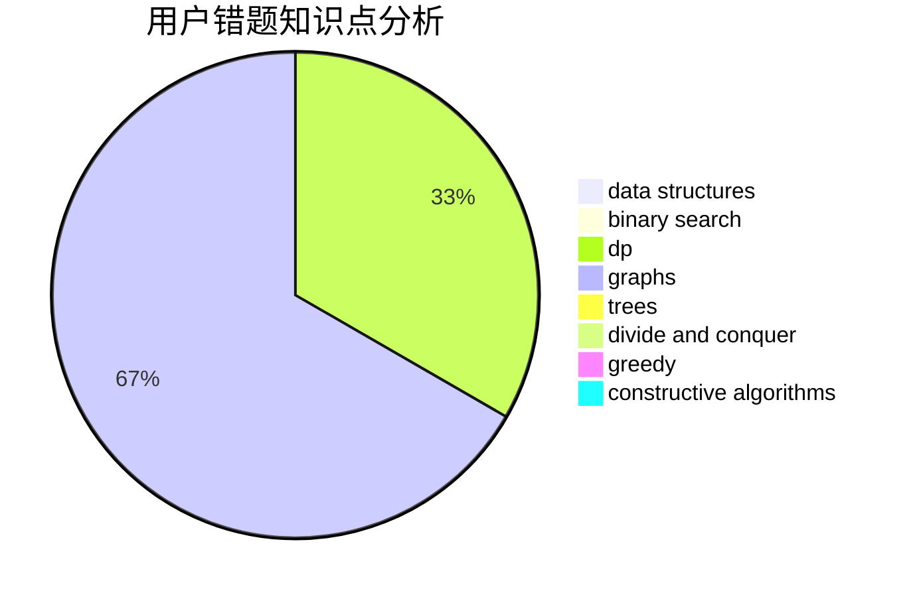

# dingdingsb
<!-- tabs:start -->
#### **用户提交结果分析**

#### **用户做题类型偏好分析**

#### **用户错题知识点分析**

<!-- tabs:end -->
# 推荐题目
[Measuring Lengths in Baden](http://codeforces.com/problemset/problem/125/A)		math		  
[Build From Suffixes](http://codeforces.com/problemset/problem/1488/H)		*special problem,
                        combinatorics,
                        data structures		  
[Substrings Sort](https://codeforces.com/contest/1489/problem/D)		sortings,
                        strings		  
[Dreamoon and Ranking Collection](http://codeforces.com/problemset/problem/1330/A)		implementation		  
[Efim and Strange Grade](https://codeforces.com/contest/719/problem/C)		dp,
                        implementation,
                        math		  
[Dorm Water Supply](https://codeforces.com/contest/108/problem/C)		dfs and similar,
                        graphs		  
[Vasya and Templates](https://codeforces.com/contest/1086/problem/C)		greedy,
                        implementation,
                        strings		  
[Geometrical Progression](http://codeforces.com/problemset/problem/758/F)		brute force,
                        math,
                        number theory		  
[Fortune Telling](http://codeforces.com/problemset/problem/59/B)		implementation,
                        number theory		  
[Nephren gives a riddle](https://codeforces.com/contest/897/problem/C)		binary search,
                        dfs and similar		  
<!-- tabs:start -->
#### **data structures**
[Measuring Lengths in Baden](http://codeforces.com/problemset/problem/1488/H)		*special problem,
                        combinatorics,
                        data structures		  
[Build From Suffixes](https://codeforces.com/contest/674/problem/G)		data structures		  
[Substrings Sort](http://codeforces.com/problemset/problem/754/D)		binary search,
                        data structures,
                        greedy,
                        sortings		  
[Dreamoon and Ranking Collection](http://codeforces.com/problemset/problem/777/C)		binary search,
                        data structures,
                        dp,
                        greedy,
                        implementation,
                        two pointers		  
[Efim and Strange Grade](http://codeforces.com/problemset/problem/1495/E)		brute force,
                        data structures,
                        greedy,
                        implementation		  
[Dorm Water Supply](http://codeforces.com/problemset/problem/525/D)		constructive algorithms,
                        data structures,
                        graphs,
                        greedy,
                        shortest paths		  
[Vasya and Templates](https://codeforces.com/contest/1287/problem/D)		constructive algorithms,
                        data structures,
                        dfs and similar,
                        graphs,
                        greedy,
                        trees		  
[Geometrical Progression](http://codeforces.com/problemset/problem/1492/C)		binary search,
                        data structures,
                        dp,
                        greedy,
                        two pointers		  
[Fortune Telling](http://codeforces.com/problemset/problem/1490/G)		binary search,
                        data structures,
                        math		  
[Nephren gives a riddle](http://codeforces.com/problemset/problem/1479/D)		binary search,
                        bitmasks,
                        brute force,
                        data structures,
                        probabilities,
                        trees		  
#### **binary search**
[Measuring Lengths in Baden](https://codeforces.com/contest/897/problem/C)		binary search,
                        dfs and similar		  
[Build From Suffixes](http://codeforces.com/problemset/problem/754/D)		binary search,
                        data structures,
                        greedy,
                        sortings		  
[Substrings Sort](http://codeforces.com/problemset/problem/777/C)		binary search,
                        data structures,
                        dp,
                        greedy,
                        implementation,
                        two pointers		  
[Dreamoon and Ranking Collection](http://codeforces.com/problemset/problem/932/D)		binary search,
                        dp,
                        trees		  
[Efim and Strange Grade](http://codeforces.com/problemset/problem/1492/C)		binary search,
                        data structures,
                        dp,
                        greedy,
                        two pointers		  
[Dorm Water Supply](http://codeforces.com/problemset/problem/1463/D)		binary search,
                        constructive algorithms,
                        greedy,
                        two pointers		  
[Vasya and Templates](http://codeforces.com/problemset/problem/1490/G)		binary search,
                        data structures,
                        math		  
[Geometrical Progression](http://codeforces.com/problemset/problem/1479/D)		binary search,
                        bitmasks,
                        brute force,
                        data structures,
                        probabilities,
                        trees		  
[Fortune Telling](http://codeforces.com/problemset/problem/1436/E)		binary search,
                        data structures,
                        two pointers		  
[Nephren gives a riddle](http://codeforces.com/problemset/problem/1461/D)		binary search,
                        brute force,
                        data structures,
                        divide and conquer,
                        implementation,
                        sortings		  
#### **dp**
[Measuring Lengths in Baden](https://codeforces.com/contest/719/problem/C)		dp,
                        implementation,
                        math		  
[Build From Suffixes](http://codeforces.com/problemset/problem/777/C)		binary search,
                        data structures,
                        dp,
                        greedy,
                        implementation,
                        two pointers		  
[Substrings Sort](http://codeforces.com/problemset/problem/932/D)		binary search,
                        dp,
                        trees		  
[Dreamoon and Ranking Collection](http://codeforces.com/problemset/problem/500/F)		divide and conquer,
                        dp		  
[Efim and Strange Grade](https://codeforces.com/contest/1314/problem/D)		dp,
                        graphs,
                        probabilities		  
[Dorm Water Supply](http://codeforces.com/problemset/problem/1172/C1)		dp,
                        probabilities		  
[Vasya and Templates](http://codeforces.com/problemset/problem/893/E)		combinatorics,
                        dp,
                        math,
                        number theory		  
[Geometrical Progression](http://codeforces.com/problemset/problem/698/A)		dp		  
[Fortune Telling](http://codeforces.com/problemset/problem/1382/B)		dp,
                        games		  
[Nephren gives a riddle](https://codeforces.com/contest/1405/problem/D)		dfs and similar,
                        dp,
                        games,
                        trees		  
#### **graph**
[Measuring Lengths in Baden](https://codeforces.com/contest/108/problem/C)		dfs and similar,
                        graphs		  
[Build From Suffixes](https://codeforces.com/contest/1314/problem/D)		dp,
                        graphs,
                        probabilities		  
[Substrings Sort](http://codeforces.com/problemset/problem/1422/D)		graphs,
                        shortest paths,
                        sortings		  
[Dreamoon and Ranking Collection](http://codeforces.com/problemset/problem/525/D)		constructive algorithms,
                        data structures,
                        graphs,
                        greedy,
                        shortest paths		  
[Efim and Strange Grade](https://codeforces.com/contest/1287/problem/D)		constructive algorithms,
                        data structures,
                        dfs and similar,
                        graphs,
                        greedy,
                        trees		  
[Dorm Water Supply](http://codeforces.com/problemset/problem/1307/G)		flows,
                        graphs,
                        shortest paths		  
[Vasya and Templates](http://codeforces.com/problemset/problem/1487/C)		brute force,
                        constructive algorithms,
                        dfs and similar,
                        graphs,
                        greedy,
                        implementation,
                        math		  
[Geometrical Progression](http://codeforces.com/problemset/problem/1437/C)		dp,
                        flows,
                        graph matchings,
                        greedy,
                        math,
                        sortings		  
[Fortune Telling](http://codeforces.com/problemset/problem/1470/D)		constructive algorithms,
                        dfs and similar,
                        graph matchings,
                        graphs,
                        greedy		  
[Nephren gives a riddle](http://codeforces.com/problemset/problem/1476/C)		dp,
                        graphs,
                        greedy		  
#### **trees**
[Measuring Lengths in Baden](http://codeforces.com/problemset/problem/932/D)		binary search,
                        dp,
                        trees		  
[Build From Suffixes](https://codeforces.com/contest/1405/problem/D)		dfs and similar,
                        dp,
                        games,
                        trees		  
[Substrings Sort](https://codeforces.com/contest/1287/problem/D)		constructive algorithms,
                        data structures,
                        dfs and similar,
                        graphs,
                        greedy,
                        trees		  
[Dreamoon and Ranking Collection](http://codeforces.com/problemset/problem/1479/D)		binary search,
                        bitmasks,
                        brute force,
                        data structures,
                        probabilities,
                        trees		  
[Efim and Strange Grade](http://codeforces.com/problemset/problem/1511/C)		brute force,
                        data structures,
                        implementation,
                        trees		  
[Dorm Water Supply](http://codeforces.com/problemset/problem/1499/F)		combinatorics,
                        dfs and similar,
                        dp,
                        trees		  
[Vasya and Templates](http://codeforces.com/problemset/problem/1491/E)		brute force,
                        dfs and similar,
                        divide and conquer,
                        number theory,
                        trees		  
[Geometrical Progression](http://codeforces.com/problemset/problem/1466/D)		data structures,
                        greedy,
                        sortings,
                        trees		  
[Fortune Telling](http://codeforces.com/problemset/problem/1495/D)		combinatorics,
                        dfs and similar,
                        graphs,
                        math,
                        shortest paths,
                        trees		  
[Nephren gives a riddle](http://codeforces.com/problemset/problem/1303/G)		data structures,
                        divide and conquer,
                        geometry,
                        trees		  
#### **divide and conquer**
[Measuring Lengths in Baden](http://codeforces.com/problemset/problem/500/F)		divide and conquer,
                        dp		  
[Build From Suffixes](http://codeforces.com/problemset/problem/1461/D)		binary search,
                        brute force,
                        data structures,
                        divide and conquer,
                        implementation,
                        sortings		  
[Substrings Sort](http://codeforces.com/problemset/problem/1466/G)		combinatorics,
                        divide and conquer,
                        hashing,
                        math,
                        string suffix structures,
                        strings		  
[Dreamoon and Ranking Collection](http://codeforces.com/problemset/problem/1490/D)		dfs and similar,
                        divide and conquer,
                        implementation		  
[Efim and Strange Grade](https://codeforces.com/contest/1483/problem/C)		data structures,
                        divide and conquer,
                        dp		  
[Dorm Water Supply](http://codeforces.com/problemset/problem/1491/E)		brute force,
                        dfs and similar,
                        divide and conquer,
                        number theory,
                        trees		  
[Vasya and Templates](http://codeforces.com/problemset/problem/1303/G)		data structures,
                        divide and conquer,
                        geometry,
                        trees		  
[Geometrical Progression](http://codeforces.com/problemset/problem/1494/D)		constructive algorithms,
                        data structures,
                        dfs and similar,
                        divide and conquer,
                        dsu,
                        greedy,
                        sortings,
                        trees		  
[Fortune Telling](http://codeforces.com/problemset/problem/1482/E)		data structures,
                        divide and conquer,
                        dp		  
[Nephren gives a riddle](http://codeforces.com/problemset/problem/566/C)		dfs and similar,
                        divide and conquer,
                        trees		  
#### **greedy**
[Measuring Lengths in Baden](https://codeforces.com/contest/1086/problem/C)		greedy,
                        implementation,
                        strings		  
[Build From Suffixes](http://codeforces.com/problemset/problem/754/D)		binary search,
                        data structures,
                        greedy,
                        sortings		  
[Substrings Sort](http://codeforces.com/problemset/problem/777/C)		binary search,
                        data structures,
                        dp,
                        greedy,
                        implementation,
                        two pointers		  
[Dreamoon and Ranking Collection](http://codeforces.com/problemset/problem/596/B)		greedy,
                        implementation		  
[Efim and Strange Grade](http://codeforces.com/problemset/problem/1153/C)		greedy,
                        strings		  
[Dorm Water Supply](http://codeforces.com/problemset/problem/381/A)		greedy,
                        implementation,
                        two pointers		  
[Vasya and Templates](http://codeforces.com/problemset/problem/33/C)		greedy		  
[Geometrical Progression](http://codeforces.com/problemset/problem/1495/E)		brute force,
                        data structures,
                        greedy,
                        implementation		  
[Fortune Telling](http://codeforces.com/problemset/problem/1000/A)		greedy,
                        implementation		  
[Nephren gives a riddle](http://codeforces.com/problemset/problem/525/D)		constructive algorithms,
                        data structures,
                        graphs,
                        greedy,
                        shortest paths		  
#### **constructive algorithms**
[Measuring Lengths in Baden](http://codeforces.com/problemset/problem/766/A)		constructive algorithms,
                        strings		  
[Build From Suffixes](http://codeforces.com/problemset/problem/525/D)		constructive algorithms,
                        data structures,
                        graphs,
                        greedy,
                        shortest paths		  
[Substrings Sort](https://codeforces.com/contest/1287/problem/D)		constructive algorithms,
                        data structures,
                        dfs and similar,
                        graphs,
                        greedy,
                        trees		  
[Dreamoon and Ranking Collection](http://codeforces.com/problemset/problem/1493/A)		constructive algorithms,
                        greedy		  
[Efim and Strange Grade](http://codeforces.com/problemset/problem/1463/D)		binary search,
                        constructive algorithms,
                        greedy,
                        two pointers		  
[Dorm Water Supply](https://codeforces.com/contest/1456/problem/B)		bitmasks,
                        brute force,
                        constructive algorithms		  
[Vasya and Templates](http://codeforces.com/problemset/problem/1492/D)		bitmasks,
                        constructive algorithms,
                        greedy,
                        math		  
[Geometrical Progression](https://codeforces.com/contest/1504/problem/D)		constructive algorithms,
                        games,
                        interactive		  
[Fortune Telling](https://codeforces.com/contest/1483/problem/A)		brute force,
                        constructive algorithms,
                        greedy,
                        implementation		  
[Nephren gives a riddle](https://codeforces.com/contest/1457/problem/D)		bitmasks,
                        brute force,
                        constructive algorithms		  
#### **sortings**
[Measuring Lengths in Baden](https://codeforces.com/contest/1489/problem/D)		sortings,
                        strings		  
[Build From Suffixes](http://codeforces.com/problemset/problem/754/D)		binary search,
                        data structures,
                        greedy,
                        sortings		  
[Substrings Sort](http://codeforces.com/problemset/problem/460/E)		brute force,
                        geometry,
                        math,
                        sortings		  
[Dreamoon and Ranking Collection](http://codeforces.com/problemset/problem/1422/D)		graphs,
                        shortest paths,
                        sortings		  
[Efim and Strange Grade](http://codeforces.com/problemset/problem/1272/A)		brute force,
                        greedy,
                        math,
                        sortings		  
[Dorm Water Supply](https://codeforces.com/contest/1496/problem/C)		geometry,
                        greedy,
                        math,
                        sortings		  
[Vasya and Templates](http://codeforces.com/problemset/problem/1495/A)		geometry,
                        greedy,
                        math,
                        sortings		  
[Geometrical Progression](http://codeforces.com/problemset/problem/1497/A)		brute force,
                        data structures,
                        greedy,
                        sortings		  
[Fortune Telling](http://codeforces.com/problemset/problem/1427/A)		math,
                        sortings		  
[Nephren gives a riddle](http://codeforces.com/problemset/problem/1461/D)		binary search,
                        brute force,
                        data structures,
                        divide and conquer,
                        implementation,
                        sortings		  
<!-- tabs:end -->
