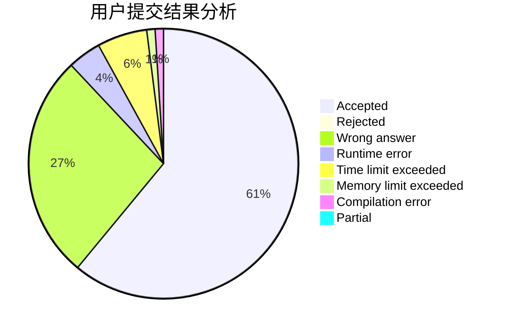
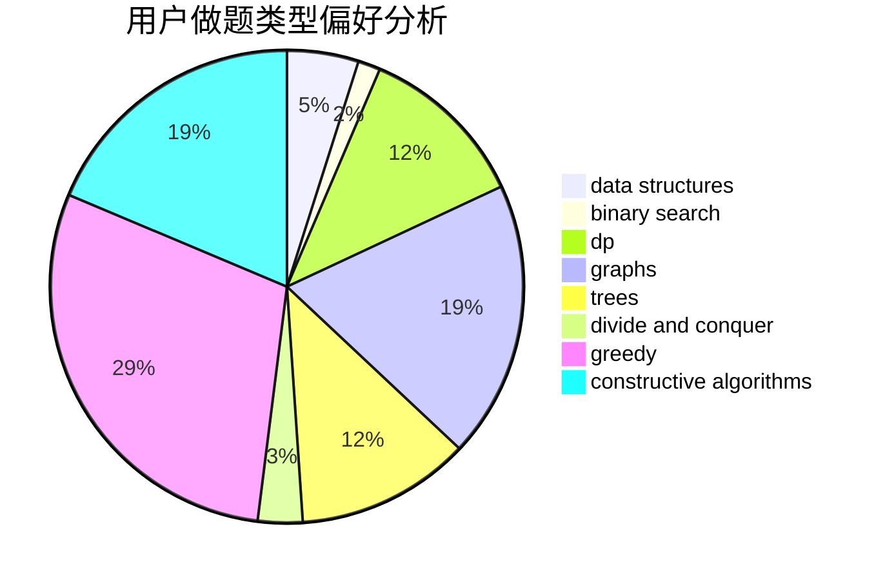
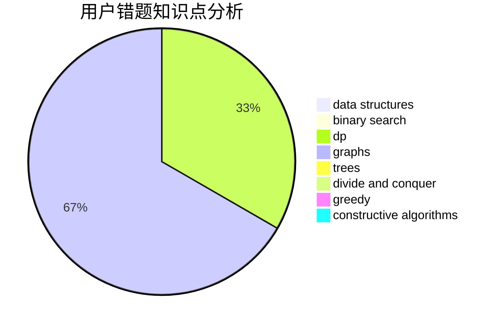

# dingdingsb

<!-- tabs:start -->

#### **用户提交结果分析**

#### **用户做题类型偏好分析**

#### **用户错题知识点分析**

<!-- tabs:end -->
# 推荐题目
[125A](https://codeforces.com/contest/125/problem/A)		math		  
[108C](https://codeforces.com/contest/108/problem/C)		dsu,graphs,sortings,trees		  
[777C](https://codeforces.com/contest/777/problem/C)		binary search,
                        data structures,
                        dp,
                        greedy,
                        implementation,
                        two pointers		  
[460E](https://codeforces.com/contest/460/problem/E)		brute force,
                        geometry,
                        math,
                        sortings		  
[1172C1](https://codeforces.com/contest/1172C/problem/1)		dp,
                        probabilities		  
[674G](https://codeforces.com/contest/674/problem/G)		dsu,graphs,sortings,trees		  
[33C](https://codeforces.com/contest/33/problem/C)		greedy		  
[938E](https://codeforces.com/contest/938/problem/E)		combinatorics,
                        math		  
[698A](https://codeforces.com/contest/698/problem/A)		dp		  
[1330A](https://codeforces.com/contest/1330/problem/A)		implementation		  
