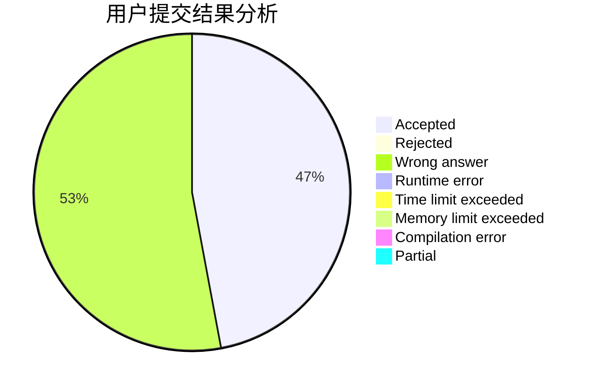
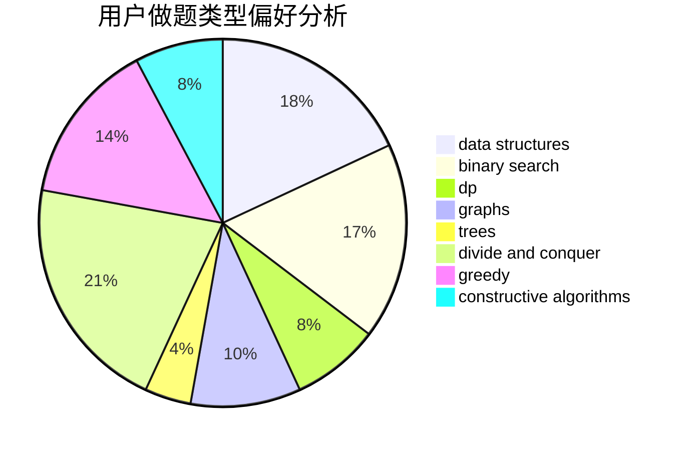
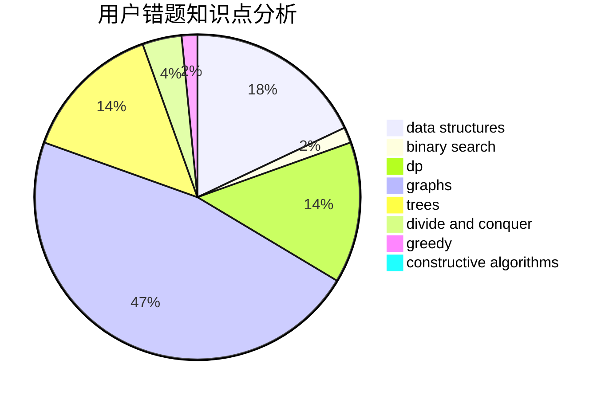

# dingning

<!-- tabs:start -->

#### **用户提交结果分析**

#### **用户做题类型偏好分析**

#### **用户错题知识点分析**

<!-- tabs:end -->
# 推荐题目
[1406C](https://codeforces.com/contest/1406/problem/C)		constructive algorithms,
                        dfs and similar,
                        graphs,
                        trees		  
[863A](https://codeforces.com/contest/863/problem/A)		brute force,
                        implementation		  
[266D](https://codeforces.com/contest/266/problem/D)		graphs,
                        math,
                        shortest paths		  
[299B](https://codeforces.com/contest/299/problem/B)		brute force,
                        implementation		  
[883G](https://codeforces.com/contest/883/problem/G)		dfs and similar,
                        graphs		  
[706E](https://codeforces.com/contest/706/problem/E)		data structures,
                        implementation		  
[704B](https://codeforces.com/contest/704/problem/B)		dp,
                        graphs,
                        greedy		  
[730E](https://codeforces.com/contest/730/problem/E)		greedy,
                        implementation		  
[547D](https://codeforces.com/contest/547/problem/D)		constructive algorithms,
                        dfs and similar,
                        graphs		  
[113B](https://codeforces.com/contest/113/problem/B)		brute force,
                        data structures,
                        hashing,
                        strings		  
