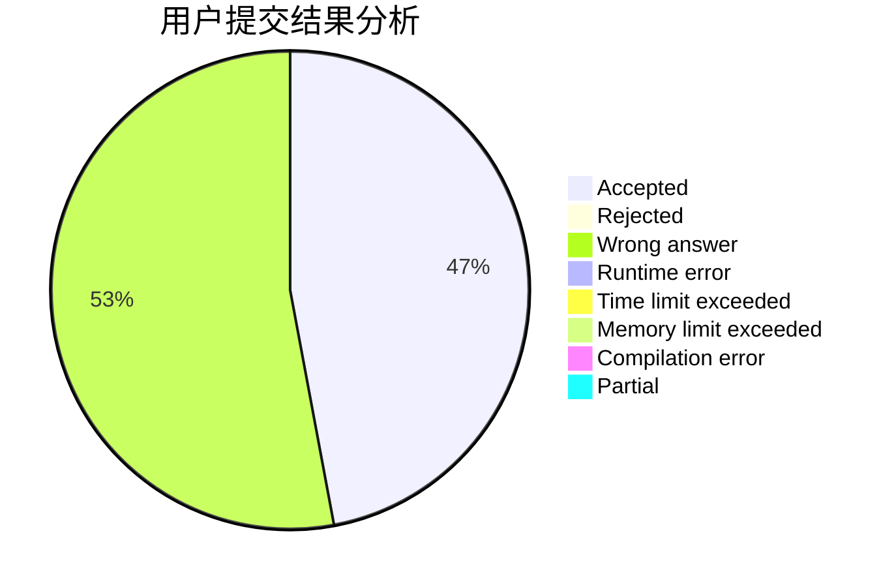
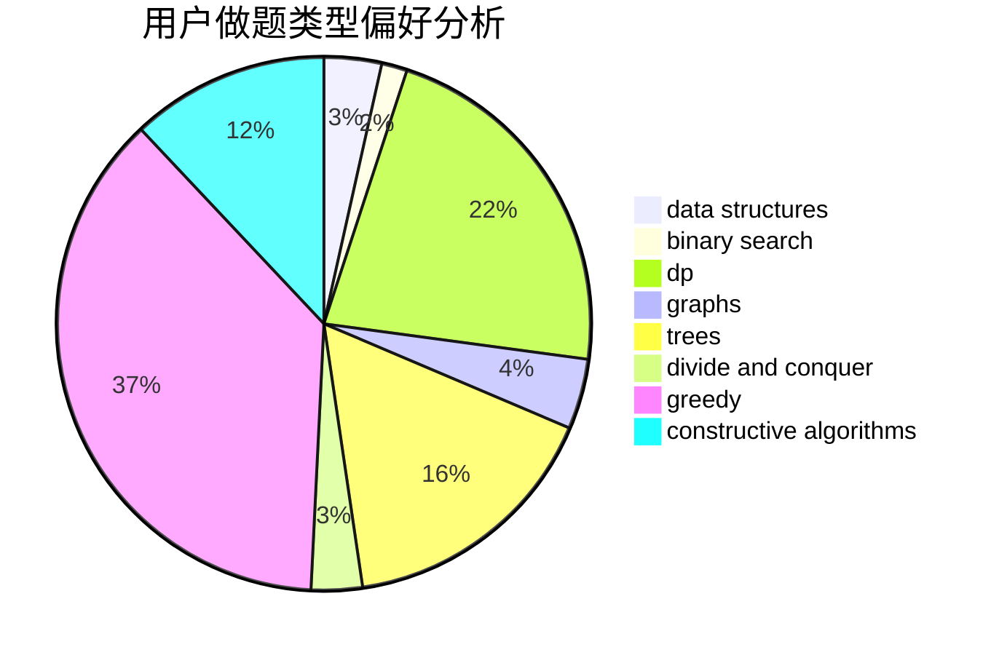
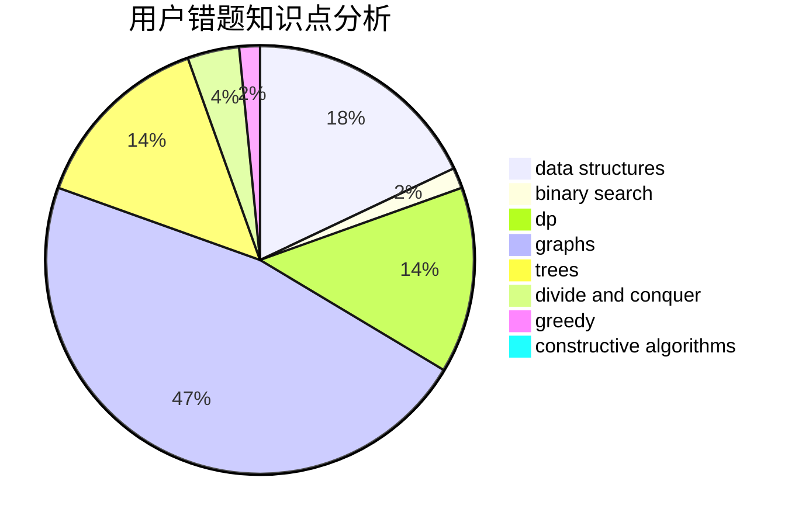

# dingning

<!-- tabs:start -->

#### **用户提交结果分析**

#### **用户做题类型偏好分析**

#### **用户错题知识点分析**

<!-- tabs:end -->
# 推荐题目
[1417C](https://codeforces.com/contest/1417/problem/C)		dsu,graphs,sortings,trees		  
[883C](https://codeforces.com/contest/883/problem/C)		binary search,
                        implementation		  
[282C](https://codeforces.com/contest/282/problem/C)		constructive algorithms,
                        implementation,
                        math		  
[3161](https://codeforces.com/contest/316/problem/1)		dsu,graphs,sortings,trees		  
[901A](https://codeforces.com/contest/901/problem/A)		constructive algorithms,
                        trees		  
[725B](https://codeforces.com/contest/725/problem/B)		implementation,
                        math		  
[723B](https://codeforces.com/contest/723/problem/B)		expression parsing,
                        implementation,
                        strings		  
[747E](https://codeforces.com/contest/747/problem/E)		dfs and similar,
                        expression parsing,
                        implementation,
                        strings		  
[572A](https://codeforces.com/contest/572/problem/A)		sortings		  
[1141B](https://codeforces.com/contest/1141/problem/B)		implementation		  
