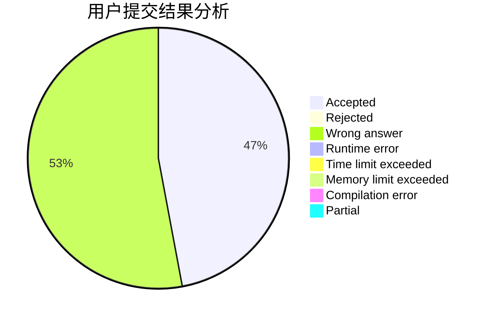
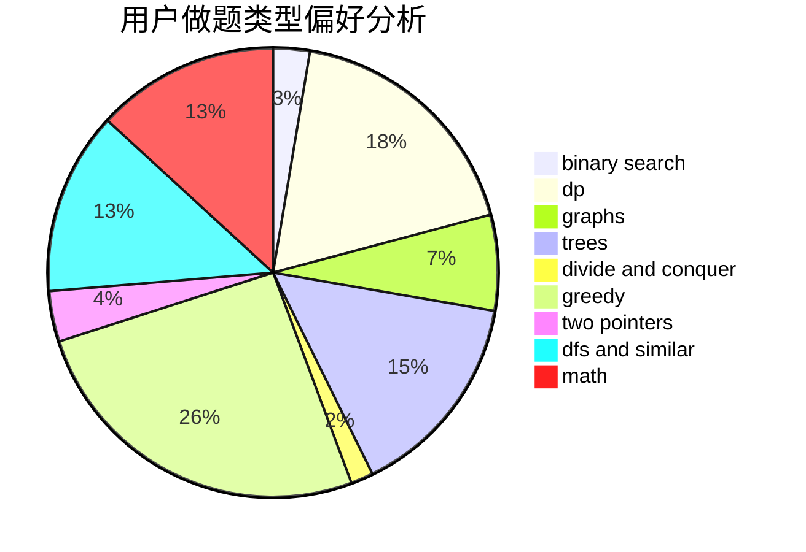

# dingning

<!-- tabs:start -->

#### **用户提交结果分析**

#### **用户做题类型偏好分析**

<!-- tabs:end -->
# 推荐题目
[1417C](https://codeforces.com/contest/1417/problem/C)
[883C](https://codeforces.com/contest/883/problem/C)
[282C](https://codeforces.com/contest/282/problem/C)
[3161](https://codeforces.com/contest/316/problem/1)
[901A](https://codeforces.com/contest/901/problem/A)
[725B](https://codeforces.com/contest/725/problem/B)
[723B](https://codeforces.com/contest/723/problem/B)
[747E](https://codeforces.com/contest/747/problem/E)
[572A](https://codeforces.com/contest/572/problem/A)
[1141B](https://codeforces.com/contest/1141/problem/B)
