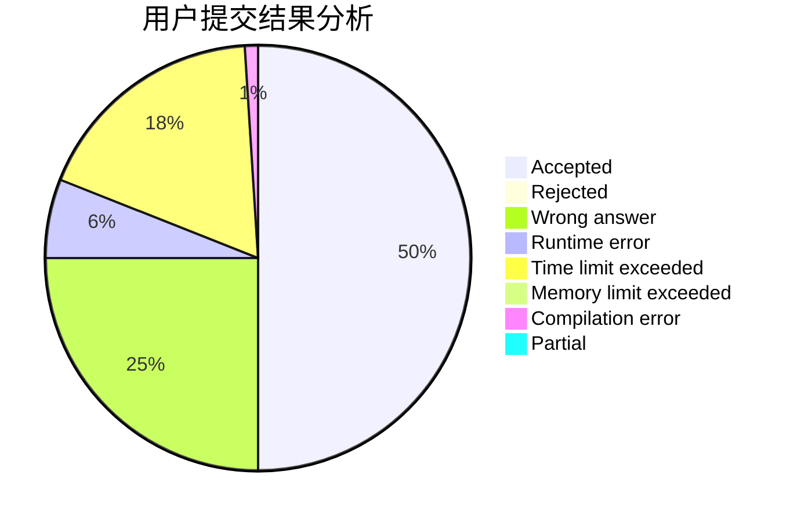
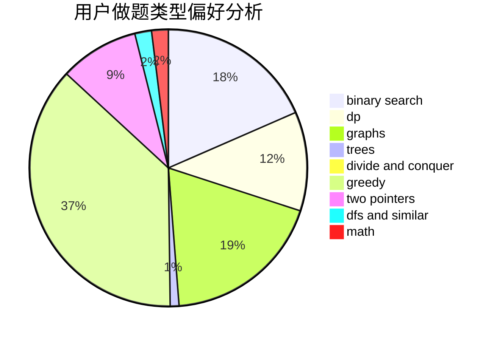

# disangan233

<!-- tabs:start -->

#### **用户提交结果分析**

#### **用户做题类型偏好分析**

<!-- tabs:end -->
# 推荐题目
[1298D](https://codeforces.com/contest/1298/problem/D)
[985E](https://codeforces.com/contest/985/problem/E)
[600F](https://codeforces.com/contest/600/problem/F)
[376A](https://codeforces.com/contest/376/problem/A)
[165A](https://codeforces.com/contest/165/problem/A)
[460B](https://codeforces.com/contest/460/problem/B)
[1219B](https://codeforces.com/contest/1219/problem/B)
[703D](https://codeforces.com/contest/703/problem/D)
[747F](https://codeforces.com/contest/747/problem/F)
[1417C](https://codeforces.com/contest/1417/problem/C)
