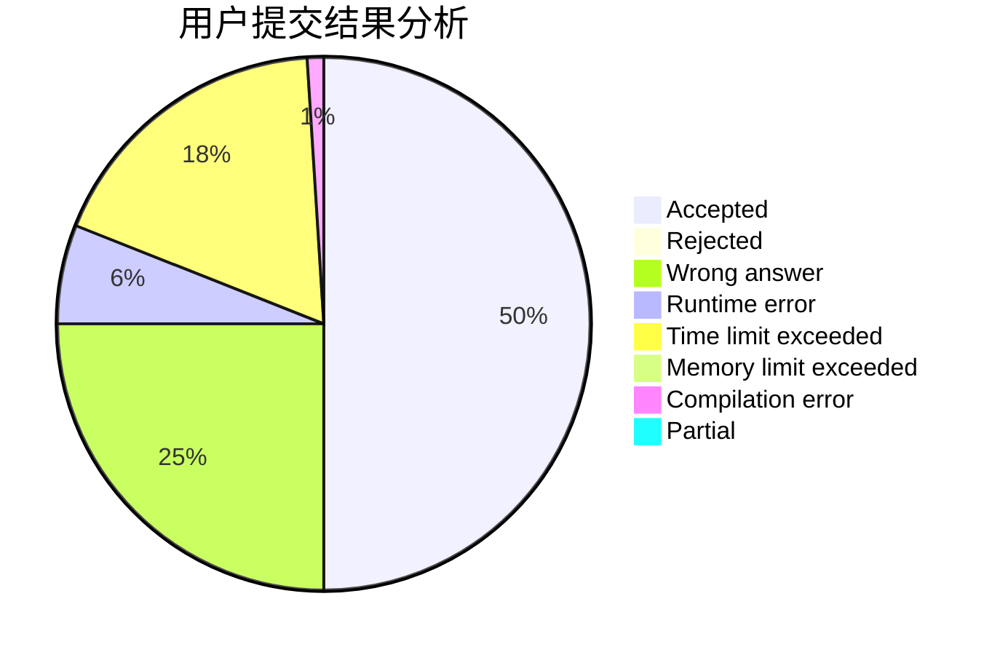
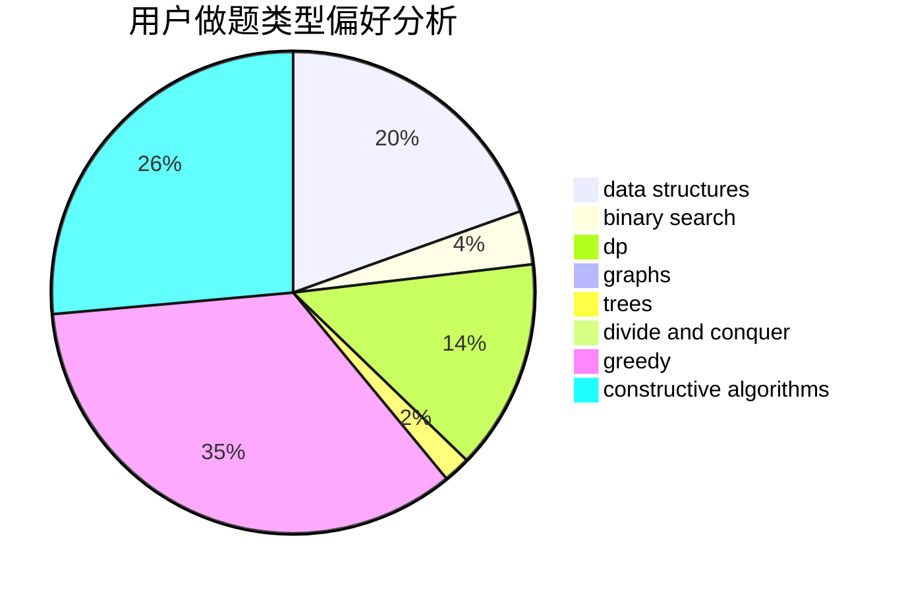
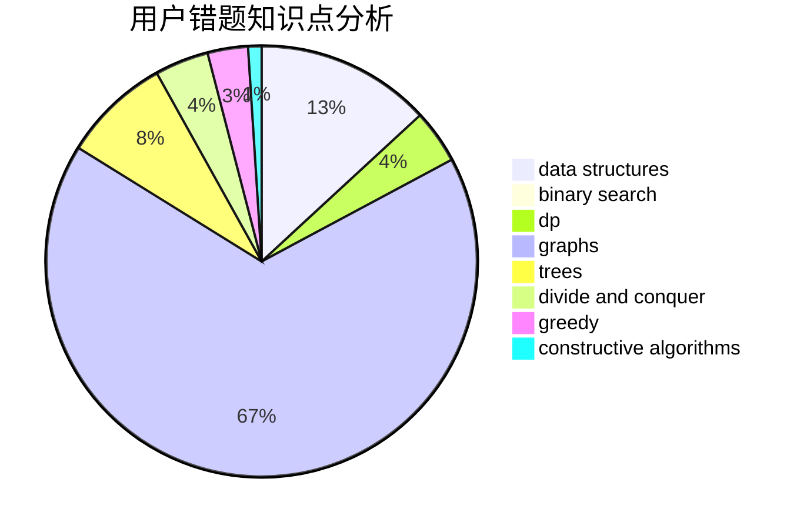

# disangan233

<!-- tabs:start -->

#### **用户提交结果分析**

#### **用户做题类型偏好分析**

#### **用户错题知识点分析**

<!-- tabs:end -->
# 推荐题目
[1291E](https://codeforces.com/contest/1291/problem/E)		dsu,graphs,sortings,trees		  
[962G](https://codeforces.com/contest/962/problem/G)		data structures,
                        dsu,
                        geometry,
                        trees		  
[580D](https://codeforces.com/contest/580/problem/D)		bitmasks,
                        dp		  
[349B](https://codeforces.com/contest/349/problem/B)		data structures,
                        dp,
                        greedy,
                        implementation		  
[1510E](https://codeforces.com/contest/1510/problem/E)		nan		  
[438D](https://codeforces.com/contest/438/problem/D)		data structures,
                        math		  
[1213G](https://codeforces.com/contest/1213/problem/G)		divide and conquer,
                        dsu,
                        graphs,
                        sortings,
                        trees		  
[67A](https://codeforces.com/contest/67/problem/A)		dp,
                        graphs,
                        greedy,
                        implementation		  
[730G](https://codeforces.com/contest/730/problem/G)		implementation		  
[1406C](https://codeforces.com/contest/1406/problem/C)		constructive algorithms,
                        dfs and similar,
                        graphs,
                        trees		  
