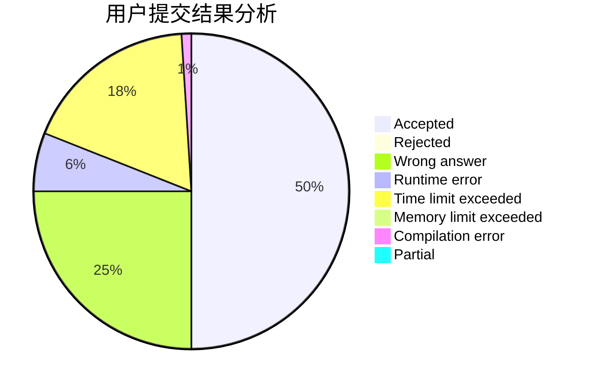
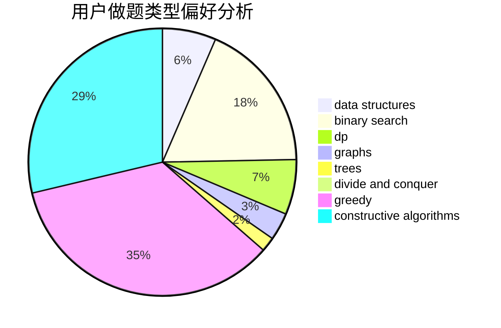
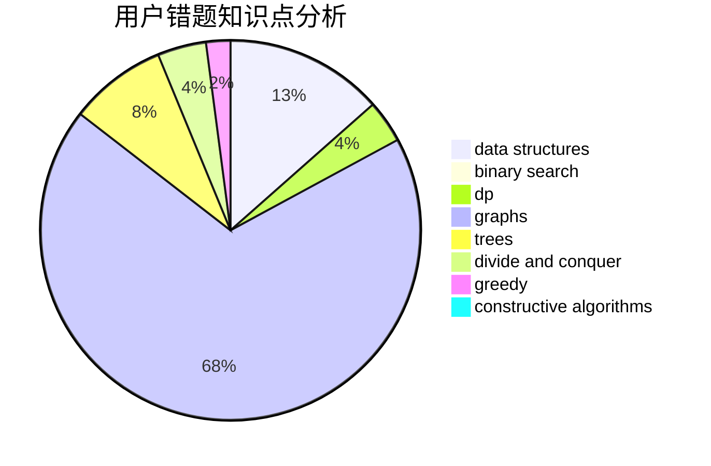

# disangan233

<!-- tabs:start -->

#### **用户提交结果分析**

#### **用户做题类型偏好分析**

#### **用户错题知识点分析**

<!-- tabs:end -->
# 推荐题目
[1298D](https://codeforces.com/contest/1298/problem/D)		dsu,graphs,sortings,trees		  
[985E](https://codeforces.com/contest/985/problem/E)		binary search,
                        data structures,
                        dp,
                        greedy,
                        two pointers		  
[600F](https://codeforces.com/contest/600/problem/F)		graphs		  
[376A](https://codeforces.com/contest/376/problem/A)		implementation,
                        math		  
[165A](https://codeforces.com/contest/165/problem/A)		implementation		  
[460B](https://codeforces.com/contest/460/problem/B)		brute force,
                        implementation,
                        math,
                        number theory		  
[1219B](https://codeforces.com/contest/1219/problem/B)		dsu,graphs,sortings,trees		  
[703D](https://codeforces.com/contest/703/problem/D)		data structures		  
[747F](https://codeforces.com/contest/747/problem/F)		brute force,
                        combinatorics,
                        dp,
                        math		  
[1417C](https://codeforces.com/contest/1417/problem/C)		dsu,graphs,sortings,trees		  
