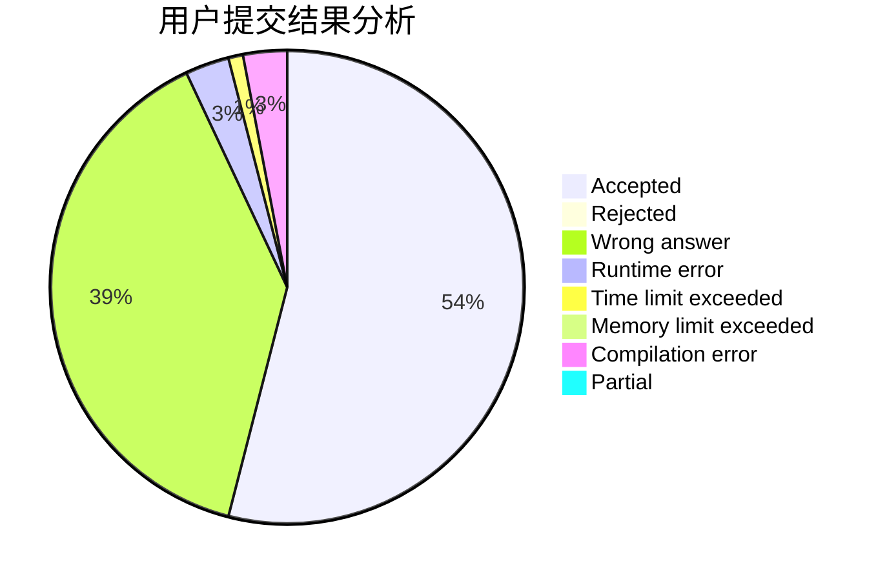
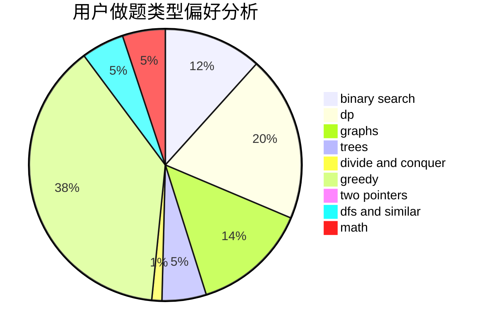

# djq_cpp

<!-- tabs:start -->

#### **用户提交结果分析**

#### **用户做题类型偏好分析**

<!-- tabs:end -->
# 推荐题目
[622F](https://codeforces.com/contest/622/problem/F)
[1191A](https://codeforces.com/contest/1191/problem/A)
[312A](https://codeforces.com/contest/312/problem/A)
[788B](https://codeforces.com/contest/788/problem/B)
[1215B](https://codeforces.com/contest/1215/problem/B)
[1065G](https://codeforces.com/contest/1065/problem/G)
[1310B](https://codeforces.com/contest/1310/problem/B)
[1030G](https://codeforces.com/contest/1030/problem/G)
[277D](https://codeforces.com/contest/277/problem/D)
[1013E](https://codeforces.com/contest/1013/problem/E)
