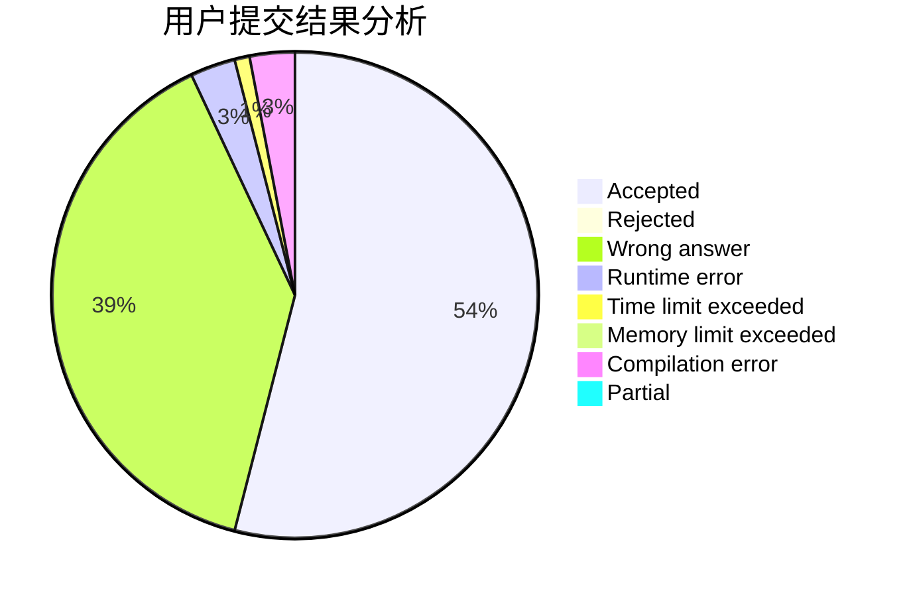
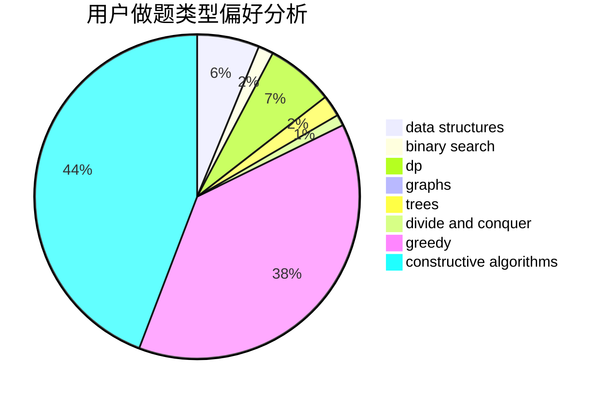
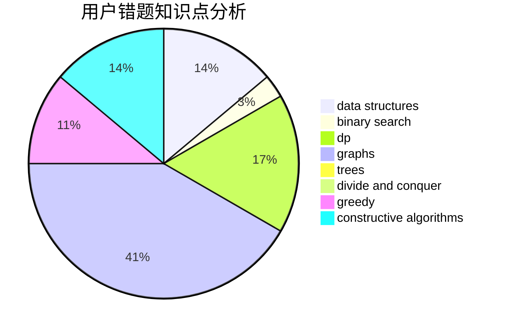

# djq_cpp

<!-- tabs:start -->

#### **用户提交结果分析**

#### **用户做题类型偏好分析**

#### **用户错题知识点分析**

<!-- tabs:end -->
# 推荐题目
[604C](https://codeforces.com/contest/604/problem/C)		dsu,graphs,sortings,trees		  
[1187D](https://codeforces.com/contest/1187/problem/D)		data structures,
                        sortings		  
[295C](https://codeforces.com/contest/295/problem/C)		combinatorics,
                        dp,
                        graphs,
                        shortest paths		  
[768C](https://codeforces.com/contest/768/problem/C)		brute force,
                        dp,
                        implementation,
                        sortings		  
[1209E2](https://codeforces.com/contest/1209E/problem/2)		bitmasks,
                        dp,
                        greedy,
                        sortings		  
[1065C](https://codeforces.com/contest/1065/problem/C)		greedy		  
[1300D](https://codeforces.com/contest/1300/problem/D)		dsu,graphs,sortings,trees		  
[1030C](https://codeforces.com/contest/1030/problem/C)		implementation		  
[25D](https://codeforces.com/contest/25/problem/D)		dsu,
                        graphs,
                        trees		  
[1013B](https://codeforces.com/contest/1013/problem/B)		greedy		  
