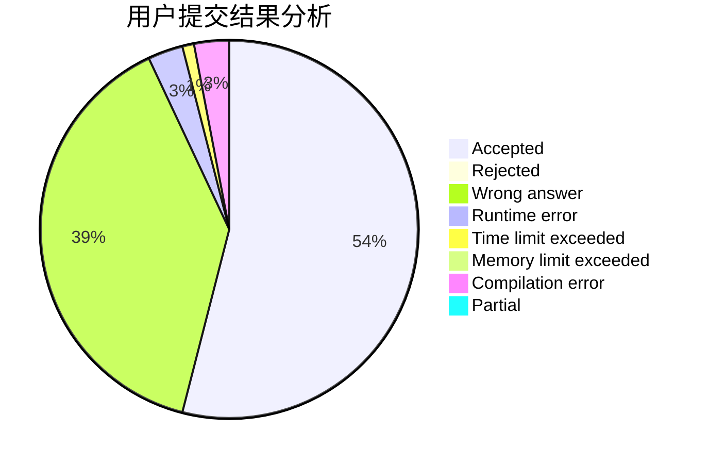
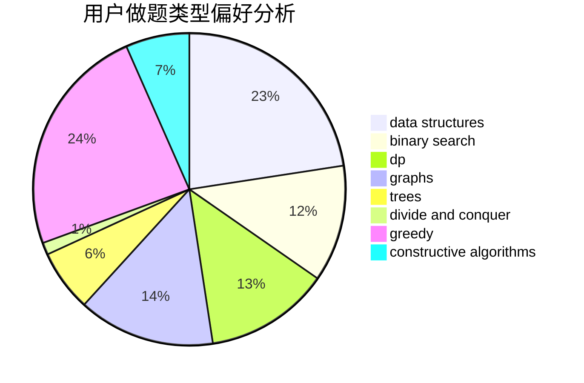
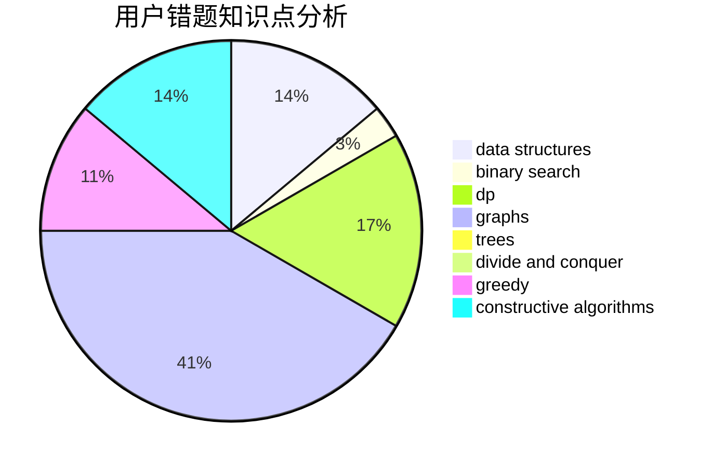

# djq_cpp

<!-- tabs:start -->

#### **用户提交结果分析**

#### **用户做题类型偏好分析**

#### **用户错题知识点分析**

<!-- tabs:end -->
# 推荐题目
[622F](https://codeforces.com/contest/622/problem/F)		math		  
[1191A](https://codeforces.com/contest/1191/problem/A)		brute force		  
[312A](https://codeforces.com/contest/312/problem/A)		implementation,
                        strings		  
[788B](https://codeforces.com/contest/788/problem/B)		combinatorics,
                        constructive algorithms,
                        dfs and similar,
                        dsu,
                        graphs		  
[1215B](https://codeforces.com/contest/1215/problem/B)		combinatorics,
                        dp,
                        implementation		  
[1065G](https://codeforces.com/contest/1065/problem/G)		strings		  
[1310B](https://codeforces.com/contest/1310/problem/B)		dp,
                        implementation		  
[1030G](https://codeforces.com/contest/1030/problem/G)		number theory		  
[277D](https://codeforces.com/contest/277/problem/D)		dp,
                        probabilities		  
[1013E](https://codeforces.com/contest/1013/problem/E)		dsu,graphs,sortings,trees		  
