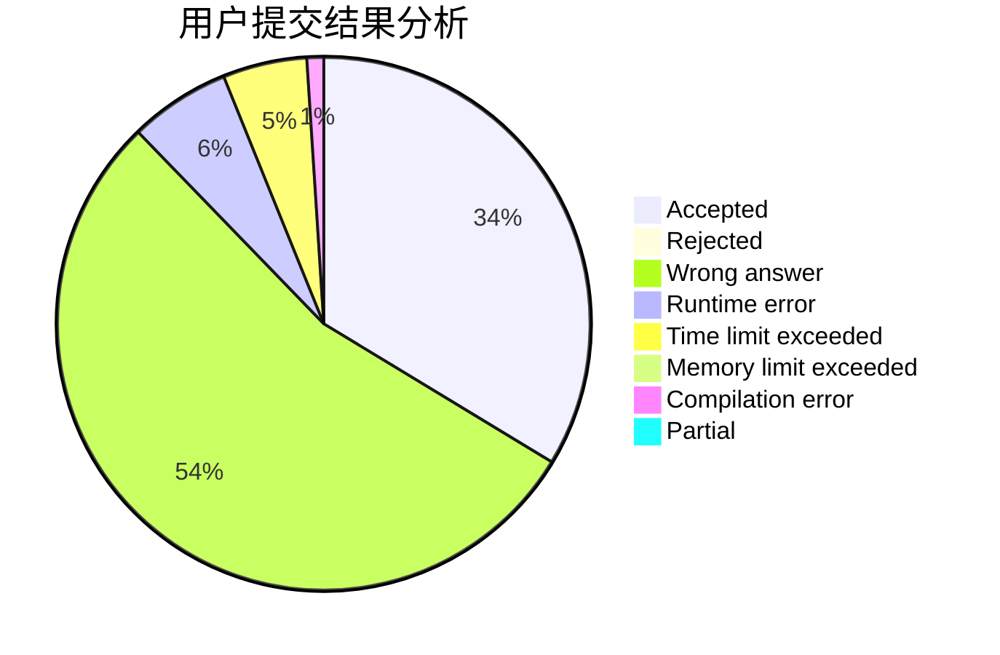
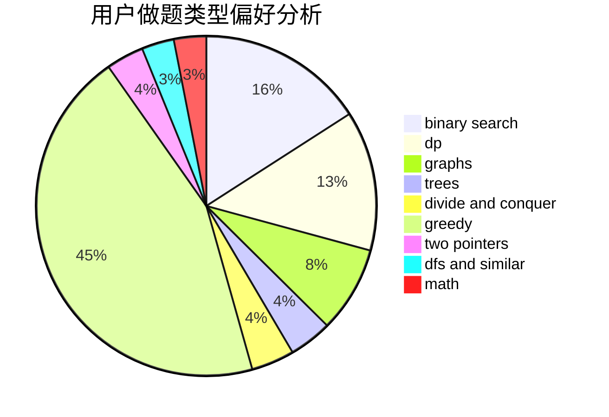

# djq_fpc

<!-- tabs:start -->

#### **用户提交结果分析**

#### **用户做题类型偏好分析**

<!-- tabs:end -->
# 推荐题目
[20A](https://codeforces.com/contest/20/problem/A)
[1179B](https://codeforces.com/contest/1179/problem/B)
[284E](https://codeforces.com/contest/284/problem/E)
[977D](https://codeforces.com/contest/977/problem/D)
[354D](https://codeforces.com/contest/354/problem/D)
[883A](https://codeforces.com/contest/883/problem/A)
[669A](https://codeforces.com/contest/669/problem/A)
[13B](https://codeforces.com/contest/13/problem/B)
[335A](https://codeforces.com/contest/335/problem/A)
[1334E](https://codeforces.com/contest/1334/problem/E)
