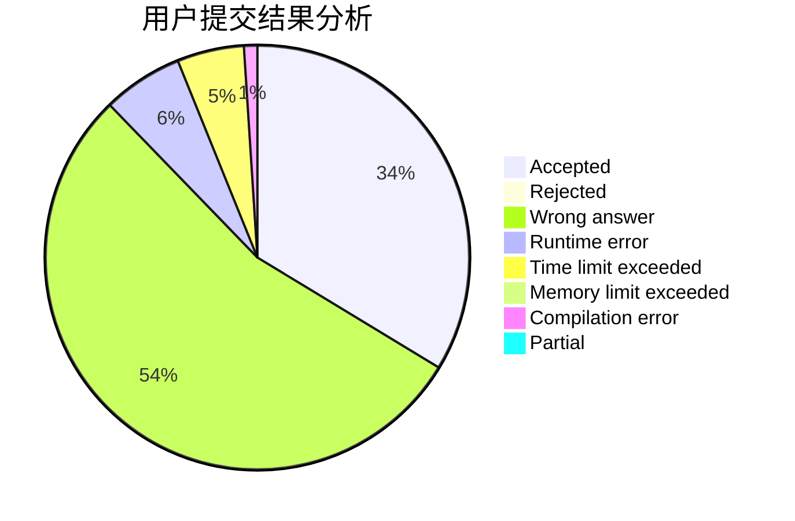
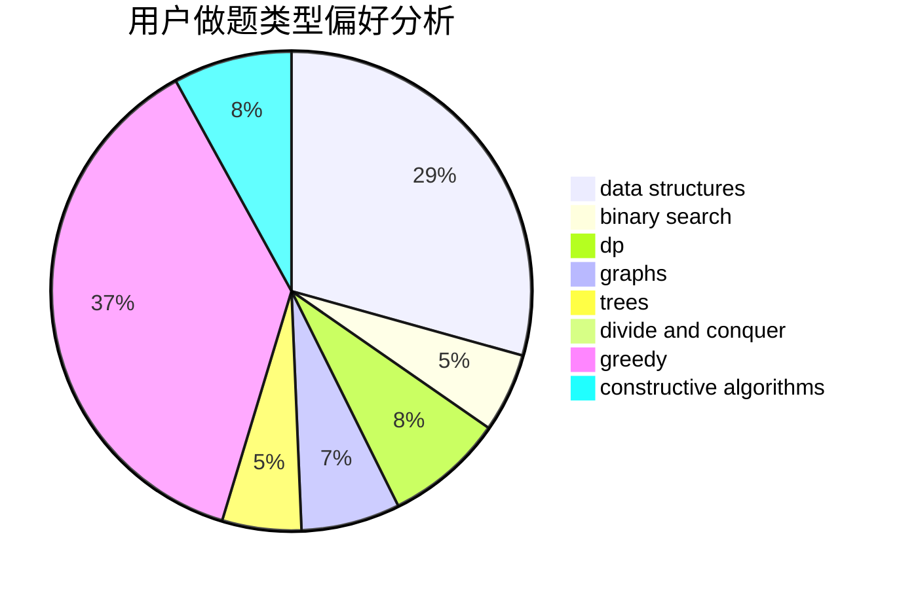

# djq_fpc

<!-- tabs:start -->

#### **用户提交结果分析**

#### **用户做题类型偏好分析**

#### **用户错题知识点分析**

<!-- tabs:end -->
# 推荐题目
[20A](https://codeforces.com/contest/20/problem/A)		implementation		  
[1179B](https://codeforces.com/contest/1179/problem/B)		constructive algorithms		  
[284E](https://codeforces.com/contest/284/problem/E)		dsu,graphs,sortings,trees		  
[977D](https://codeforces.com/contest/977/problem/D)		dfs and similar,
                        math,
                        sortings		  
[354D](https://codeforces.com/contest/354/problem/D)		dp		  
[883A](https://codeforces.com/contest/883/problem/A)		implementation		  
[669A](https://codeforces.com/contest/669/problem/A)		math		  
[13B](https://codeforces.com/contest/13/problem/B)		geometry,
                        implementation		  
[335A](https://codeforces.com/contest/335/problem/A)		binary search,
                        constructive algorithms,
                        greedy		  
[1334E](https://codeforces.com/contest/1334/problem/E)		combinatorics,
                        graphs,
                        greedy,
                        math,
                        number theory		  
