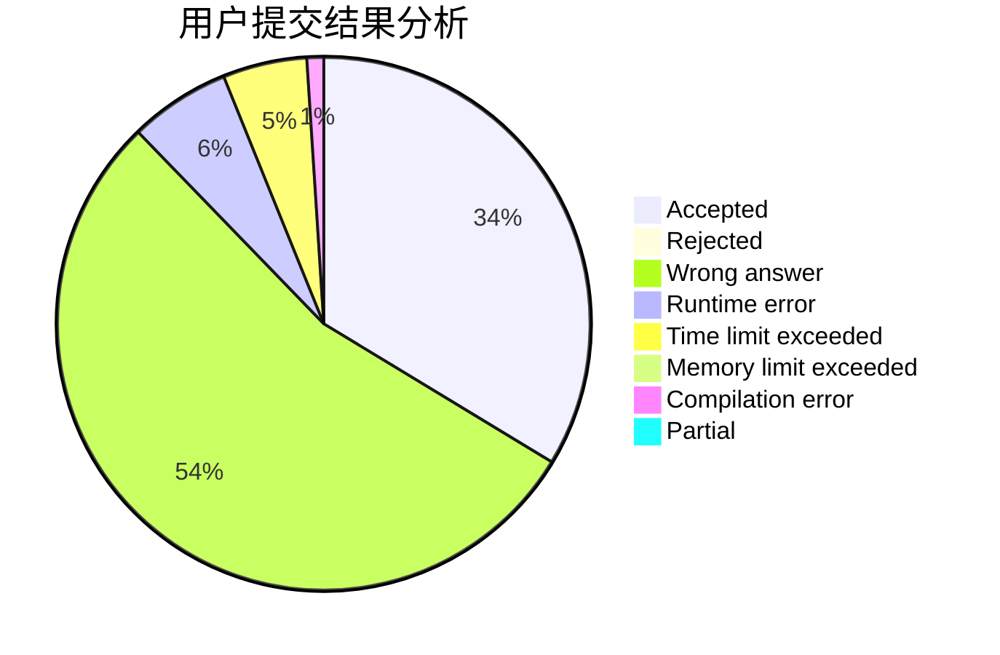
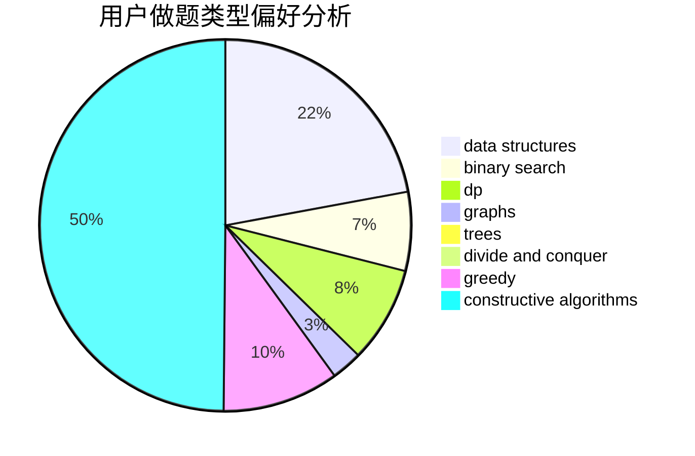

# djq_fpc

<!-- tabs:start -->

#### **用户提交结果分析**

#### **用户做题类型偏好分析**

#### **用户错题知识点分析**

<!-- tabs:end -->
# 推荐题目
[183D](https://codeforces.com/contest/183/problem/D)		dp,
                        greedy,
                        probabilities		  
[1176A](https://codeforces.com/contest/1176/problem/A)		brute force,
                        greedy,
                        implementation		  
[269B](https://codeforces.com/contest/269/problem/B)		dp		  
[955D](https://codeforces.com/contest/955/problem/D)		brute force,
                        strings		  
[325C](https://codeforces.com/contest/325/problem/C)		dfs and similar,
                        graphs,
                        shortest paths		  
[862D](https://codeforces.com/contest/862/problem/D)		binary search,
                        divide and conquer,
                        interactive		  
[639D](https://codeforces.com/contest/639/problem/D)		data structures,
                        greedy,
                        sortings,
                        two pointers		  
[1391E](https://codeforces.com/contest/1391/problem/E)		constructive algorithms,
                        dfs and similar,
                        graphs,
                        greedy,
                        trees		  
[311D](https://codeforces.com/contest/311/problem/D)		data structures,
                        math		  
[1328B](https://codeforces.com/contest/1328/problem/B)		binary search,
                        brute force,
                        combinatorics,
                        implementation,
                        math		  
