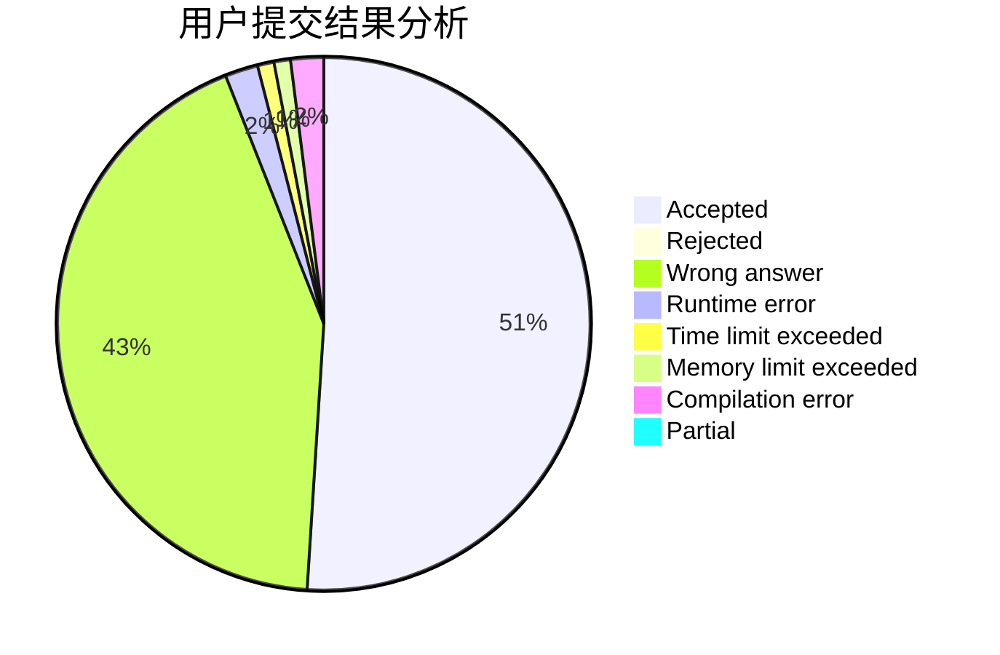
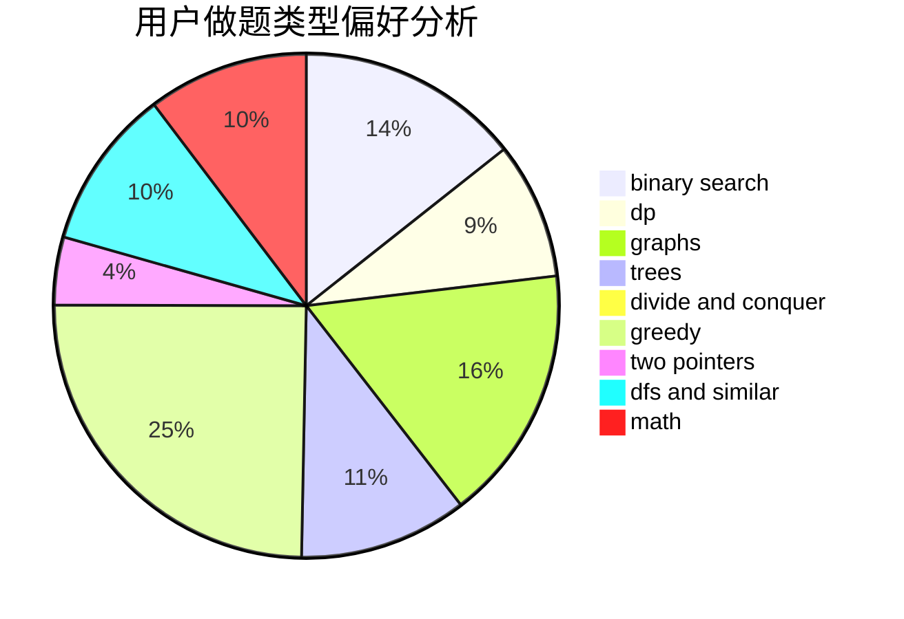

# dna049

<!-- tabs:start -->

#### **用户提交结果分析**

#### **用户做题类型偏好分析**

<!-- tabs:end -->
# 推荐题目
[1260F](https://codeforces.com/contest/1260/problem/F)
[1013E](https://codeforces.com/contest/1013/problem/E)
[724C](https://codeforces.com/contest/724/problem/C)
[44C](https://codeforces.com/contest/44/problem/C)
[877B](https://codeforces.com/contest/877/problem/B)
[136B](https://codeforces.com/contest/136/problem/B)
[843D](https://codeforces.com/contest/843/problem/D)
[1044A](https://codeforces.com/contest/1044/problem/A)
[241E](https://codeforces.com/contest/241/problem/E)
[741A](https://codeforces.com/contest/741/problem/A)
