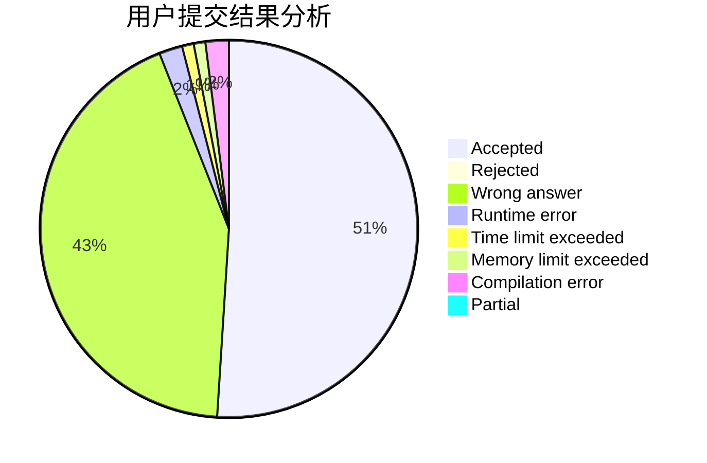
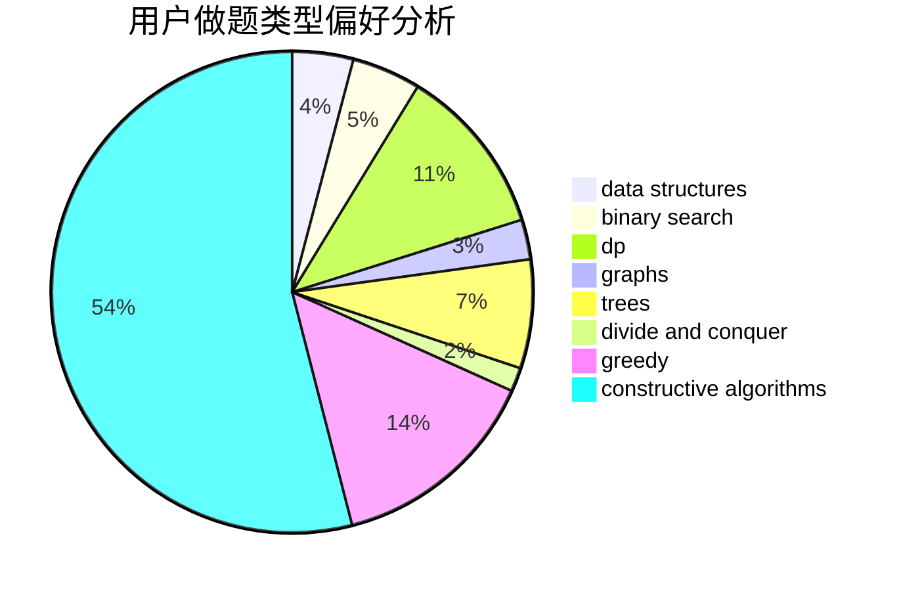
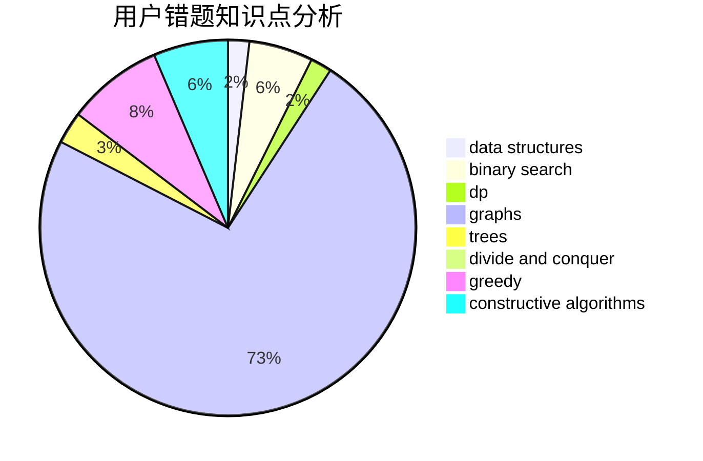

# dna049

<!-- tabs:start -->

#### **用户提交结果分析**

#### **用户做题类型偏好分析**

#### **用户错题知识点分析**

<!-- tabs:end -->
# 推荐题目
[1260F](https://codeforces.com/contest/1260/problem/F)		data structures,
                        trees		  
[1013E](https://codeforces.com/contest/1013/problem/E)		dsu,graphs,sortings,trees		  
[724C](https://codeforces.com/contest/724/problem/C)		greedy,
                        hashing,
                        implementation,
                        math,
                        number theory,
                        sortings		  
[44C](https://codeforces.com/contest/44/problem/C)		implementation		  
[877B](https://codeforces.com/contest/877/problem/B)		brute force,
                        dp		  
[136B](https://codeforces.com/contest/136/problem/B)		implementation,
                        math		  
[843D](https://codeforces.com/contest/843/problem/D)		graphs,
                        shortest paths		  
[1044A](https://codeforces.com/contest/1044/problem/A)		binary search,
                        two pointers		  
[241E](https://codeforces.com/contest/241/problem/E)		graphs,
                        shortest paths		  
[741A](https://codeforces.com/contest/741/problem/A)		dfs and similar,
                        math		  
