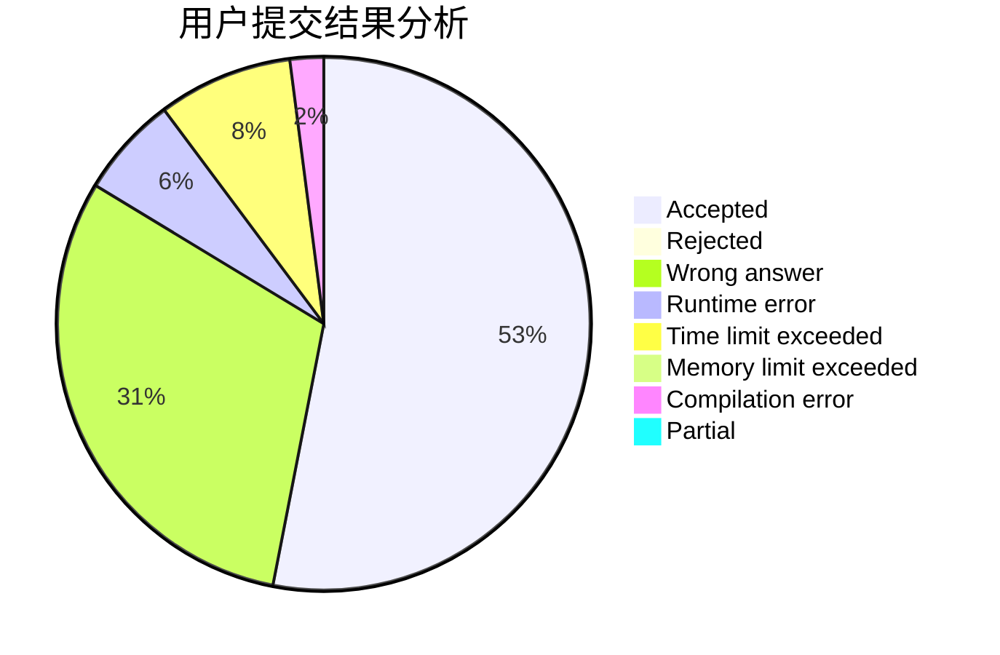
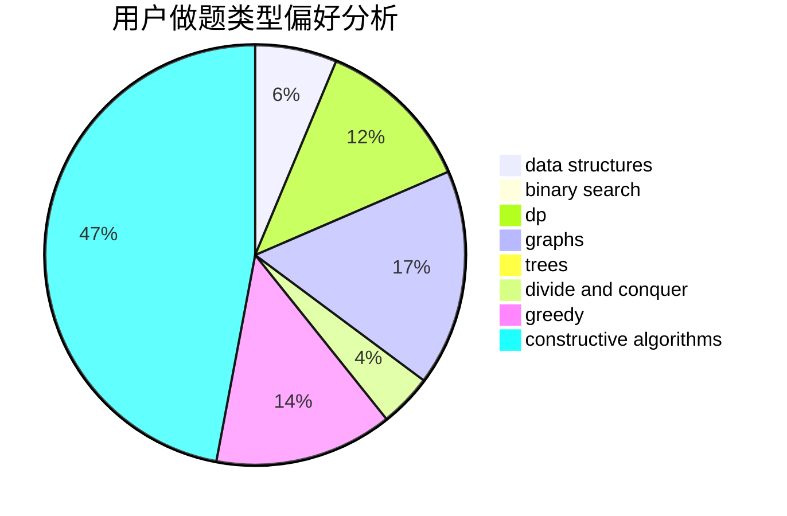
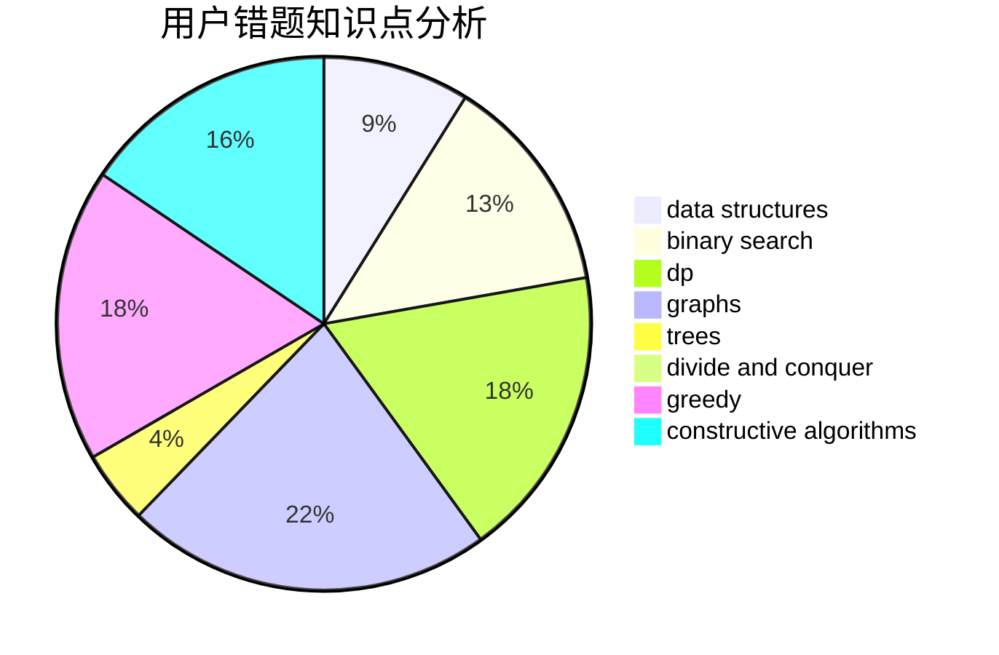

# dntkm

<!-- tabs:start -->

#### **用户提交结果分析**

#### **用户做题类型偏好分析**

#### **用户错题知识点分析**

<!-- tabs:end -->
# 推荐题目
[789D](https://codeforces.com/contest/789/problem/D)		dsu,graphs,sortings,trees		  
[438B](https://codeforces.com/contest/438/problem/B)		dsu,graphs,sortings,trees		  
[446E](https://codeforces.com/contest/446/problem/E)		math,
                        matrices		  
[1310C](https://codeforces.com/contest/1310/problem/C)		binary search,
                        dp,
                        strings		  
[479B](https://codeforces.com/contest/479/problem/B)		brute force,
                        constructive algorithms,
                        greedy,
                        implementation,
                        sortings		  
[1138C](https://codeforces.com/contest/1138/problem/C)		dsu,graphs,sortings,trees		  
[1508C](https://codeforces.com/contest/1508/problem/C)		data structures,
                        dfs and similar,
                        dsu,
                        graphs,
                        greedy,
                        math		  
[415A](https://codeforces.com/contest/415/problem/A)		implementation		  
[754D](https://codeforces.com/contest/754/problem/D)		binary search,
                        data structures,
                        greedy,
                        sortings		  
[653B](https://codeforces.com/contest/653/problem/B)		brute force,
                        dfs and similar,
                        dp,
                        strings		  
