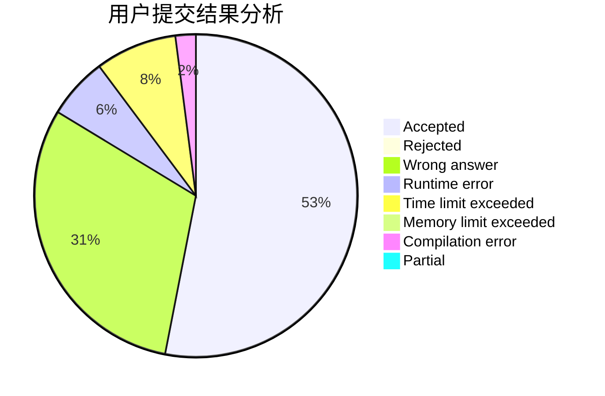
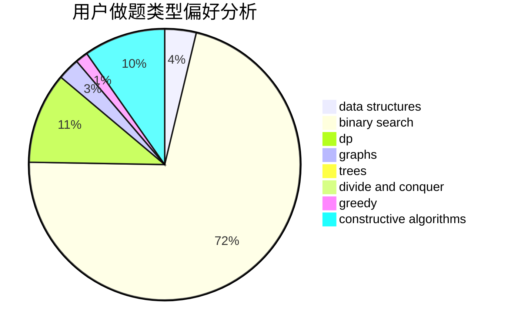
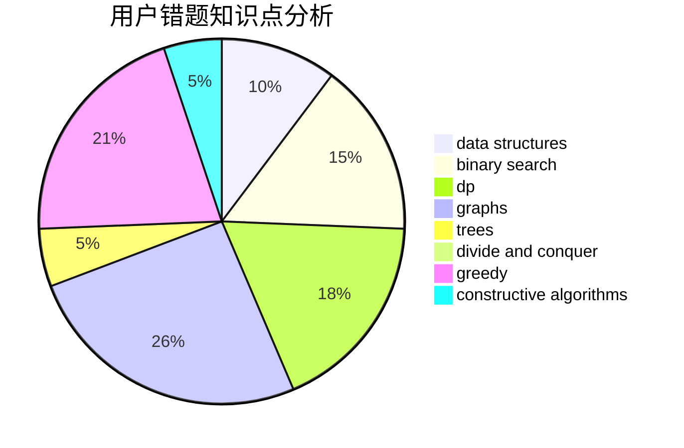

# dntkm

<!-- tabs:start -->

#### **用户提交结果分析**

#### **用户做题类型偏好分析**

#### **用户错题知识点分析**

<!-- tabs:end -->
# 推荐题目
[804F](https://codeforces.com/contest/804/problem/F)		combinatorics,
                        dfs and similar,
                        dp,
                        graphs,
                        number theory		  
[45G](https://codeforces.com/contest/45/problem/G)		number theory		  
[467A](https://codeforces.com/contest/467/problem/A)		implementation		  
[1316F](https://codeforces.com/contest/1316/problem/F)		data structures,
                        divide and conquer,
                        probabilities		  
[49A](https://codeforces.com/contest/49/problem/A)		implementation		  
[1140A](https://codeforces.com/contest/1140/problem/A)		implementation		  
[15A](https://codeforces.com/contest/15/problem/A)		implementation,
                        sortings		  
[43E](https://codeforces.com/contest/43/problem/E)		brute force,
                        implementation,
                        two pointers		  
[772E](https://codeforces.com/contest/772/problem/E)		binary search,
                        divide and conquer,
                        interactive,
                        trees		  
[677B](https://codeforces.com/contest/677/problem/B)		implementation,
                        math		  
