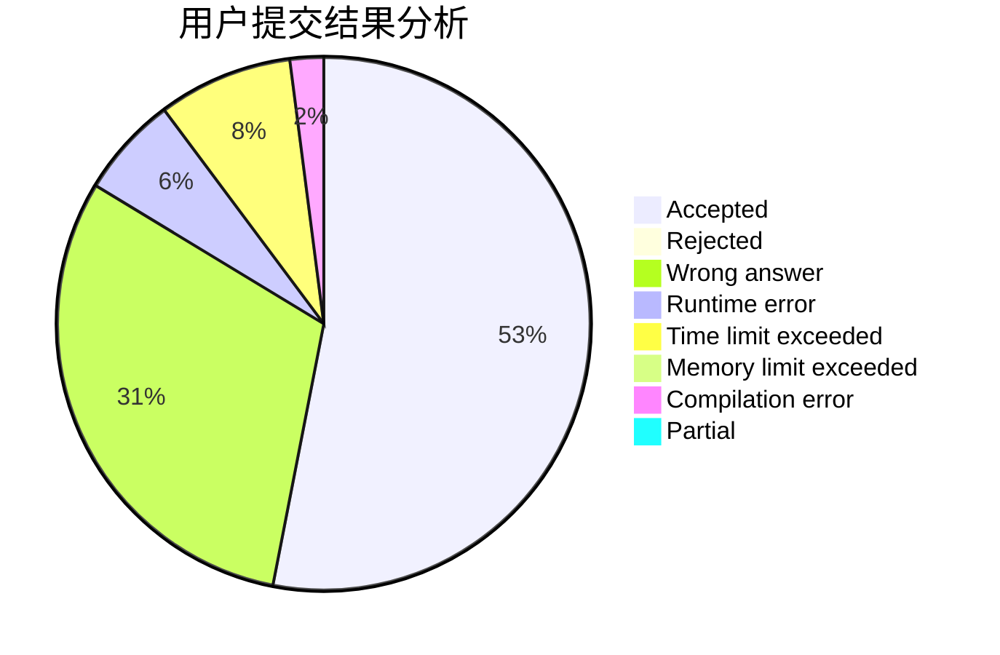
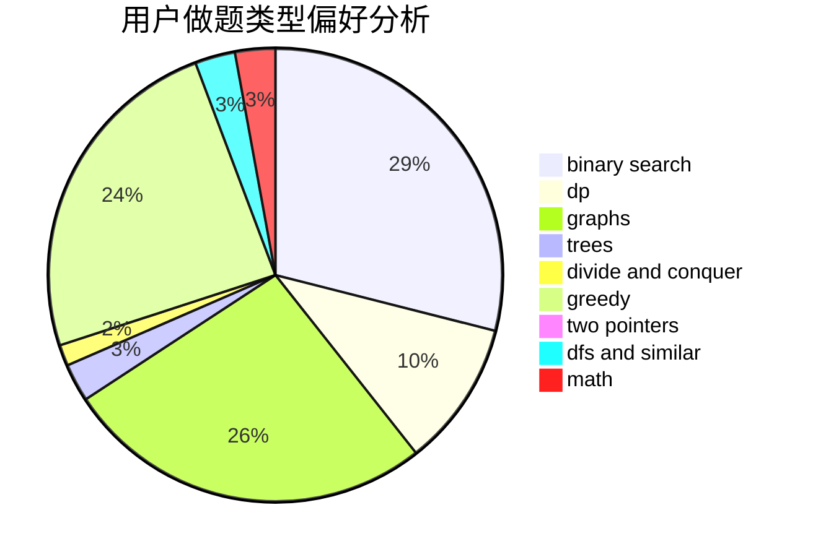

# dntkm

<!-- tabs:start -->

#### **用户提交结果分析**

#### **用户做题类型偏好分析**

<!-- tabs:end -->
# 推荐题目
[804F](https://codeforces.com/contest/804/problem/F)
[45G](https://codeforces.com/contest/45/problem/G)
[467A](https://codeforces.com/contest/467/problem/A)
[1316F](https://codeforces.com/contest/1316/problem/F)
[49A](https://codeforces.com/contest/49/problem/A)
[1140A](https://codeforces.com/contest/1140/problem/A)
[15A](https://codeforces.com/contest/15/problem/A)
[43E](https://codeforces.com/contest/43/problem/E)
[772E](https://codeforces.com/contest/772/problem/E)
[677B](https://codeforces.com/contest/677/problem/B)
