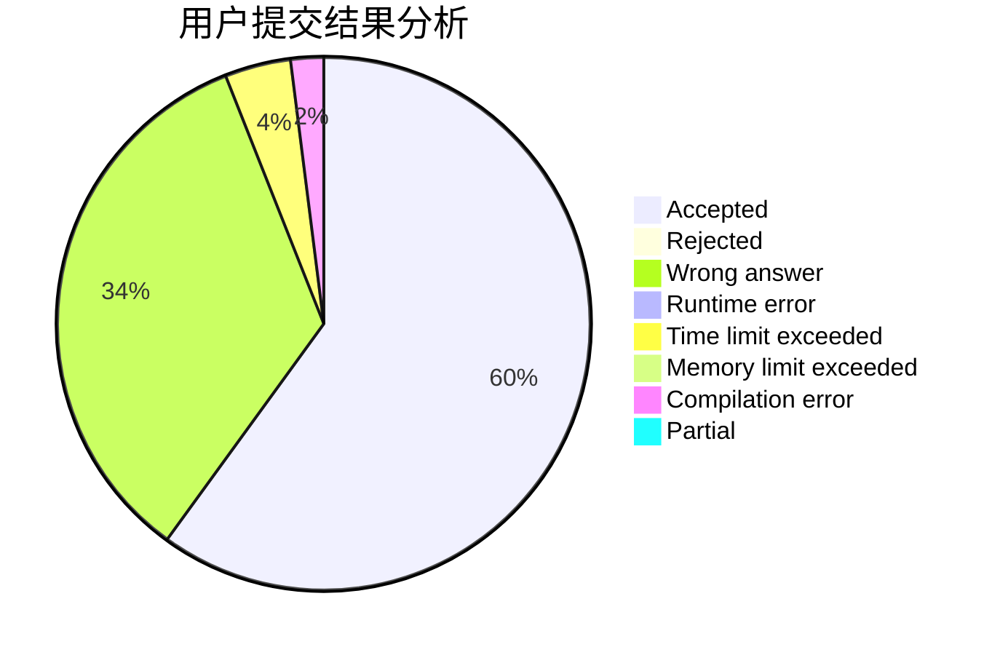
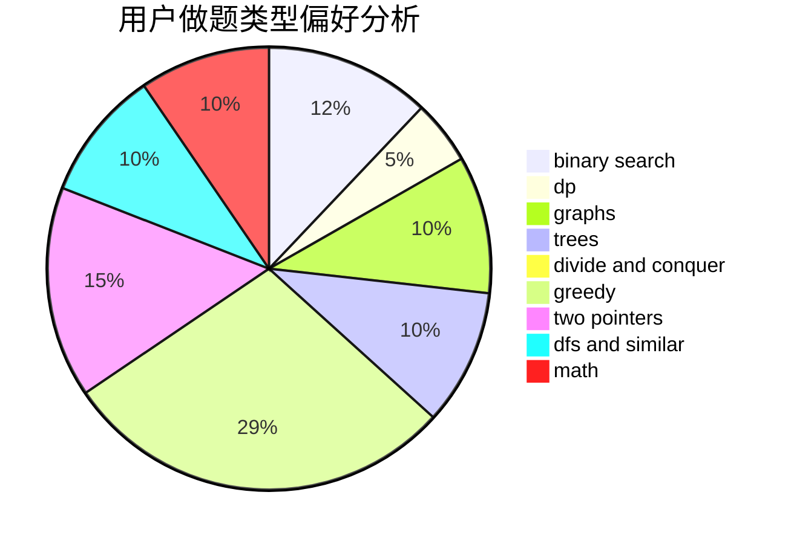

# do_loop

<!-- tabs:start -->

#### **用户提交结果分析**

#### **用户做题类型偏好分析**

<!-- tabs:end -->
# 推荐题目
[784C](https://codeforces.com/contest/784/problem/C)
[1148B](https://codeforces.com/contest/1148/problem/B)
[652F](https://codeforces.com/contest/652/problem/F)
[505A](https://codeforces.com/contest/505/problem/A)
[954I](https://codeforces.com/contest/954/problem/I)
[1100D](https://codeforces.com/contest/1100/problem/D)
[725E](https://codeforces.com/contest/725/problem/E)
[811C](https://codeforces.com/contest/811/problem/C)
[498B](https://codeforces.com/contest/498/problem/B)
[1303A](https://codeforces.com/contest/1303/problem/A)
