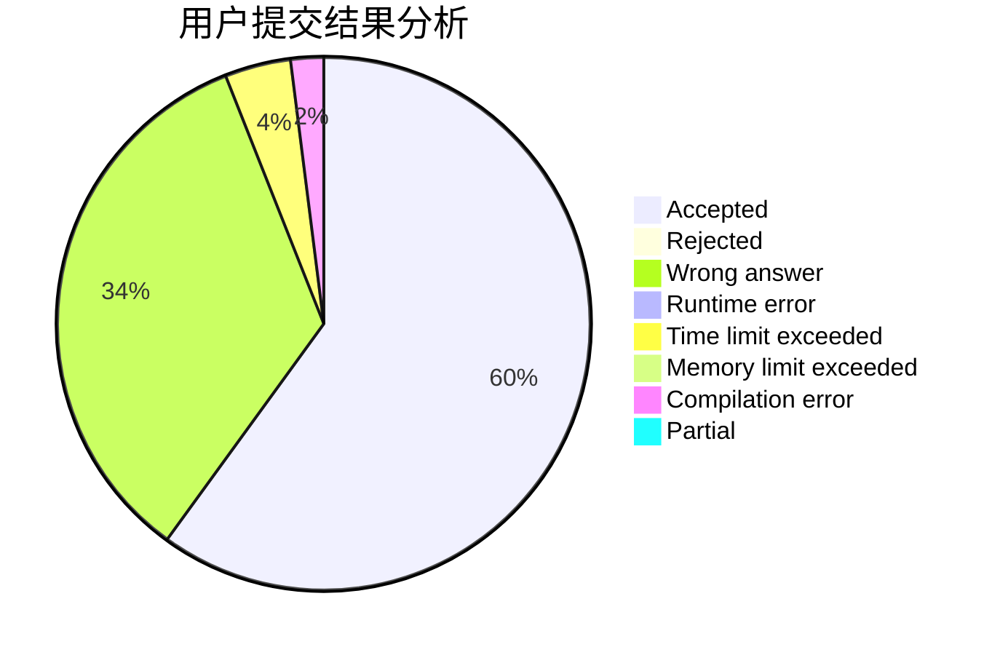
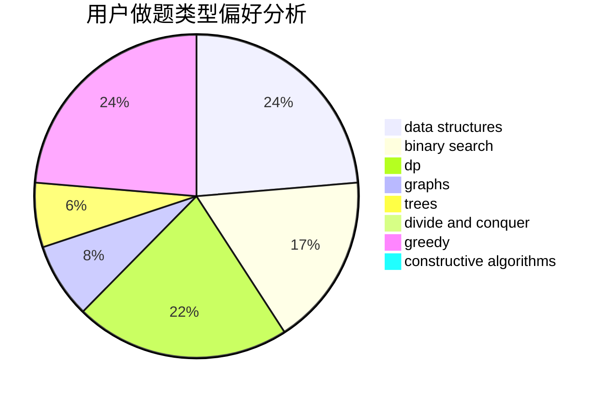
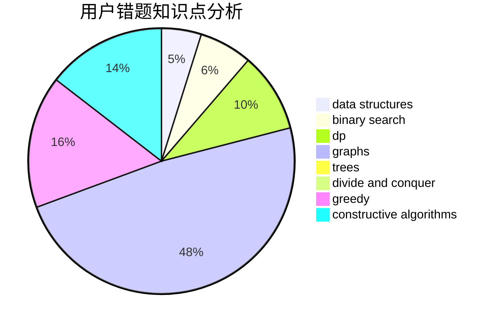

# do_loop

<!-- tabs:start -->

#### **用户提交结果分析**

#### **用户做题类型偏好分析**

#### **用户错题知识点分析**

<!-- tabs:end -->
# 推荐题目
[784C](https://codeforces.com/contest/784/problem/C)		*special problem,
                        implementation		  
[1148B](https://codeforces.com/contest/1148/problem/B)		binary search,
                        brute force,
                        two pointers		  
[652F](https://codeforces.com/contest/652/problem/F)		constructive algorithms,
                        math		  
[505A](https://codeforces.com/contest/505/problem/A)		brute force,
                        implementation,
                        strings		  
[954I](https://codeforces.com/contest/954/problem/I)		fft,
                        math		  
[1100D](https://codeforces.com/contest/1100/problem/D)		constructive algorithms,
                        games,
                        interactive		  
[725E](https://codeforces.com/contest/725/problem/E)		brute force,
                        greedy		  
[811C](https://codeforces.com/contest/811/problem/C)		dp,
                        implementation		  
[498B](https://codeforces.com/contest/498/problem/B)		dp,
                        probabilities,
                        two pointers		  
[1303A](https://codeforces.com/contest/1303/problem/A)		implementation,
                        strings		  
