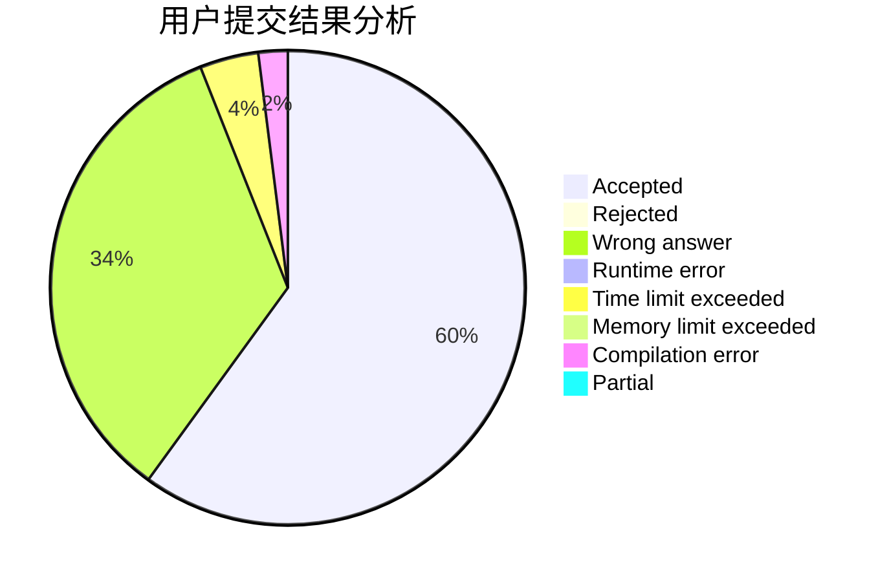
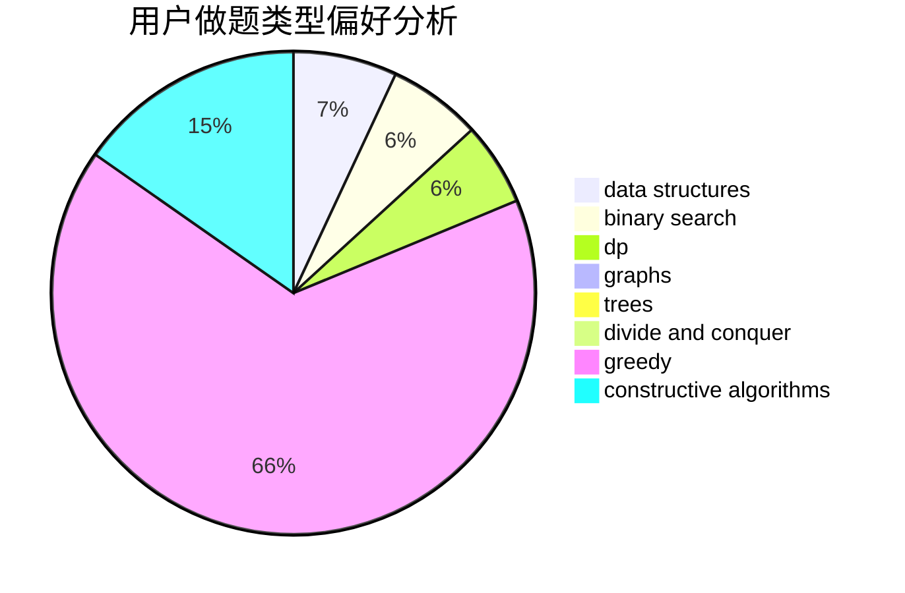
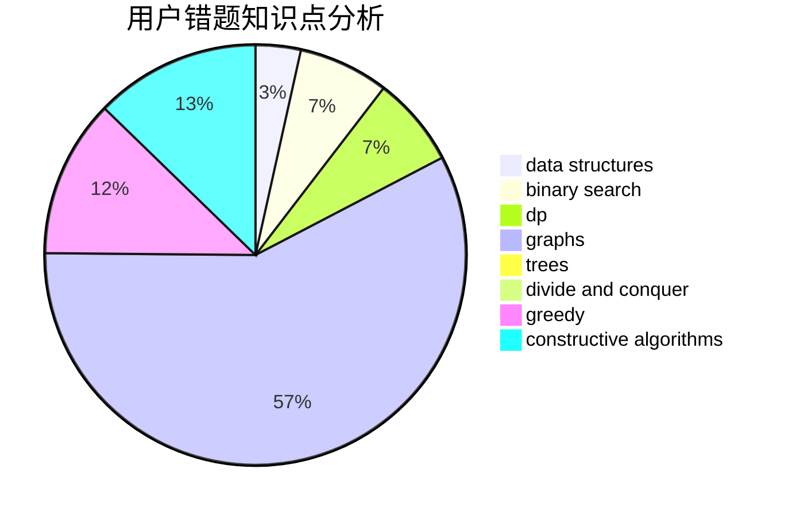

# do_loop

<!-- tabs:start -->

#### **用户提交结果分析**

#### **用户做题类型偏好分析**

#### **用户错题知识点分析**

<!-- tabs:end -->
# 推荐题目
[764E](https://codeforces.com/contest/764/problem/E)		dsu,graphs,sortings,trees		  
[1146B](https://codeforces.com/contest/1146/problem/B)		implementation,
                        strings		  
[626E](https://codeforces.com/contest/626/problem/E)		binary search,
                        math,
                        ternary search		  
[483E](https://codeforces.com/contest/483/problem/E)		dsu,graphs,sortings,trees		  
[932G](https://codeforces.com/contest/932/problem/G)		dp,
                        string suffix structures,
                        strings		  
[1100A](https://codeforces.com/contest/1100/problem/A)		implementation		  
[707C](https://codeforces.com/contest/707/problem/C)		math,
                        number theory		  
[797D](https://codeforces.com/contest/797/problem/D)		data structures,
                        dfs and similar		  
[478B](https://codeforces.com/contest/478/problem/B)		combinatorics,
                        constructive algorithms,
                        greedy,
                        math		  
[1295E](https://codeforces.com/contest/1295/problem/E)		data structures,
                        divide and conquer		  
