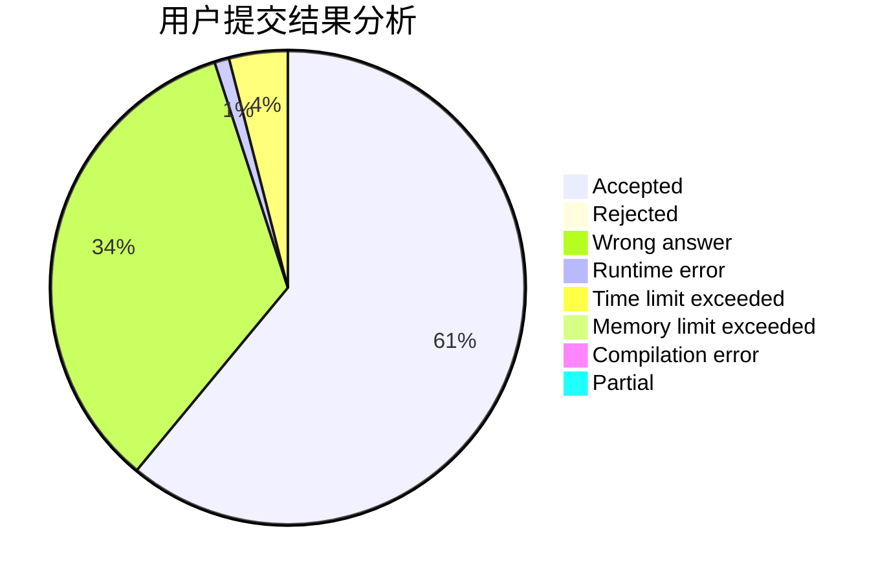
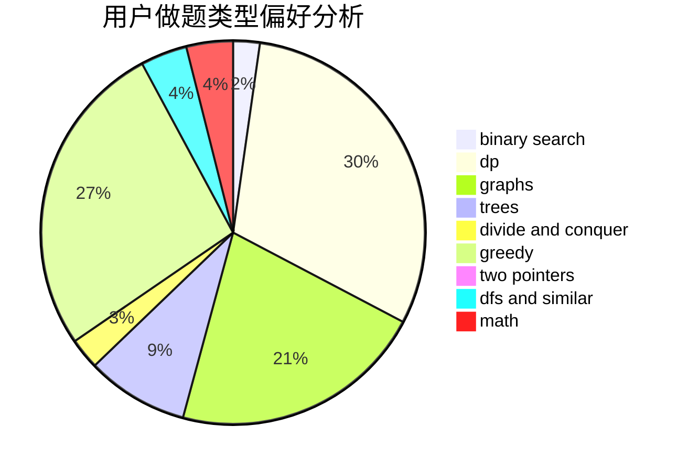

# do_while_true

<!-- tabs:start -->

#### **用户提交结果分析**

#### **用户做题类型偏好分析**

<!-- tabs:end -->
# 推荐题目
[1465F](https://codeforces.com/contest/1465/problem/F)
[1164M](https://codeforces.com/contest/1164/problem/M)
[1302F](https://codeforces.com/contest/1302/problem/F)
[652E](https://codeforces.com/contest/652/problem/E)
[11521](https://codeforces.com/contest/1152/problem/1)
[584E](https://codeforces.com/contest/584/problem/E)
[1205F](https://codeforces.com/contest/1205/problem/F)
[990C](https://codeforces.com/contest/990/problem/C)
[86B](https://codeforces.com/contest/86/problem/B)
[1031D](https://codeforces.com/contest/1031/problem/D)
