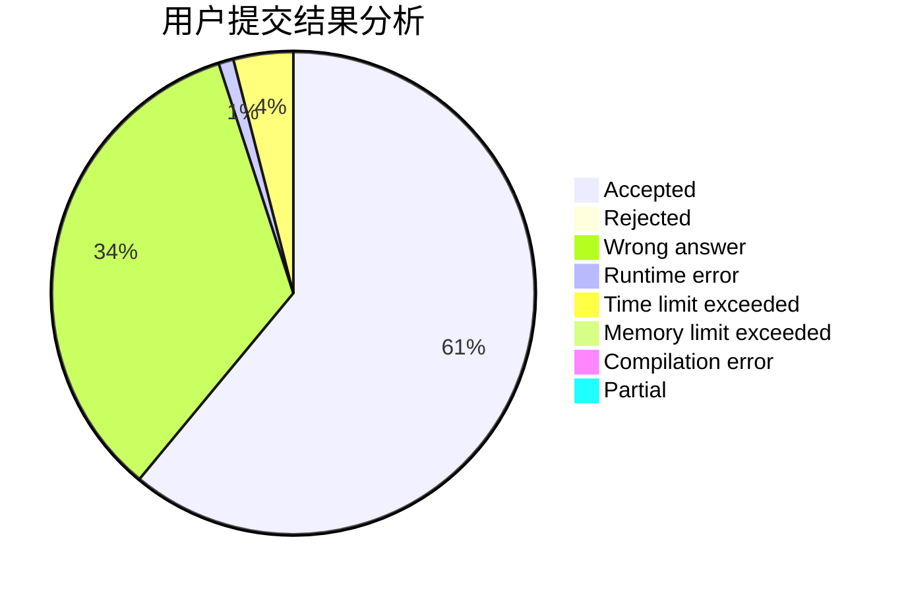
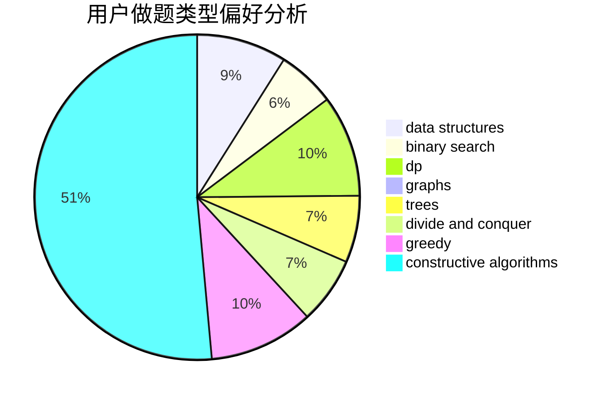

# do_while_true

<!-- tabs:start -->

#### **用户提交结果分析**

#### **用户做题类型偏好分析**

#### **用户错题知识点分析**

<!-- tabs:end -->
# 推荐题目
[1456B](https://codeforces.com/contest/1456/problem/B)		dsu,graphs,sortings,trees		  
[1162E](https://codeforces.com/contest/1162/problem/E)		dsu,graphs,sortings,trees		  
[1295D](https://codeforces.com/contest/1295/problem/D)		math,
                        number theory		  
[626D](https://codeforces.com/contest/626/problem/D)		brute force,
                        combinatorics,
                        dp,
                        probabilities		  
[114D](https://codeforces.com/contest/114/problem/D)		dsu,graphs,sortings,trees		  
[566A](https://codeforces.com/contest/566/problem/A)		dfs and similar,
                        strings,
                        trees		  
[1201B](https://codeforces.com/contest/1201/problem/B)		greedy,
                        math		  
[976D](https://codeforces.com/contest/976/problem/D)		constructive algorithms,
                        graphs,
                        implementation		  
[851A](https://codeforces.com/contest/851/problem/A)		implementation,
                        math		  
[1031A](https://codeforces.com/contest/1031/problem/A)		implementation,
                        math		  
