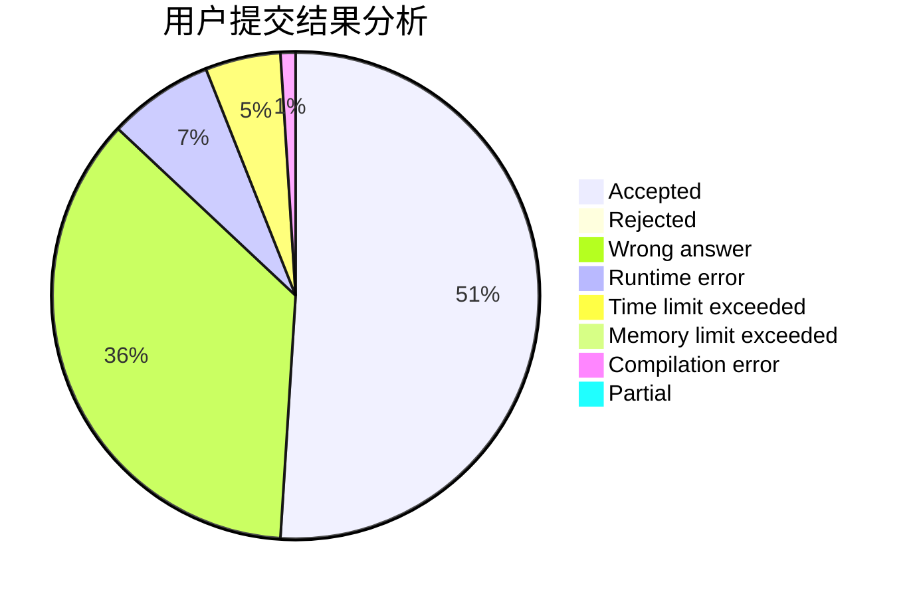
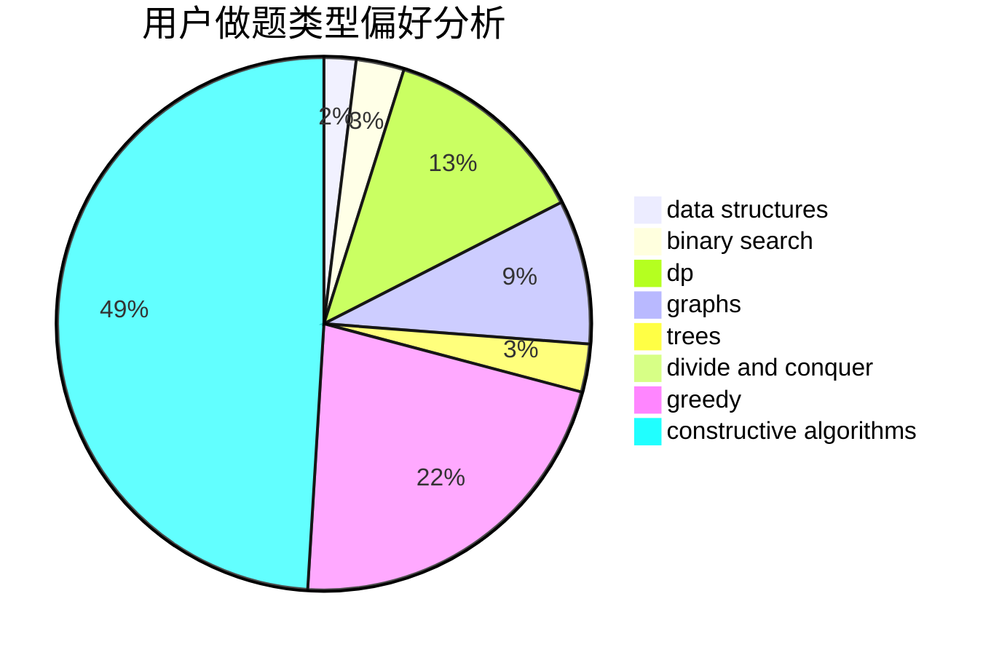
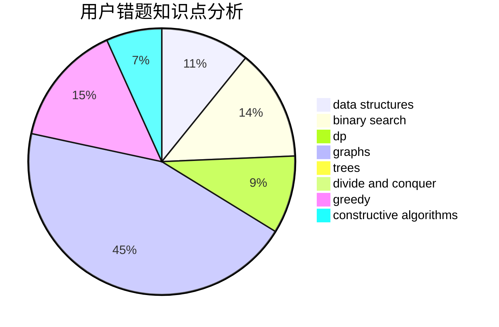

# dongdziz

<!-- tabs:start -->

#### **用户提交结果分析**

#### **用户做题类型偏好分析**

#### **用户错题知识点分析**

<!-- tabs:end -->
# 推荐题目
[628F](https://codeforces.com/contest/628/problem/F)		flows		  
[74B](https://codeforces.com/contest/74/problem/B)		dp,
                        games,
                        greedy		  
[815B](https://codeforces.com/contest/815/problem/B)		brute force,
                        combinatorics,
                        constructive algorithms,
                        math		  
[1056C](https://codeforces.com/contest/1056/problem/C)		greedy,
                        implementation,
                        interactive,
                        sortings		  
[180C](https://codeforces.com/contest/180/problem/C)		dp		  
[868C](https://codeforces.com/contest/868/problem/C)		bitmasks,
                        brute force,
                        constructive algorithms,
                        dp		  
[588A](https://codeforces.com/contest/588/problem/A)		greedy		  
[305A](https://codeforces.com/contest/305/problem/A)		brute force,
                        constructive algorithms,
                        implementation		  
[1116A2](https://codeforces.com/contest/1116A/problem/2)		nan		  
[57C](https://codeforces.com/contest/57/problem/C)		combinatorics,
                        math		  
