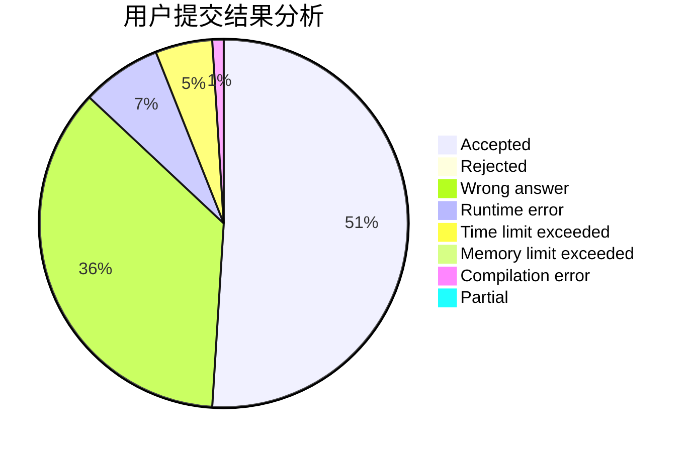
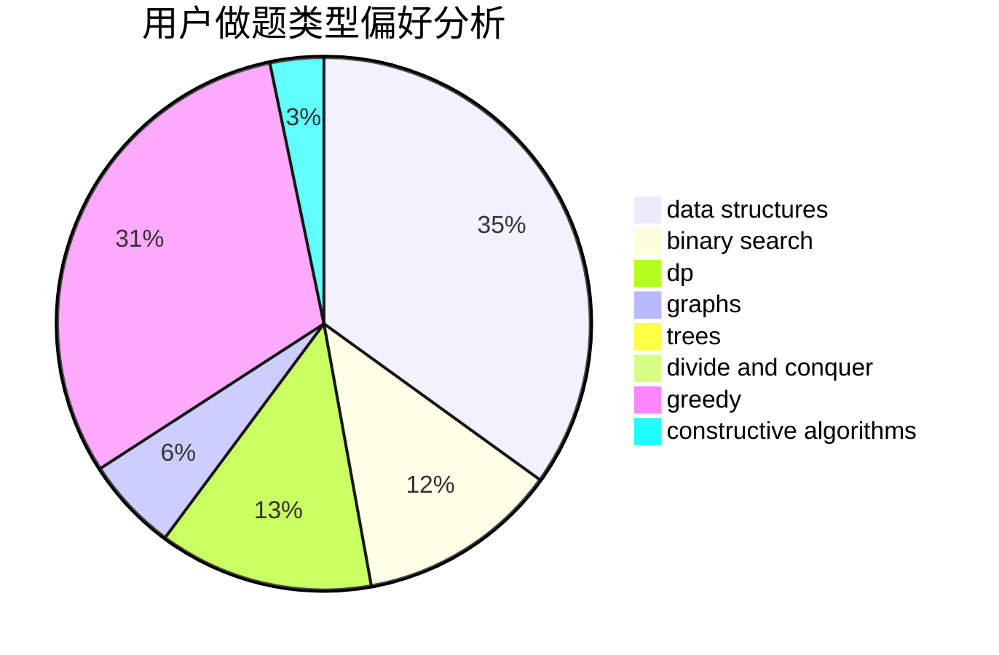
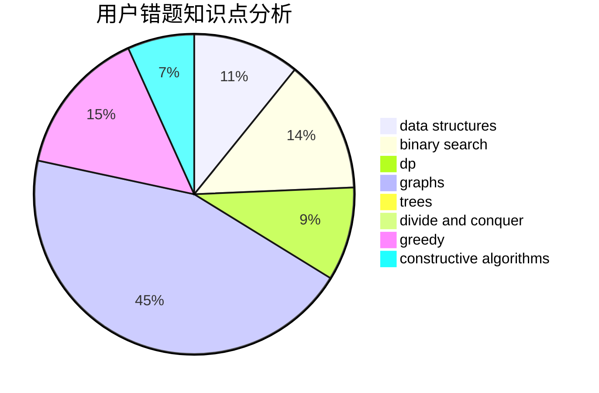

# dongdziz

<!-- tabs:start -->

#### **用户提交结果分析**

#### **用户做题类型偏好分析**

#### **用户错题知识点分析**

<!-- tabs:end -->
# 推荐题目
[656F](https://codeforces.com/contest/656/problem/F)		*special problem		  
[769A](https://codeforces.com/contest/769/problem/A)		*special problem,
                        implementation,
                        sortings		  
[834B](https://codeforces.com/contest/834/problem/B)		data structures,
                        implementation		  
[1056F](https://codeforces.com/contest/1056/problem/F)		binary search,
                        dp,
                        math		  
[205D](https://codeforces.com/contest/205/problem/D)		dsu,graphs,sortings,trees		  
[887E](https://codeforces.com/contest/887/problem/E)		binary search,
                        geometry,
                        sortings		  
[608C](https://codeforces.com/contest/608/problem/C)		dsu,graphs,sortings,trees		  
[325C](https://codeforces.com/contest/325/problem/C)		dfs and similar,
                        graphs,
                        shortest paths		  
[1117D](https://codeforces.com/contest/1117/problem/D)		dp,
                        math,
                        matrices		  
[600A](https://codeforces.com/contest/600/problem/A)		implementation,
                        strings		  
