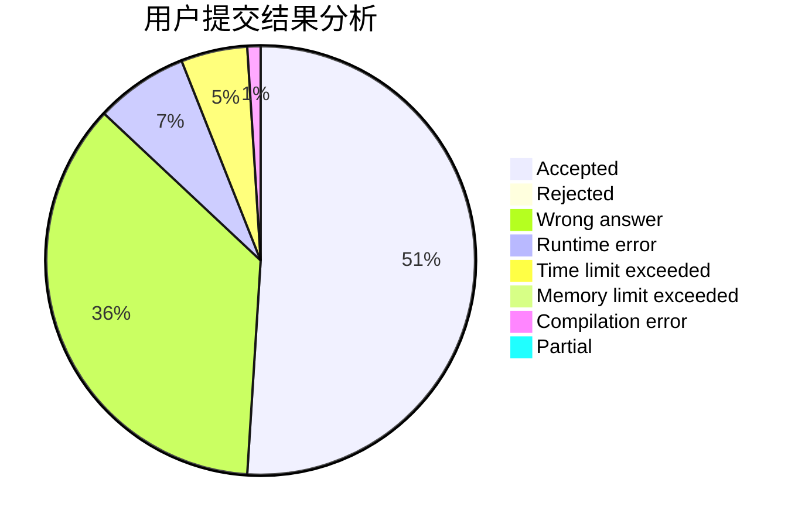
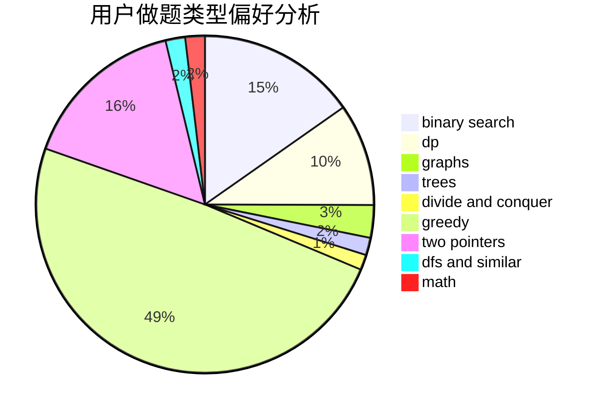

# dongdziz

<!-- tabs:start -->

#### **用户提交结果分析**

#### **用户做题类型偏好分析**

<!-- tabs:end -->
# 推荐题目
[656F](https://codeforces.com/contest/656/problem/F)
[769A](https://codeforces.com/contest/769/problem/A)
[834B](https://codeforces.com/contest/834/problem/B)
[1056F](https://codeforces.com/contest/1056/problem/F)
[205D](https://codeforces.com/contest/205/problem/D)
[887E](https://codeforces.com/contest/887/problem/E)
[608C](https://codeforces.com/contest/608/problem/C)
[325C](https://codeforces.com/contest/325/problem/C)
[1117D](https://codeforces.com/contest/1117/problem/D)
[600A](https://codeforces.com/contest/600/problem/A)
