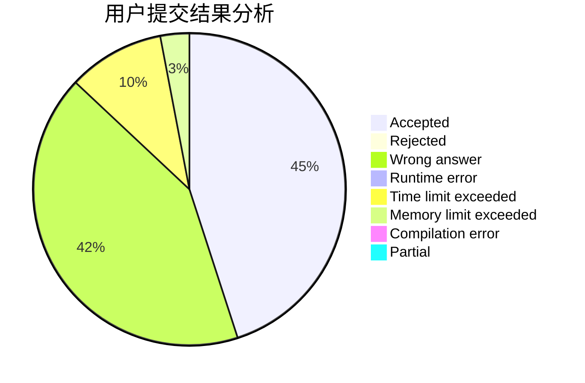
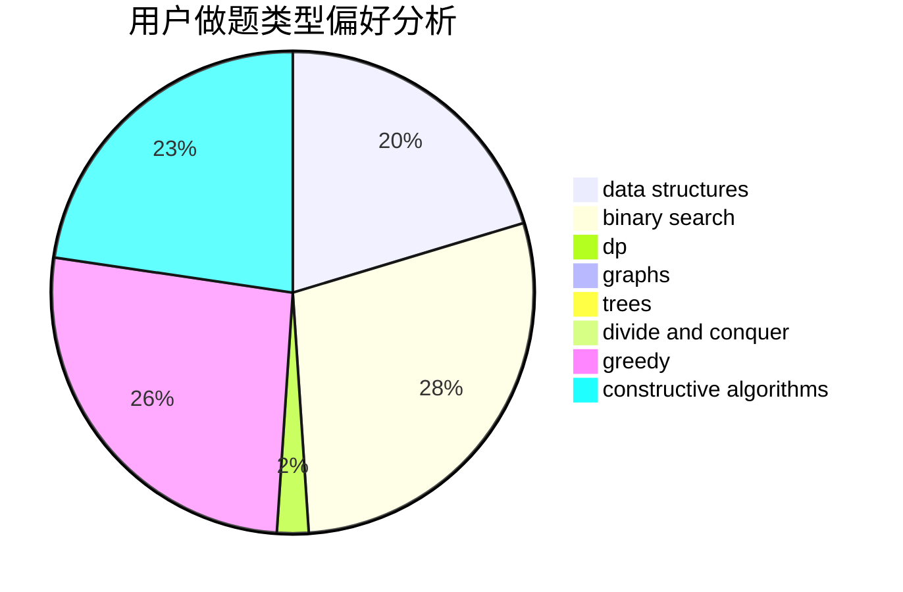
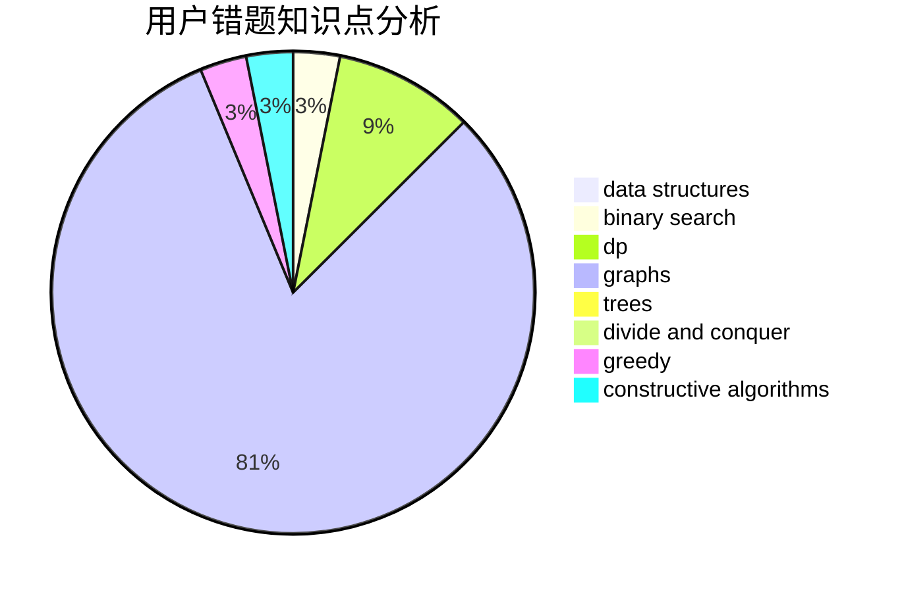

# Arya_Erin

<!-- tabs:start -->

#### **用户提交结果分析**

#### **用户做题类型偏好分析**

#### **用户错题知识点分析**

<!-- tabs:end -->
# 推荐题目
[1355D](https://codeforces.com/contest/1355/problem/D)		constructive algorithms,
                        math		  
[424B](https://codeforces.com/contest/424/problem/B)		binary search,
                        greedy,
                        implementation,
                        sortings		  
[1460A](https://codeforces.com/contest/1460/problem/A)		dsu,graphs,sortings,trees		  
[421B](https://codeforces.com/contest/421/problem/B)		dsu,graphs,sortings,trees		  
[424A](https://codeforces.com/contest/424/problem/A)		implementation		  
[1368A](https://codeforces.com/contest/1368/problem/A)		brute force,
                        greedy,
                        implementation,
                        math		  
[1084B](https://codeforces.com/contest/1084/problem/B)		greedy,
                        implementation		  
[403C](https://codeforces.com/contest/403/problem/C)		dsu,graphs,sortings,trees		  
[213C](https://codeforces.com/contest/213/problem/C)		dp		  
[38C](https://codeforces.com/contest/38/problem/C)		brute force		  
