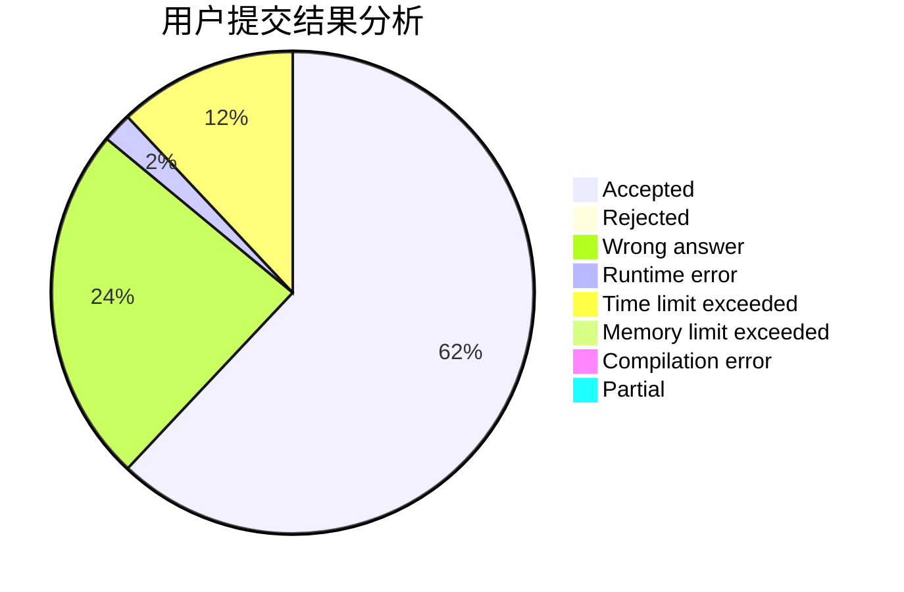
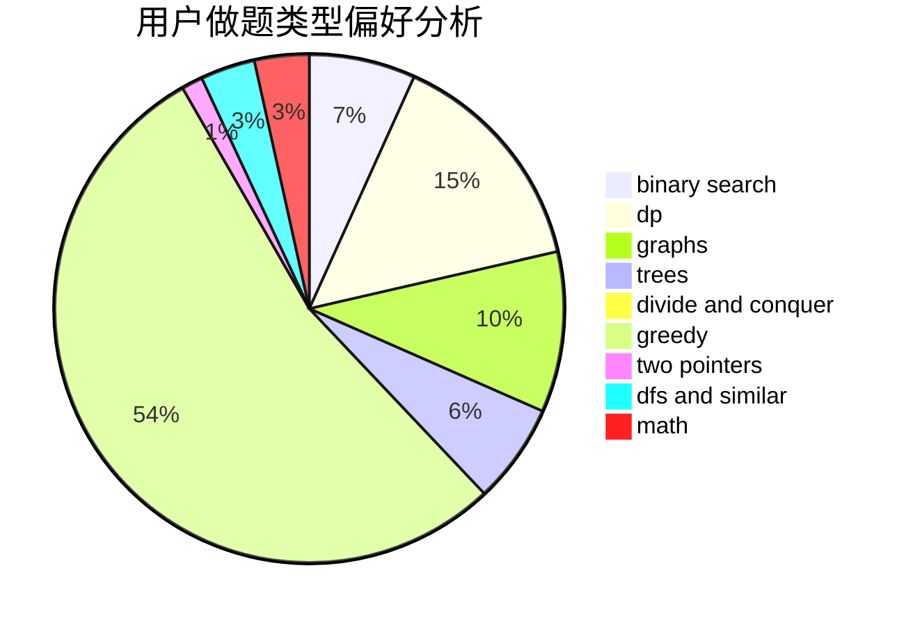

# dongyc666

<!-- tabs:start -->

#### **用户提交结果分析**

#### **用户做题类型偏好分析**

<!-- tabs:end -->
# 推荐题目
[766E](https://codeforces.com/contest/766/problem/E)
[578B](https://codeforces.com/contest/578/problem/B)
[1225E](https://codeforces.com/contest/1225/problem/E)
[115B](https://codeforces.com/contest/115/problem/B)
[582A](https://codeforces.com/contest/582/problem/A)
[838E](https://codeforces.com/contest/838/problem/E)
[1188E](https://codeforces.com/contest/1188/problem/E)
[1017G](https://codeforces.com/contest/1017/problem/G)
[699C](https://codeforces.com/contest/699/problem/C)
[1087C](https://codeforces.com/contest/1087/problem/C)
