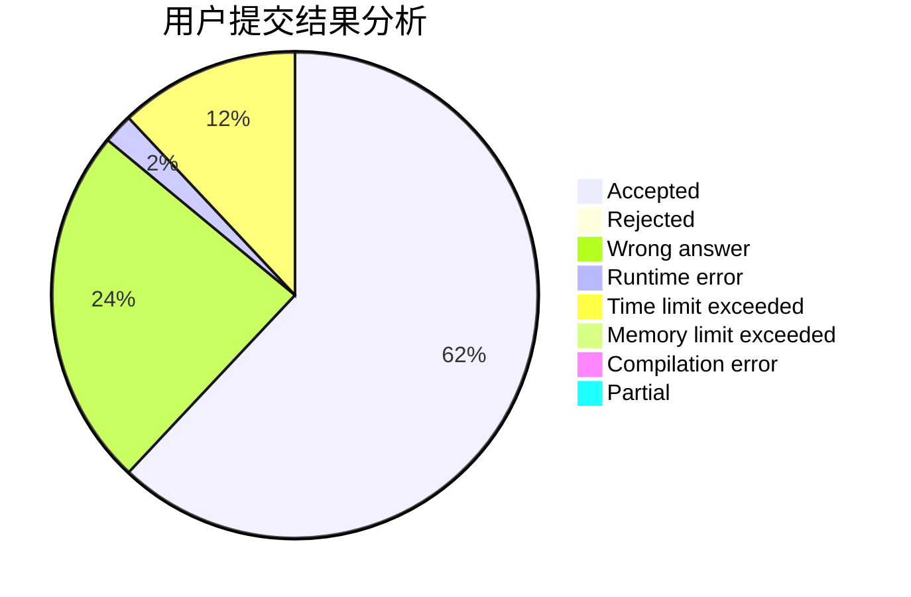
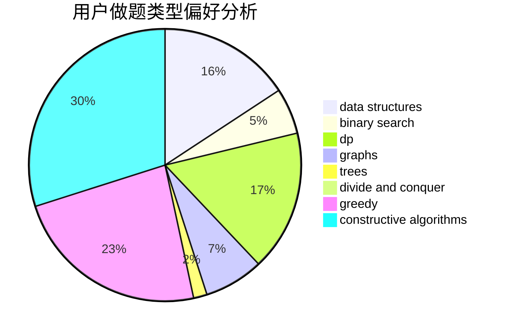

# dongyc666

<!-- tabs:start -->

#### **用户提交结果分析**

#### **用户做题类型偏好分析**

#### **用户错题知识点分析**

<!-- tabs:end -->
# 推荐题目
[766E](https://codeforces.com/contest/766/problem/E)		bitmasks,
                        constructive algorithms,
                        data structures,
                        dfs and similar,
                        dp,
                        math,
                        trees		  
[578B](https://codeforces.com/contest/578/problem/B)		brute force,
                        greedy		  
[1225E](https://codeforces.com/contest/1225/problem/E)		binary search,
                        dp		  
[115B](https://codeforces.com/contest/115/problem/B)		greedy,
                        sortings		  
[582A](https://codeforces.com/contest/582/problem/A)		constructive algorithms,
                        greedy,
                        number theory		  
[838E](https://codeforces.com/contest/838/problem/E)		dp		  
[1188E](https://codeforces.com/contest/1188/problem/E)		combinatorics		  
[1017G](https://codeforces.com/contest/1017/problem/G)		data structures		  
[699C](https://codeforces.com/contest/699/problem/C)		dsu,graphs,sortings,trees		  
[1087C](https://codeforces.com/contest/1087/problem/C)		dsu,graphs,sortings,trees		  
