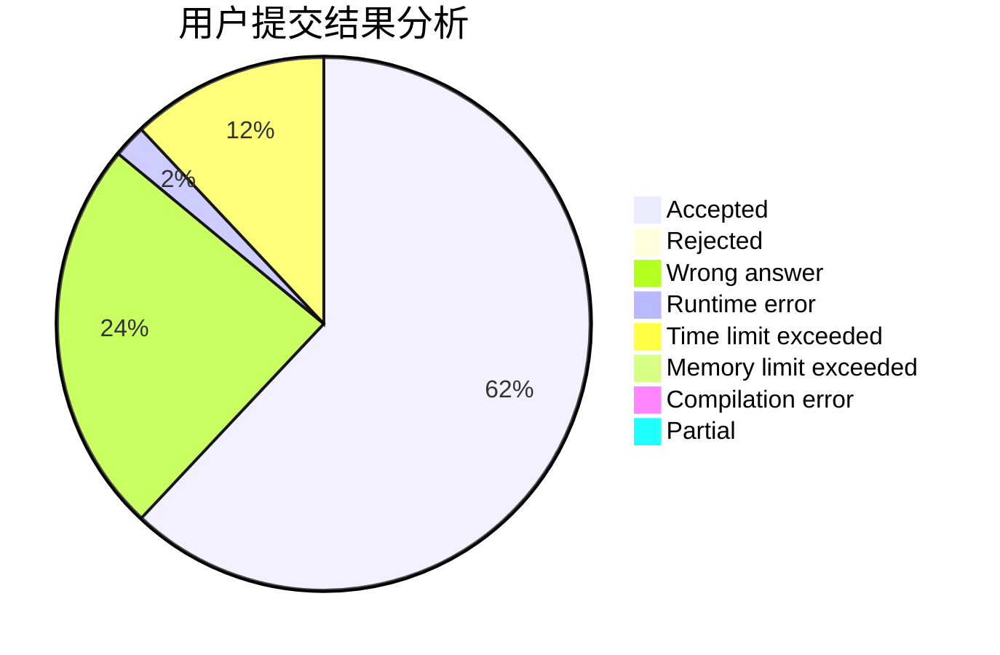
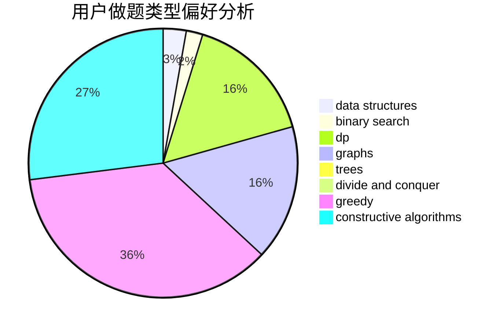
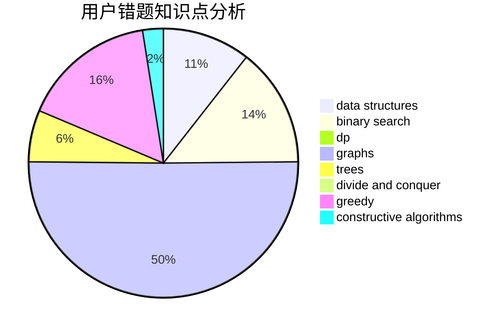

# dongyc666

<!-- tabs:start -->

#### **用户提交结果分析**

#### **用户做题类型偏好分析**

#### **用户错题知识点分析**

<!-- tabs:end -->
# 推荐题目
[747B](https://codeforces.com/contest/747/problem/B)		implementation,
                        strings		  
[552E](https://codeforces.com/contest/552/problem/E)		brute force,
                        dp,
                        expression parsing,
                        greedy,
                        implementation,
                        strings		  
[1218C](https://codeforces.com/contest/1218/problem/C)		dp		  
[1157F](https://codeforces.com/contest/1157/problem/F)		constructive algorithms,
                        dp,
                        greedy,
                        two pointers		  
[559C](https://codeforces.com/contest/559/problem/C)		combinatorics,
                        dp,
                        math,
                        number theory		  
[818F](https://codeforces.com/contest/818/problem/F)		binary search,
                        math,
                        ternary search		  
[1184E3](https://codeforces.com/contest/1184E/problem/3)		data structures,
                        dsu,
                        graphs,
                        trees		  
[1017D](https://codeforces.com/contest/1017/problem/D)		bitmasks,
                        brute force,
                        data structures		  
[674F](https://codeforces.com/contest/674/problem/F)		dsu,graphs,sortings,trees		  
[1086E](https://codeforces.com/contest/1086/problem/E)		dsu,graphs,sortings,trees		  
