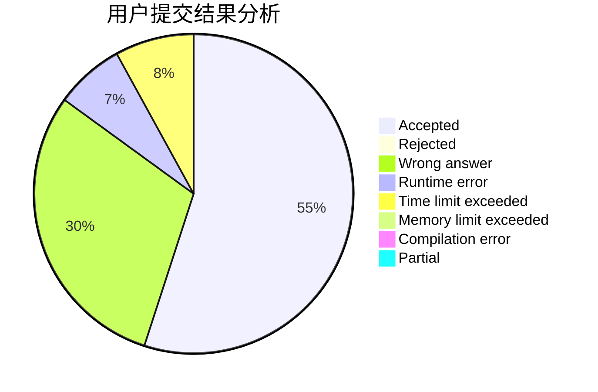
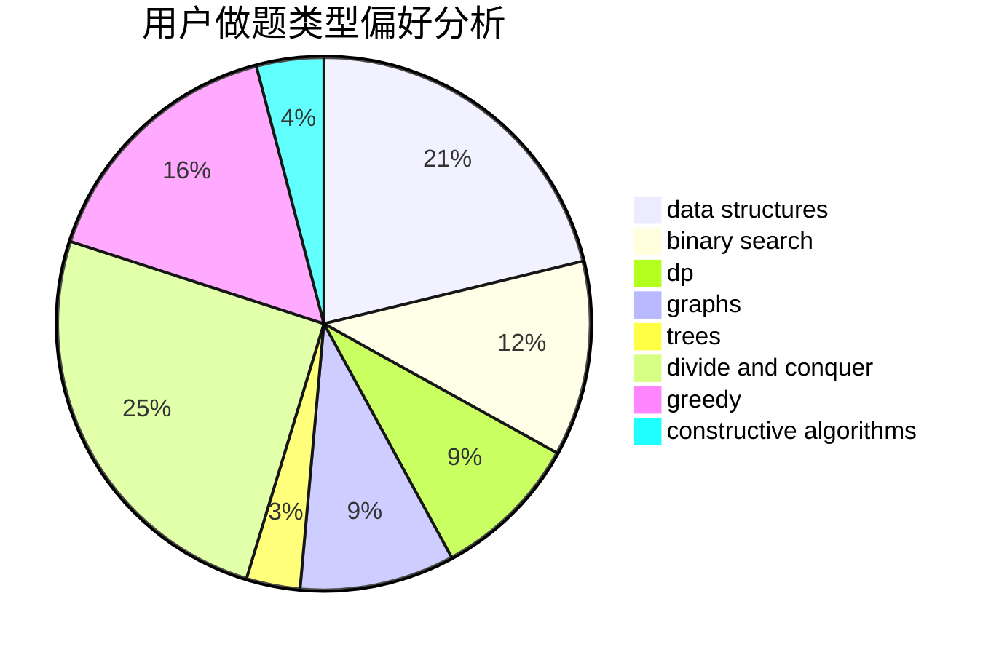
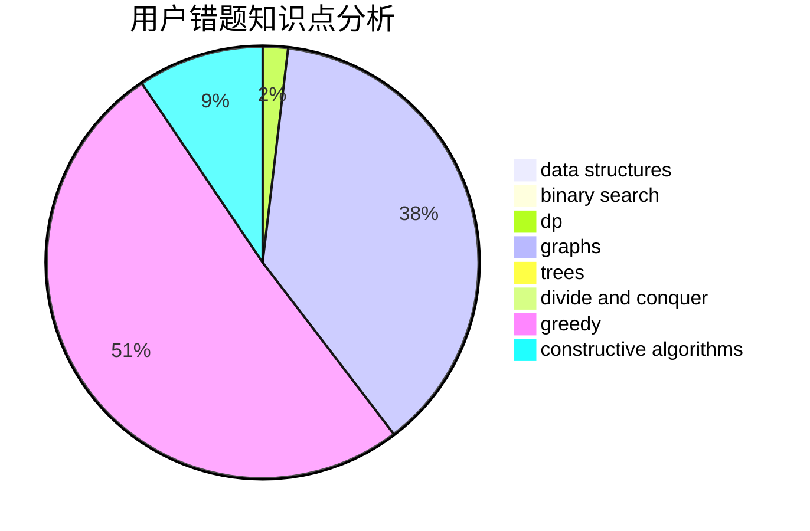

# dongyeguiwu00

<!-- tabs:start -->

#### **用户提交结果分析**

#### **用户做题类型偏好分析**

#### **用户错题知识点分析**

<!-- tabs:end -->
# 推荐题目
[919B](https://codeforces.com/contest/919/problem/B)		binary search,
                        brute force,
                        dp,
                        implementation,
                        number theory		  
[1057B](https://codeforces.com/contest/1057/problem/B)		*special problem,
                        brute force		  
[1091H](https://codeforces.com/contest/1091/problem/H)		games		  
[463D](https://codeforces.com/contest/463/problem/D)		dfs and similar,
                        dp,
                        graphs,
                        implementation		  
[1214G](https://codeforces.com/contest/1214/problem/G)		bitmasks,
                        data structures		  
[1295D](https://codeforces.com/contest/1295/problem/D)		math,
                        number theory		  
[232E](https://codeforces.com/contest/232/problem/E)		bitmasks,
                        divide and conquer,
                        dp		  
[298D](https://codeforces.com/contest/298/problem/D)		dsu,graphs,sortings,trees		  
[938A](https://codeforces.com/contest/938/problem/A)		implementation		  
[1138F](https://codeforces.com/contest/1138/problem/F)		dsu,graphs,sortings,trees		  
