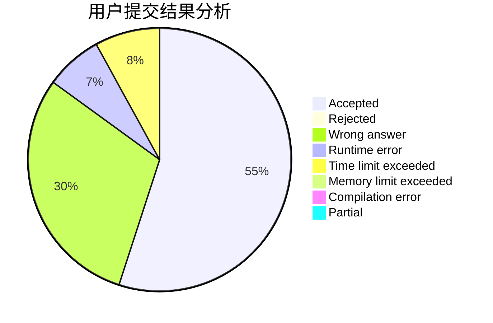
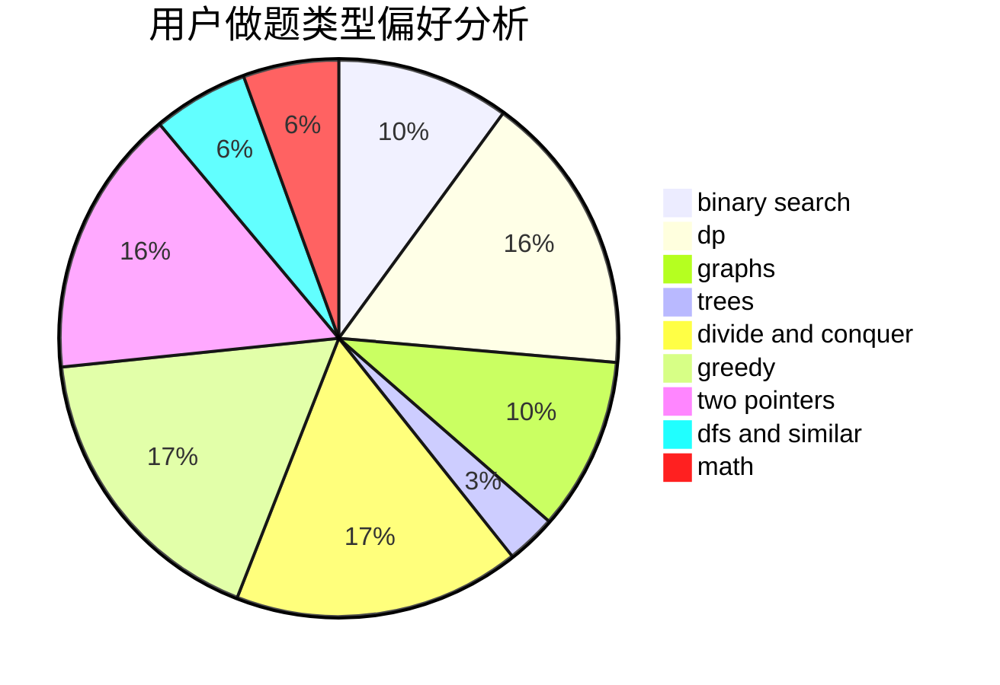

# dongyeguiwu00

<!-- tabs:start -->

#### **用户提交结果分析**

#### **用户做题类型偏好分析**

<!-- tabs:end -->
# 推荐题目
[919B](https://codeforces.com/contest/919/problem/B)
[1057B](https://codeforces.com/contest/1057/problem/B)
[1091H](https://codeforces.com/contest/1091/problem/H)
[463D](https://codeforces.com/contest/463/problem/D)
[1214G](https://codeforces.com/contest/1214/problem/G)
[1295D](https://codeforces.com/contest/1295/problem/D)
[232E](https://codeforces.com/contest/232/problem/E)
[298D](https://codeforces.com/contest/298/problem/D)
[938A](https://codeforces.com/contest/938/problem/A)
[1138F](https://codeforces.com/contest/1138/problem/F)
