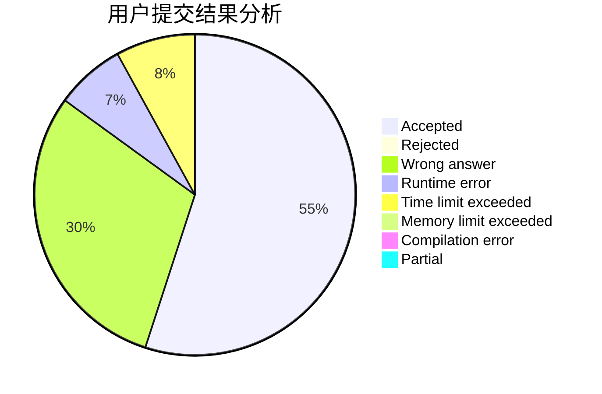
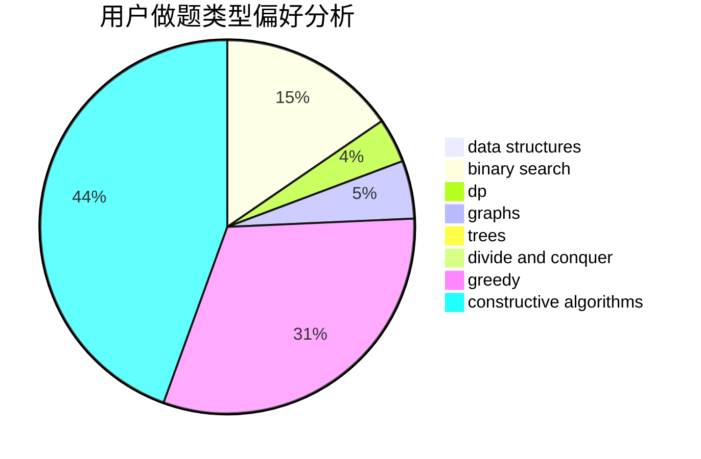
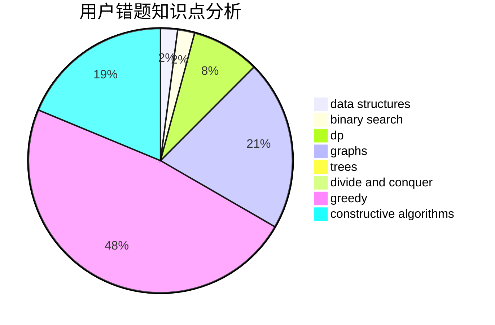

# dongyeguiwu00

<!-- tabs:start -->

#### **用户提交结果分析**

#### **用户做题类型偏好分析**

#### **用户错题知识点分析**

<!-- tabs:end -->
# 推荐题目
[903A](https://codeforces.com/contest/903/problem/A)		greedy,
                        implementation		  
[1056F](https://codeforces.com/contest/1056/problem/F)		binary search,
                        dp,
                        math		  
[1091E](https://codeforces.com/contest/1091/problem/E)		binary search,
                        data structures,
                        graphs,
                        greedy,
                        implementation,
                        math,
                        sortings		  
[443A](https://codeforces.com/contest/443/problem/A)		constructive algorithms,
                        implementation		  
[1209C](https://codeforces.com/contest/1209/problem/C)		constructive algorithms,
                        greedy,
                        implementation		  
[1288B](https://codeforces.com/contest/1288/problem/B)		math		  
[213C](https://codeforces.com/contest/213/problem/C)		dp		  
[282B](https://codeforces.com/contest/282/problem/B)		greedy,
                        math		  
[917C](https://codeforces.com/contest/917/problem/C)		combinatorics,
                        dp,
                        matrices		  
[1136D](https://codeforces.com/contest/1136/problem/D)		greedy		  
