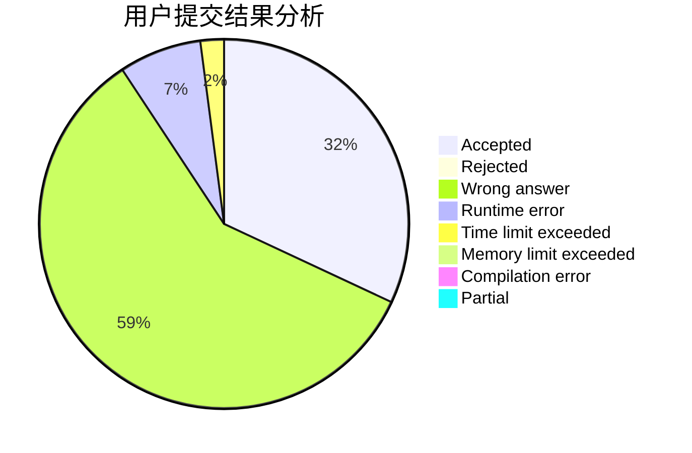
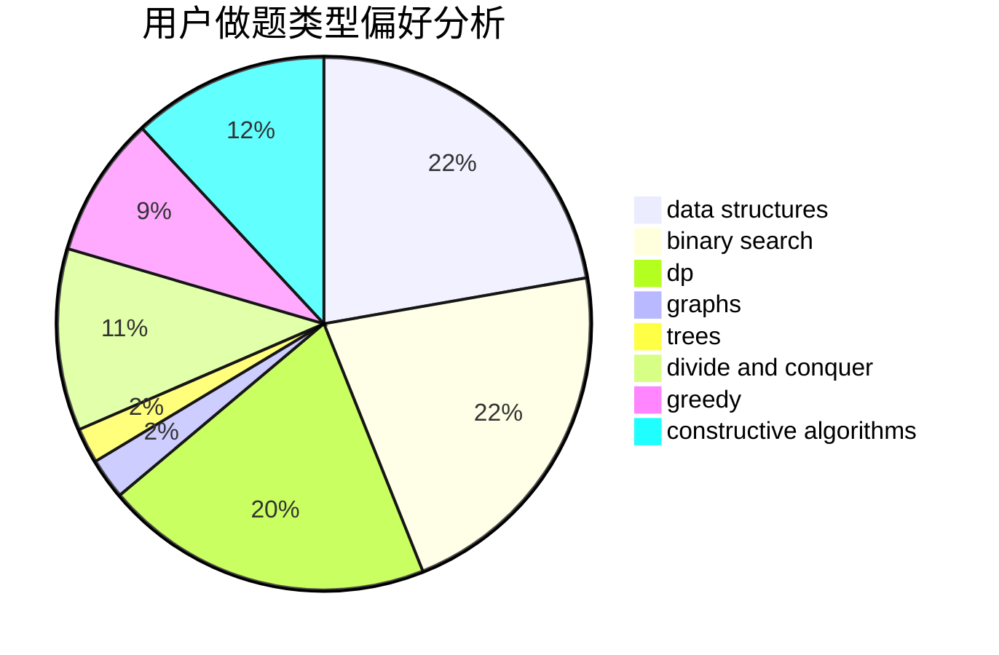
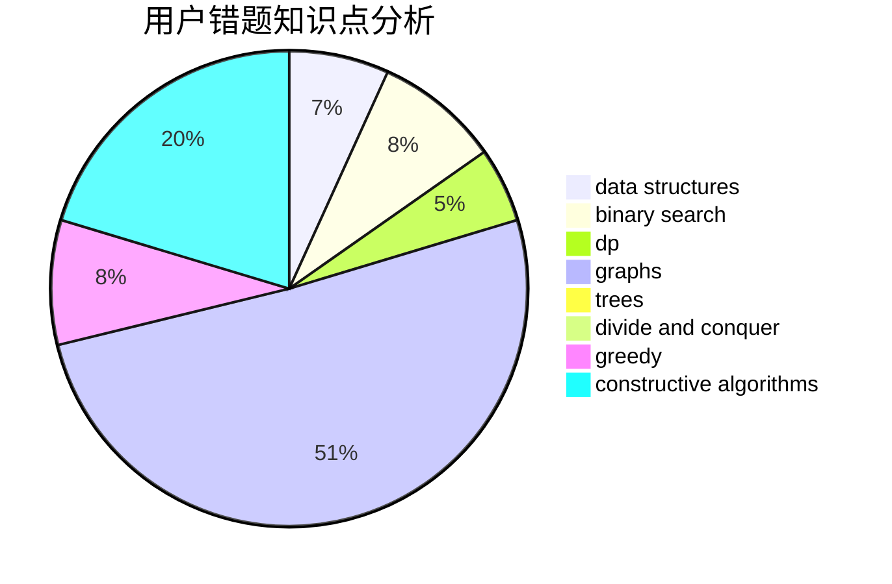

# doublefuck

<!-- tabs:start -->

#### **用户提交结果分析**

#### **用户做题类型偏好分析**

#### **用户错题知识点分析**

<!-- tabs:end -->
# 推荐题目
[349B](https://codeforces.com/contest/349/problem/B)		data structures,
                        dp,
                        greedy,
                        implementation		  
[934E](https://codeforces.com/contest/934/problem/E)		dsu,graphs,sortings,trees		  
[313E](https://codeforces.com/contest/313/problem/E)		constructive algorithms,
                        data structures,
                        dsu,
                        greedy		  
[1219C](https://codeforces.com/contest/1219/problem/C)		implementation,
                        strings		  
[1355F](https://codeforces.com/contest/1355/problem/F)		constructive algorithms,
                        interactive,
                        number theory		  
[1398D](https://codeforces.com/contest/1398/problem/D)		dp,
                        greedy,
                        sortings		  
[632B](https://codeforces.com/contest/632/problem/B)		brute force,
                        constructive algorithms		  
[717A](https://codeforces.com/contest/717/problem/A)		math,
                        number theory		  
[331E2](https://codeforces.com/contest/331E/problem/2)		constructive algorithms,
                        dp		  
[354A](https://codeforces.com/contest/354/problem/A)		brute force,
                        greedy,
                        math		  
