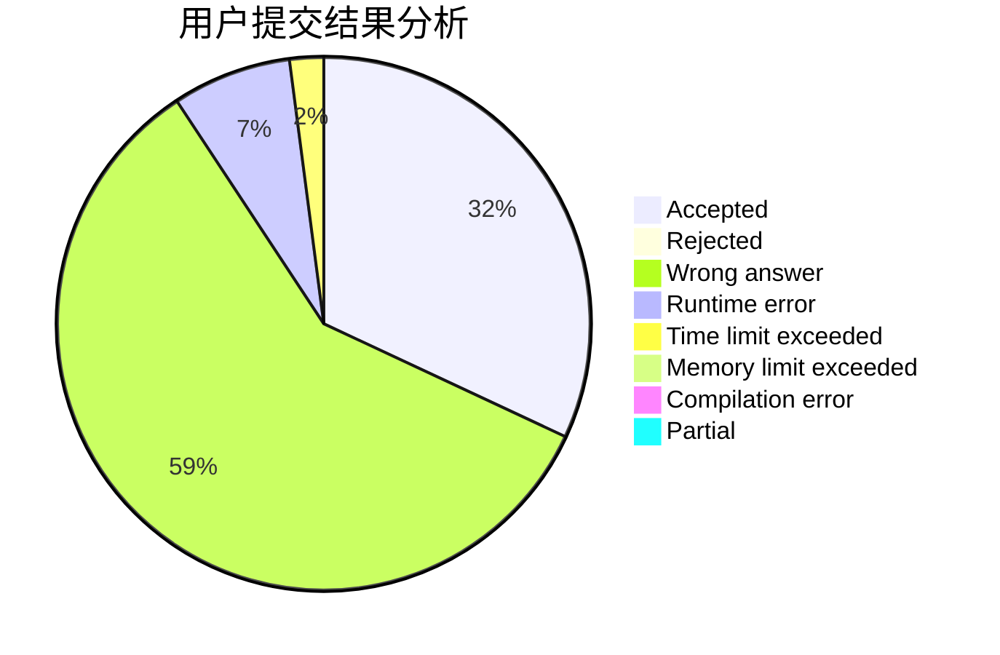
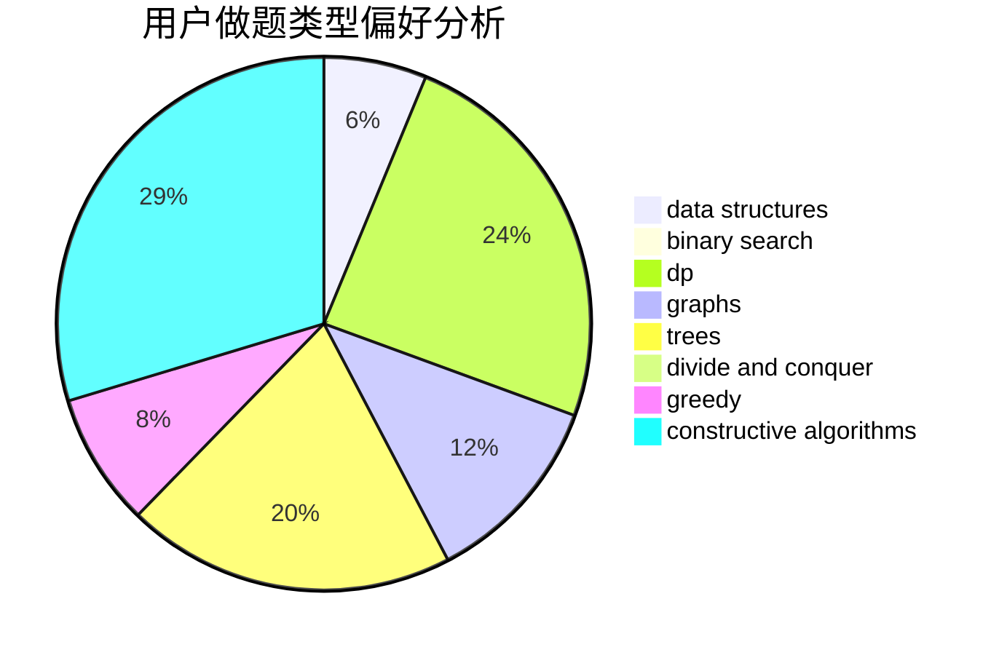
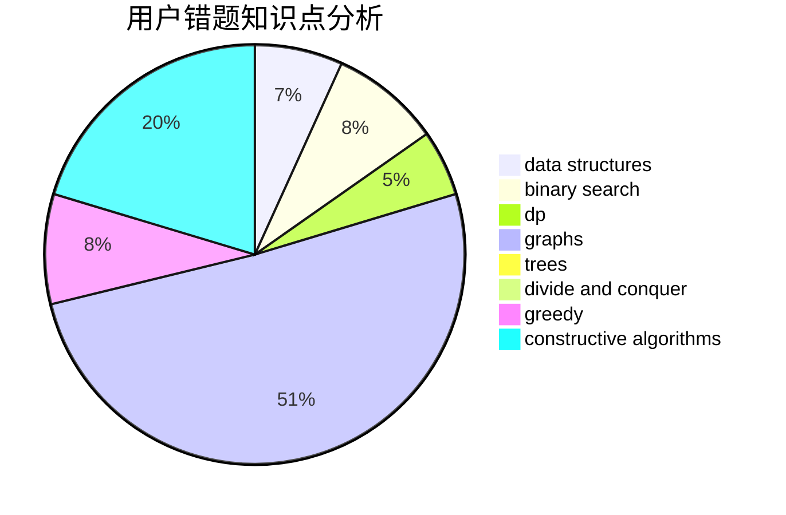

# doublefuck

<!-- tabs:start -->

#### **用户提交结果分析**

#### **用户做题类型偏好分析**

#### **用户错题知识点分析**

<!-- tabs:end -->
# 推荐题目
[376A](https://codeforces.com/contest/376/problem/A)		implementation,
                        math		  
[956D](https://codeforces.com/contest/956/problem/D)		dsu,graphs,sortings,trees		  
[338D](https://codeforces.com/contest/338/problem/D)		chinese remainder theorem,
                        math,
                        number theory		  
[12272](https://codeforces.com/contest/1227/problem/2)		dsu,graphs,sortings,trees		  
[1362E](https://codeforces.com/contest/1362/problem/E)		dsu,graphs,sortings,trees		  
[1407C](https://codeforces.com/contest/1407/problem/C)		constructive algorithms,
                        interactive,
                        math,
                        two pointers		  
[662E](https://codeforces.com/contest/662/problem/E)		brute force,
                        dp,
                        greedy		  
[734D](https://codeforces.com/contest/734/problem/D)		implementation		  
[35C](https://codeforces.com/contest/35/problem/C)		brute force,
                        dfs and similar,
                        shortest paths		  
[37D](https://codeforces.com/contest/37/problem/D)		combinatorics,
                        dp,
                        math		  
