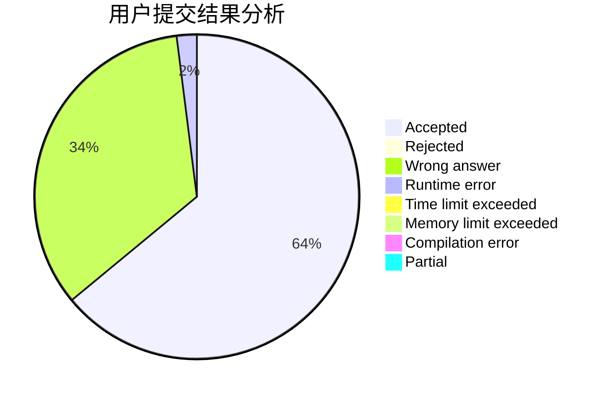
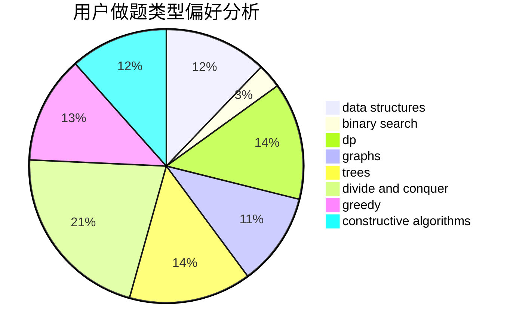
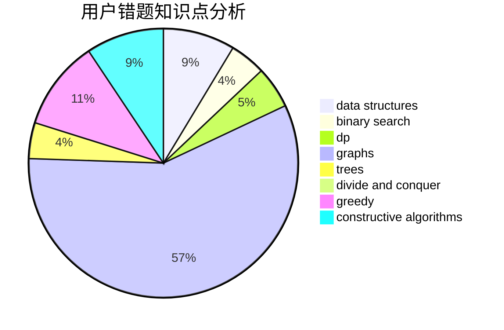

# dph754132771

<!-- tabs:start -->

#### **用户提交结果分析**

#### **用户做题类型偏好分析**

#### **用户错题知识点分析**

<!-- tabs:end -->
# 推荐题目
[878C](https://codeforces.com/contest/878/problem/C)		data structures,
                        graphs		  
[205D](https://codeforces.com/contest/205/problem/D)		dsu,graphs,sortings,trees		  
[853A](https://codeforces.com/contest/853/problem/A)		greedy		  
[436F](https://codeforces.com/contest/436/problem/F)		brute force,
                        data structures,
                        dp		  
[257D](https://codeforces.com/contest/257/problem/D)		greedy,
                        math		  
[480B](https://codeforces.com/contest/480/problem/B)		dsu,graphs,sortings,trees		  
[251C](https://codeforces.com/contest/251/problem/C)		dp,
                        greedy,
                        number theory		  
[1252J](https://codeforces.com/contest/1252/problem/J)		brute force,
                        dp		  
[217D](https://codeforces.com/contest/217/problem/D)		bitmasks,
                        brute force,
                        combinatorics,
                        dfs and similar,
                        math		  
[185E](https://codeforces.com/contest/185/problem/E)		binary search,
                        data structures		  
