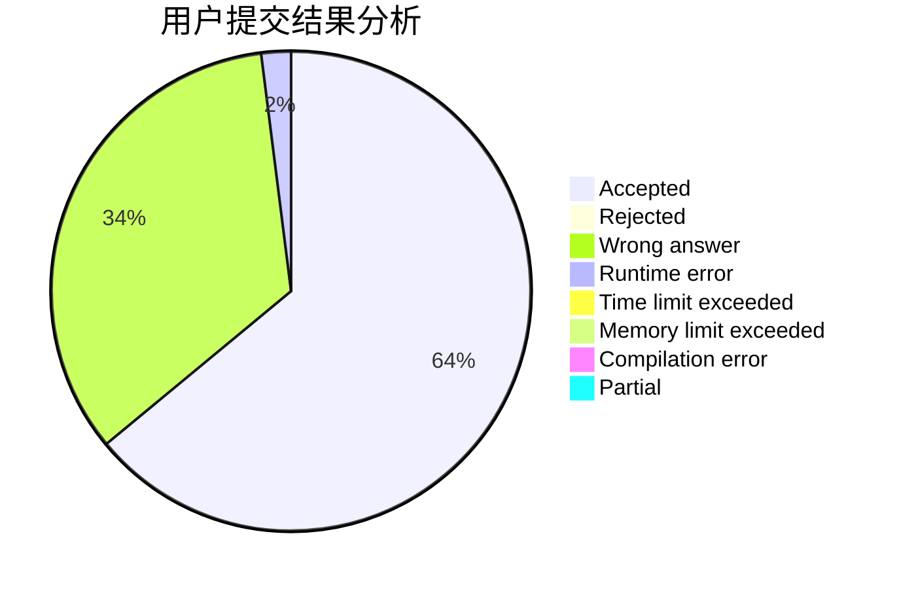
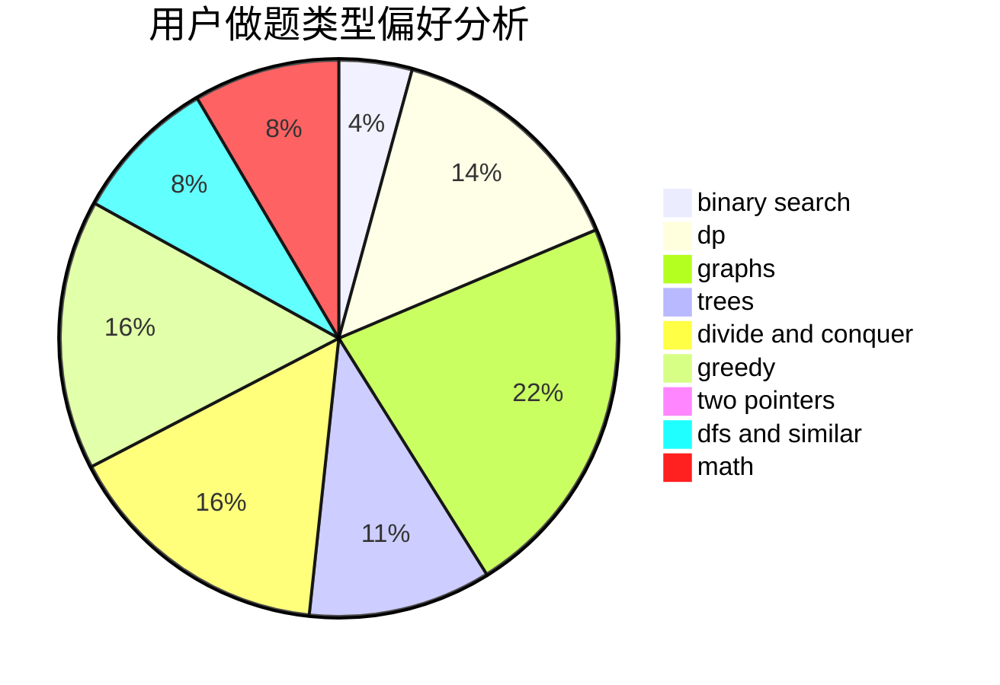

# dph754132771

<!-- tabs:start -->

#### **用户提交结果分析**

#### **用户做题类型偏好分析**

<!-- tabs:end -->
# 推荐题目
[878C](https://codeforces.com/contest/878/problem/C)
[205D](https://codeforces.com/contest/205/problem/D)
[853A](https://codeforces.com/contest/853/problem/A)
[436F](https://codeforces.com/contest/436/problem/F)
[257D](https://codeforces.com/contest/257/problem/D)
[480B](https://codeforces.com/contest/480/problem/B)
[251C](https://codeforces.com/contest/251/problem/C)
[1252J](https://codeforces.com/contest/1252/problem/J)
[217D](https://codeforces.com/contest/217/problem/D)
[185E](https://codeforces.com/contest/185/problem/E)
