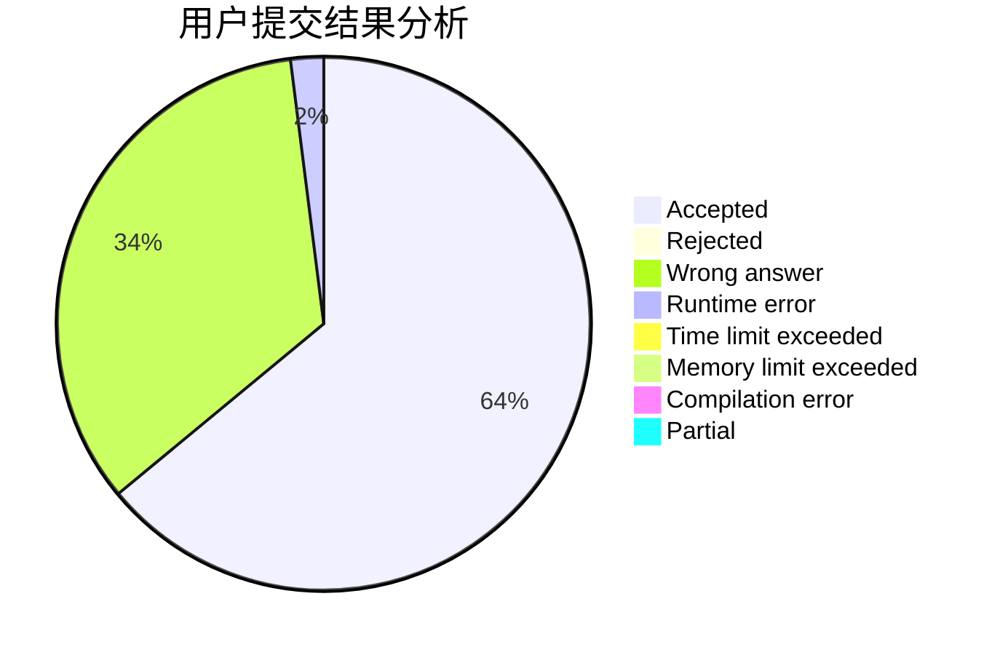
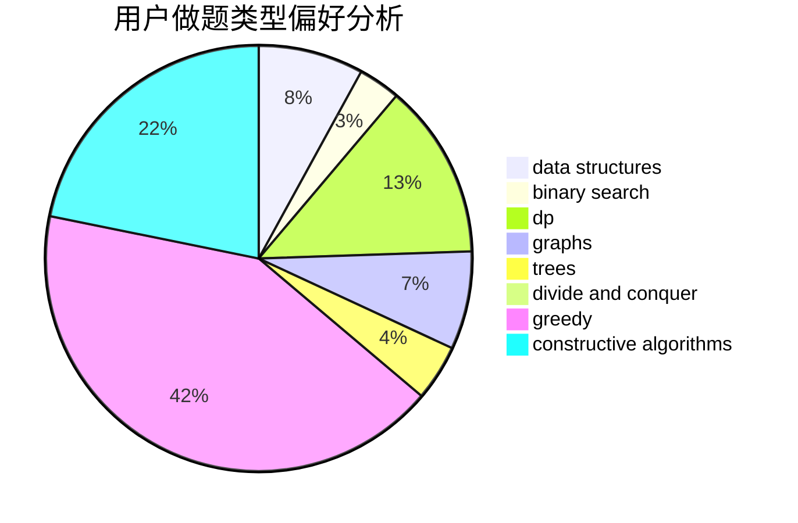
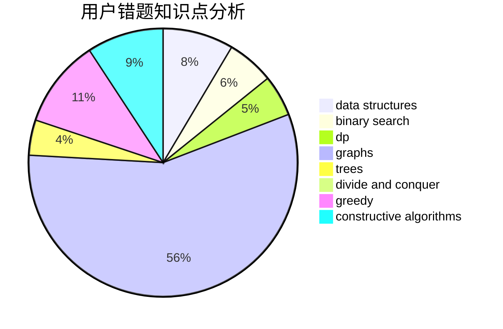

# dph754132771

<!-- tabs:start -->

#### **用户提交结果分析**

#### **用户做题类型偏好分析**

#### **用户错题知识点分析**

<!-- tabs:end -->
# 推荐题目
[860C](https://codeforces.com/contest/860/problem/C)		dsu,graphs,sortings,trees		  
[180C](https://codeforces.com/contest/180/problem/C)		dp		  
[835C](https://codeforces.com/contest/835/problem/C)		dp,
                        implementation		  
[409F](https://codeforces.com/contest/409/problem/F)		*special problem		  
[235A](https://codeforces.com/contest/235/problem/A)		number theory		  
[461B](https://codeforces.com/contest/461/problem/B)		dfs and similar,
                        dp,
                        trees		  
[230B](https://codeforces.com/contest/230/problem/B)		binary search,
                        implementation,
                        math,
                        number theory		  
[1249B1](https://codeforces.com/contest/1249B/problem/1)		dsu,
                        math		  
[193D](https://codeforces.com/contest/193/problem/D)		data structures		  
[160C](https://codeforces.com/contest/160/problem/C)		implementation,
                        math,
                        sortings		  
