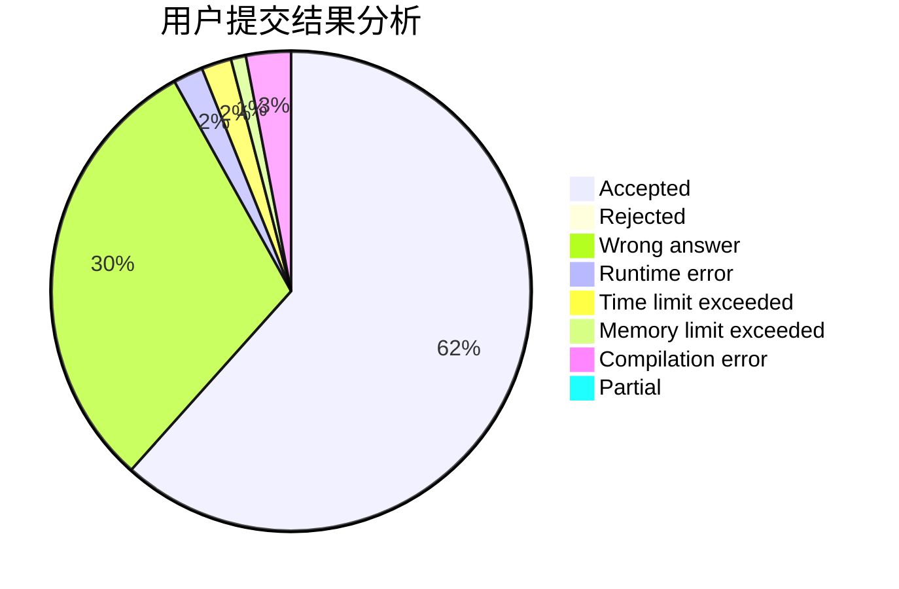
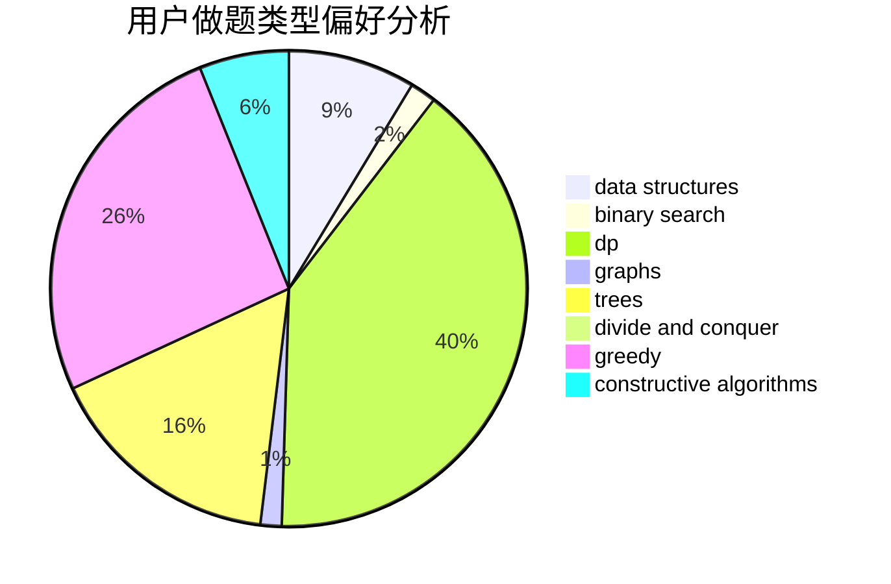
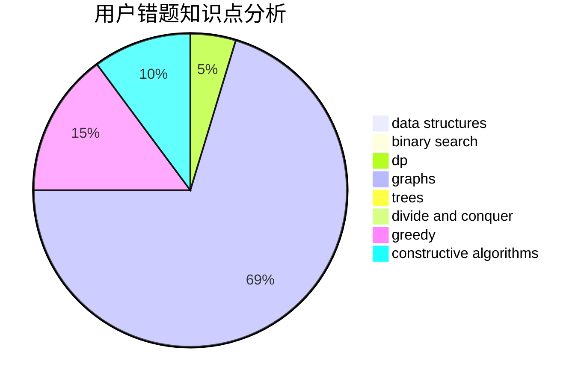

# dqa2021

<!-- tabs:start -->

#### **用户提交结果分析**

#### **用户做题类型偏好分析**

#### **用户错题知识点分析**

<!-- tabs:end -->
# 推荐题目
[808A](https://codeforces.com/contest/808/problem/A)		implementation		  
[1409D](https://codeforces.com/contest/1409/problem/D)		greedy,
                        math		  
[1474C](https://codeforces.com/contest/1474/problem/C)		brute force,
                        constructive algorithms,
                        data structures,
                        greedy,
                        implementation,
                        sortings		  
[364C](https://codeforces.com/contest/364/problem/C)		brute force,
                        number theory		  
[1065B](https://codeforces.com/contest/1065/problem/B)		constructive algorithms,
                        graphs		  
[268D](https://codeforces.com/contest/268/problem/D)		dp		  
[767B](https://codeforces.com/contest/767/problem/B)		brute force,
                        greedy		  
[1172C1](https://codeforces.com/contest/1172C/problem/1)		dp,
                        probabilities		  
[1367F1](https://codeforces.com/contest/1367F/problem/1)		dp,
                        greedy,
                        two pointers		  
[1374C](https://codeforces.com/contest/1374/problem/C)		greedy,
                        strings		  
