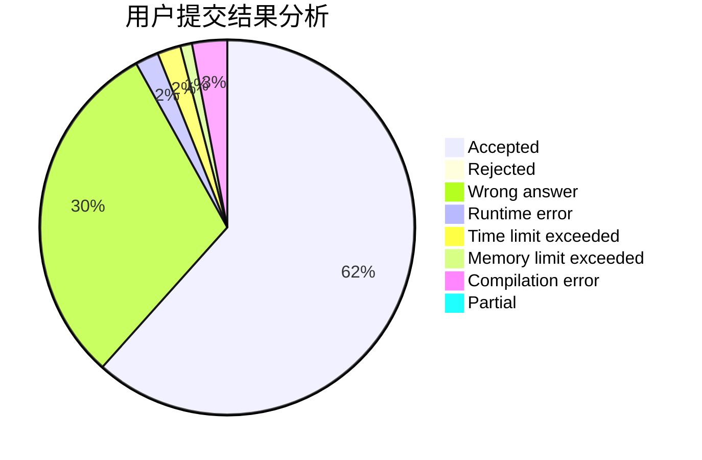
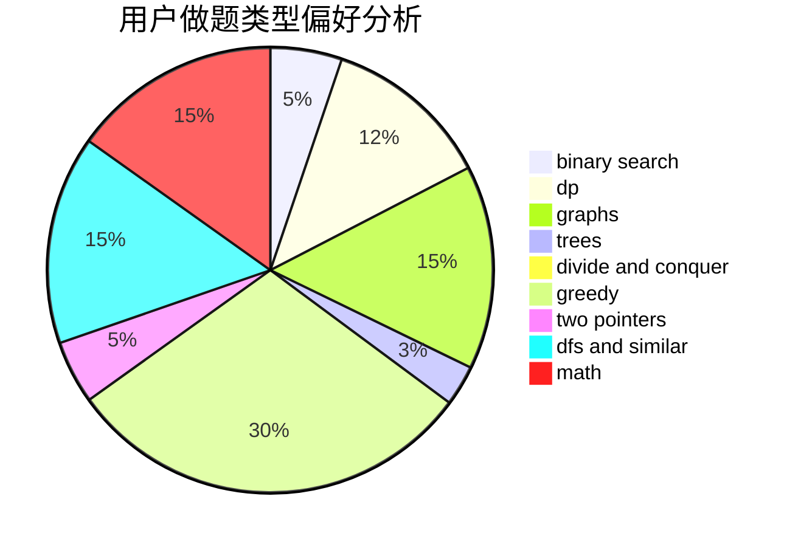

# dqa2021

<!-- tabs:start -->

#### **用户提交结果分析**

#### **用户做题类型偏好分析**

<!-- tabs:end -->
# 推荐题目
[822F](https://codeforces.com/contest/822/problem/F)
[14201](https://codeforces.com/contest/1420/problem/1)
[1482H](https://codeforces.com/contest/1482/problem/H)
[3912](https://codeforces.com/contest/391/problem/2)
[1065F](https://codeforces.com/contest/1065/problem/F)
[283E](https://codeforces.com/contest/283/problem/E)
[786D](https://codeforces.com/contest/786/problem/D)
[1174E](https://codeforces.com/contest/1174/problem/E)
[1374C](https://codeforces.com/contest/1374/problem/C)
[1383B](https://codeforces.com/contest/1383/problem/B)
